# Hệ thống Nhận diện bản nhạc quang học và Xử lý âm thanh cho Piano - Optical Music Recognition and Audio Processing for Piano

## Lời cảm ơn

*Tôi xin gửi lời cảm ơn chân thành đến [Leminionn](https://github.com/Leminionn) vì những đóng góp quý báu trong quá trình gán nhãn dữ liệu ảnh cho dự án này. Sự hỗ trợ nhiệt tình và tỉ mỉ của bạn đã góp phần quan trọng vào việc xây dựng tập dữ liệu huấn luyện cho mô hình nhận diện ký hiệu âm nhạc. Không có sự giúp đỡ của bạn, việc hoàn thiện hệ thống này sẽ khó khăn hơn rất nhiều.*

## Mục lục của báo cáo

1. [Hệ thống nhận diện bản nhạc quang học (OMR)](#1-hệ-thống-nhận-diện-bản-nhạc-quang-học-omr)
    - [Khái quát về OMR](#11-khái-quát-về-omr)
    - [Những thách thức trong OMR](#12-những-thách-thức-trong-omr)
    - [Các công đoạn xây dựng hệ thống](#13-các-công-đoạn-xây-dựng-hệ-thống)

2. [Quá trình tiền xử lý dữ liệu cho bản nhạc](#2-quá-trình-tiền-xử-lý-dữ-liệu-cho-bản-nhạc)
    - [Nguyên nhân và mục đích tiền xử lý](#21-nguyên-nhân-và-mục-đích-tiền-xử-lý)
    - [Công cụ giúp người dùng chỉnh sửa dữ liệu thủ công](#22-công-cụ-giúp-người-dùng-chỉnh-sửa-dữ-liệu-thủ-công)

3. [Phân tích và xử lý âm thanh](#3-phân-tích-và-xử-lý-âm-thanh)
    - [Chuyển đổi dữ liệu từ dạng thông số kỹ thuật sang dạng nhạc lý](#31-chuyển-đổi-dữ-liệu-từ-dạng-thông-số-kỹ-thuật-sang-dạng-nhạc-lý)
    - [Xây dựng đầu ra âm thanh của bản nhạc](#32-xây-dựng-đầu-ra-âm-thanh-của-bản-nhạc)

4. [Một số kỹ thuật/thư viện được sử dụng trong hệ thống](#4-một-số-kỹ-thuậtthư-viện-được-sử-dụng-trong-hệ-thống)
    - [Server-Sent Events (SSE)](#41-server-sent-events-sse)
    - [WebSocket](#42-websocket)
    - [Multi-threading](#43-multi-threading)
    - [Các thư viện khác](#44-các-thư-viện-khác)

5. [Kết luận](#5-kết-luận)

# 1. Hệ thống nhận diện bản nhạc quang học (OMR)
## 1.1. Khái quát về OMR

Nhận diện bản nhạc quang học (Optical Music Recognition - OMR) là một lĩnh vực nghiên cứu thuộc giao thoa giữa **thị giác máy tính** (computer vision), **xử lý ảnh** (image processing), **âm nhạc học** (musicology) và **xử lý dữ liệu** (data processing). Mục tiêu của OMR là tự động phân tích hình ảnh chứa các bản nhạc — có thể là bản in hoặc bản viết tay (báo cáo này chỉ thực hiện với bản in) — và chuyển đổi các ký hiệu âm nhạc thành định dạng kỹ thuật số có thể chỉnh sửa.
Quá trình này không đơn giản chỉ là nhận diện từng ký hiệu đơn lẻ, mà còn phải hiểu và tái hiện cấu trúc âm nhạc tổng thể của bản nhạc gốc, bao gồm nhịp điệu, cao độ, hợp âm và các giá trị nhịp.

Thông thường, một hệ thống OMR hoàn chỉnh bao gồm ba giai đoạn chính:
- **Xử lý ảnh (Image Processing)**: Ở giai đoạn này, hình ảnh bản nhạc được xử lý để cải thiện chất lượng và loại bỏ nhiễu. Các kỹ thuật như chuyển đổi ảnh về nhị phân, loại bỏ nhiễu, áp dụng các phép toán hình thái học (morphological operations), làm mờ Gauss thường được sử dụng.

- **Phân đoạn và nhận diện ký hiệu (Segmentation and Symbol Recognition)**: Sau khi xử lý ảnh, hệ thống sẽ chia bản nhạc thành các phần nhỏ hơn, thông thường là cặp khuông nhạc, và nhận diện các ký hiệu âm nhạc trong từng phần. Trong báo cáo này, ta sử dụng thuật toán YOLO (You Only Look Once) để nhận diện các ký hiệu âm nhạc.

- **Giải mã ngữ cảnh (Musical Reconstruction)**: Đây là bước tái tạo ý nghĩa âm nhạc từ các ký hiệu đã nhận diện. Ví dụ, xác định vị trí cao độ từ vị trí đầu nốt nhạc trên khuông nhạc, xác định nhịp điệu từ các ký hiệu thời gian, và xác định các hợp âm từ các nốt nhạc được nhóm lại của từng giai đoạn. Tuy nhiên, trong thực tế, mỗi giai đoạn đều có những khó khăn và thách thức riêng mà ngay cả những hệ thống OMR tiên tiến nhất cũng không thể giải quyết hoàn toàn.

## 1.2. Những thách thức trong OMR
### 1.2.1. Sự đa dạng và phức tạp của ký hiệu âm nhạc
Khác với văn bản tự nhiên vốn có hệ thống chữ cái đơn giản và nhất quán, ký hiệu âm nhạc có một sự phong phú về hình dạng, kích thước và cách biểu diễn. Bên cạnh các nốt nhạc cơ bản, bản nhạc còn chứa nhiều yếu tố phức tạp như dấu luyến, dấu nối, dấu chấm, các chỉ thị nhịp độ, biểu cảm, v.v.

Hơn nữa, nhiều ký hiệu có thể trông rất giống nhau về mặt hình học nhưng có ý nghĩa âm nhạc hoàn toàn khác biệt. Ví dụ, một dấu chấm đặt sau một nốt có ý nghĩa kéo dài trường độ, trong khi một dấu chấm đặt gần hoặc trên nốt có thể biểu diễn kỹ thuật staccato. Ngoài ra, trong một số bản nhạc, dấu nối (beam) có thể trải dài từ khuông nhạc trên xuống khuông nhạc dưới, trong khi trong các bản nhạc thông thường, dấu nối chỉ kéo dài giữa các nốt nhạc trên cùng một khuông nhạc.

Điều này đòi hỏi hệ thống OMR không chỉ nhận diện hình dạng thuần túy, mà còn phải hiểu ngữ cảnh không gian và quy tắc ký hiệu học âm nhạc.

### 1.2.2. Khó khăn trong việc xác định các ký hiệu âm nhạc
Trong một bản nhạc, tất cả các ký hiệu đều có vai trò quan trọng và có mối quan hệ chặt chẽ với nhau. Không giống như các hệ thống nhận diện vật thể khác, sự thiếu sót của một vật thể thường chỉ làm giảm độ chính xác của hệ thống vì các vật thể này không có mối liên hệ chặt chẽ với nhau. Tuy nhiên, sự thiếu hụt của một ký hiệu có thể dẫn đến việc hiểu sai hoặc không hiểu được toàn bộ bản nhạc. Điều này đòi hỏi hệ thống OMR phải có khả năng nhận diện với độ chính xác cao trong nhiều ngữ cảnh khác nhau.

Ví dụ, âm giai trong một bản nhạc được xác định bởi các dấu hoá (dấu thăng, dấu giáng). Nếu hệ thống không nhận diện đúng các dấu hoá này, nó có thể dẫn đến việc hiểu sai cao độ của các nốt nhạc. Tương tự, nếu hệ thống nhận diện sai một đuôi nốt (stem) hoặc một dấu hoá, nó sẽ khiến cho bản nhạc bị sai lệch hoàn toàn về mặt ý nghĩa.

Trong một số trường hợp, các quy tắc trong âm nhạc có thể bị phá vỡ hoặc thay đổi do người soạn nhạc sáng tạo. Điều này làm cho việc nhận diện trở nên khó khăn hơn, vì hệ thống OMR cần phải có khả năng thích ứng với những thay đổi này mà vẫn đảm bảo tính chính xác của cao độ và trường độ.

### 1.2.3. Thiếu dữ liệu để huấn luyện mô hình
Sự thành công của các hệ thống OMR hiện đại, đặc biệt các mô hình học sâu, phụ thuộc vào việc có bộ dữ liệu lớn, đa dạng và gán nhãn chính xác. Tuy nhiên, bộ dữ liệu để huấn luyện mô hình YOLO rất hạn chế, đặc biệt là trong lĩnh vực âm nhạc. Các bộ dữ liệu hiện có thường không đồng nhất về chất lượng, độ phân giải và định dạng, điều này có thể dẫn đến việc mô hình không hoạt động tốt trong các tình huống thực tế.

Ngoài ra, việc gán nhãn các ký hiệu âm nhạc trong hình ảnh cũng là một thách thức lớn. Các ký hiệu có thể bị che khuất, biến dạng hoặc bị nhiễu, làm cho việc xác định vị trí và loại ký hiệu trở nên khó khăn hơn. Điều này đòi hỏi người gán nhãn phải có kiến thức sâu về âm nhạc và kỹ năng xử lý ảnh để đảm bảo tính chính xác của dữ liệu huấn luyện.

Hơn nữa, không phải ký hiệu nào cũng xuất hiện nhiều lần trong các bản nhạc, điều này có thể dẫn đến việc mô hình không được huấn luyện đầy đủ cho tất cả các ký hiệu âm nhạc. Điều này đặc biệt quan trọng trong các bản nhạc phức tạp hoặc ít phổ biến, nơi mà một số ký hiệu có thể xuất hiện rất hiếm.

# 1.3. Các công đoạn xây dựng hệ thống
## 1.3.1. Xử lý ảnh
## 1.3.1.1. Phân vùng cho khuông nhạc

Công đoạn đầu tiên trong xử lý ảnh là phân chia ảnh thành các khu vực nhỏ hơn, thường là cặp khuông nhạc. Sau đó, các ký hiệu âm nhạc trong từng khu vực sẽ được nhận diện và phân loại. Để làm điều này, bức ảnh sẽ xử lí từng bước như sau:

- Đây là ảnh gốc, được chụp lấy từ một trang của bản nhạc. Ảnh này có độ phân giải cao và chứa nhiều ký hiệu âm nhạc khác nhau.

<div align="center">
    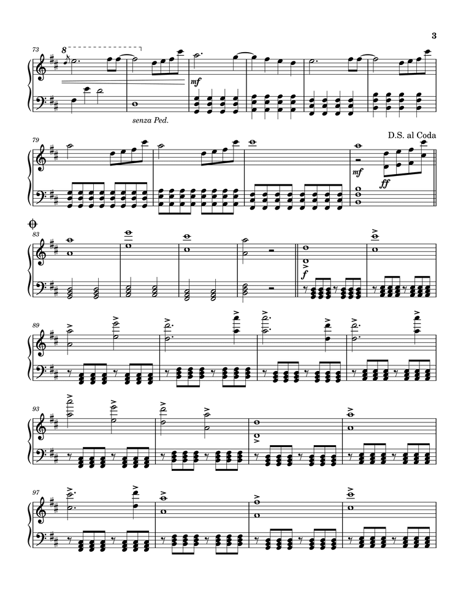
    <p><i>Ảnh gốc</i></p>
</div>

- Ảnh được chuyển sang không gian màu xám, sau đó áp dụng **bộ lọc Gaussian** với kernel kích thước (5×5) nhằm làm giảm nhiễu cục bộ.

- Ảnh mờ được **nhị phân hóa** ngược sử dụng phương pháp `Otsu` (kí hiệu trắng trên nền đen). Các vùng tối trong ảnh sẽ trở thành màu trắng (255), trong khi các vùng sáng sẽ trở thành màu đen (0), và không có kí hiệu nào nằm trong khoảng "màu xám" (khoảng giữa 0 và 255). Mục đích của bước này là làm nổi bật các ký hiệu âm nhạc trong ảnh.

<div align="center">
    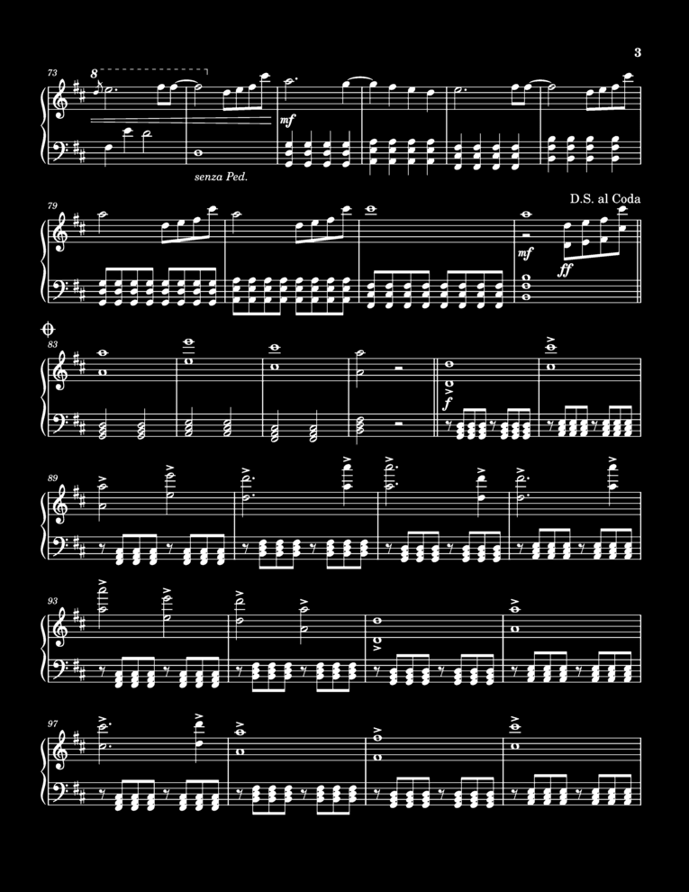
    <p><i>Ảnh nhị phân</i></p>
</div>

- **Phép toán giãn nở** (dilation) được sử dụng với một ma trận nhị phân kích thước (40x10) (`cv2.MORPH_RECT`) chứa toàn giá trị 1. "Hình chữ nhật" này sẽ kết nối các thành phần nằm gần nhau và làm cho chúng liên kết với nhau thành một khối liên tục. Điều này giúp làm nổi bật các cặp khuông nhạc, thuận lợi cho việc tìm đường biên và tách bản nhạc thành các phần nhỏ hơn để nhận diện.

<div align="center">
    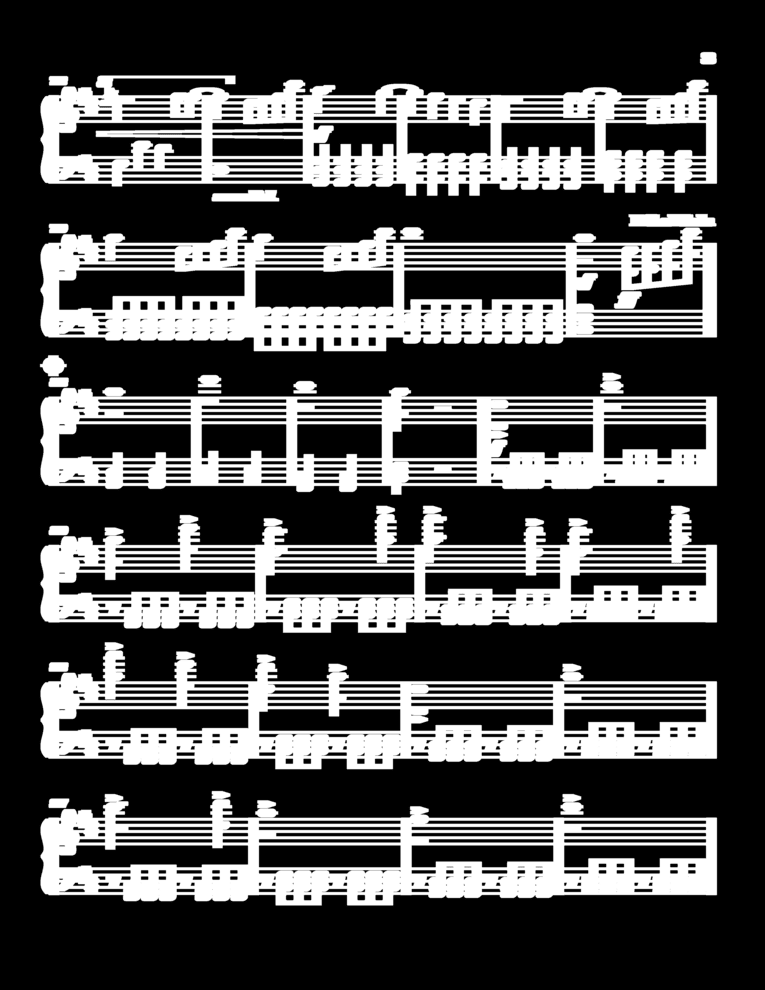
    <p><i>Ảnh sau khi giãn nở</i></p>
</div>

- Từ ảnh nhị phân đã được xử lý, ta sử dụng **phương pháp tìm đường biên** (contour) để xác định các vùng chứa khuông nhạc. Với tham số `cv2.RETR_EXTERNAL`, chỉ trích xuất các đường biên ngoài cùng, bỏ qua các đường biên bên trong. Điều này giúp loại bỏ các chi tiết không cần thiết và chỉ giữ lại các khuôn nhạc chính. Ngoài ra, ta cũng sử dụng tham số `cv2.CHAIN_APPROX_SIMPLE` để giảm số lượng điểm trong đường biên, giúp tiết kiệm bộ nhớ và tăng tốc độ xử lý. Lưu ý, ta sẽ chỉ lấy các đường biên có độ dài bằng 80% so với chiều rộng của ảnh vì các khuông nhạc thường có chiều dài như vậy.

<div align="center">
    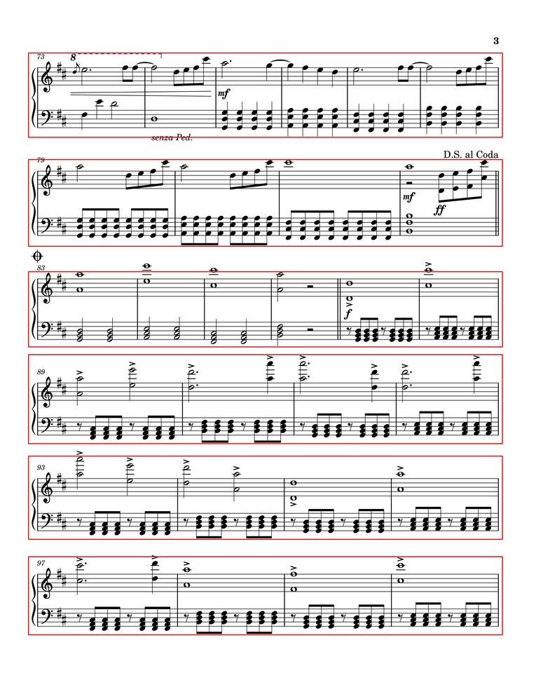
    <p><i>Ảnh sau khi tìm đường biên</i></p>
</div>

## 1.3.1.2. Trích xuất dòng kẻ khuông nhạc
Ta sẽ thực hiện trich xuất các dòng kẻ khuông nhạc từ ảnh gốc. Các bước thực hiện như sau:

- Vùng khuông nhạc được chuyển sang ảnh xám và sau đó nhị phân hóa với ngưỡng **210** (chủ yếu là các ký hiệu đủ lớn và sắc nét) kết hợp Otsu để làm nổi bật các đối tượng tối trên nền sáng.

- Một phần tử cấu trúc hình chữ nhật (với chiều dài khoảng 80% chiều rộng ảnh và chiều cao 1 pixel) cùng với **phép co** (erosion) và **phép giãn** (dilation) được sử dụng để làm nổi bật các đường kẻ khuông nhạc.

- Các đường biên được tìm kiếm và sắp xếp theo thứ tự tọa độ đứng. Các hộp (bounding box) có chiều rộng nhỏ (dưới 80% chiều rộng ảnh) hoặc có độ dày lớn hơn 4 pixel sẽ bị loại bỏ để tránh nhầm lẫn với các yếu tố không phải đường khuông (ví dụ như thanh nối nhịp trong các nốt nhóm).

- Các dòng kẻ khuông hợp lệ (theo các tiêu chí hình học) được lưu trữ dưới dạng danh sách các bounding box `(x, y, width, height)`. Dưới đây là một ví dụ về các dòng kẻ khuông nhạc được trích xuất từ một vùng khuông nhạc:

    ```python
    # 5 dòng kẻ của khuôn nhạc treble - khoá Sol (phía trên)
    (50, 83, 2636, 3)
    (50, 108, 2636, 2)
    (50, 132, 2636, 3)
    (50, 157, 2636, 3)
    (50, 182, 2636, 3)

    # 5 dòng kẻ của khuôn nhạc bass - khoá Fa (phía dưới)
    (50, 326, 2636, 3)
    (50, 351, 2636, 3)
    (50, 376, 2636, 2)
    (50, 400, 2636, 3)
    (50, 425, 2636, 3)
    ```

## 1.3.1.3. Loại bỏ dòng kẻ khuông nhạc
Sau khi đã lọc ra các dòng kẻ, ta tiến hành loại bỏ các dòng kẻ khuông nhạc và chỉ giữ lại các ký hiệu âm nhạc. Cụ thể:

- Vùng khuông nhạc được chuyển sang ảnh xám và sau đó nhị phân hóa với ngưỡng 210 (chủ yếu là các ký hiệu đủ lớn và sắc nét) kết hợp Otsu để làm nổi bật các đối tượng tối trên nền sáng.

- Ta sử dụng một ma trận có kích thước (1x4) (đường kẻ thường có độ rộng khoảng 4 pixel), ảnh được co lại (erosion) rồi giãn nở (dilation) theo chiều dọc để làm mờ hoặc loại bỏ các đường kẻ ngang mỏng (tức đường khuông).

- Do thao tác co có thể làm mất chi tiết của các nốt, ảnh được phục hồi bằng giãn nở sử dụng phần tử hình elip (2×2) nhằm khôi phục hình dạng các notehead và các chi tiết nhạc cụ. Thao tác này tuy giúp khôi phục các chi tiết bị mất, nhưng nó cũng làm cho các chi tiết này bị đôi chút biến dạng (mặc dù không đáng kể).

- Cuối cùng, ảnh được đảo ngược lại về nền trắng - đối tượng đen, thuận tiện cho các bước phân tích sau này. Dưới đây là các vùng khuông nhạc đã được loại bỏ dòng kẻ:

    <div align="center">
        
        <p><i>Vùng 0</i></p>
    </div>

    <div align="center">
        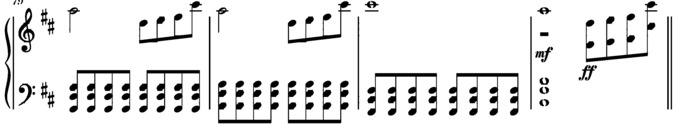
        <p><i>Vùng 1</i></p>
    </div>

    <div align="center">
        
        <p><i>Vùng 2</i></p>
    </div>

    <div align="center">
        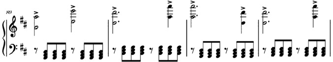
        <p><i>Vùng 3</i></p>
    </div>

    <div align="center">
        
        <p><i>Vùng 4</i></p>
    </div>

    <div align="center">
        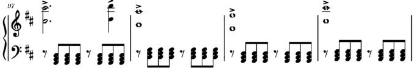
        <p><i>Vùng 5</i></p>
    </div>

## 1.3.2. Huấn luyện mô hình YOLO
## 1.3.2.1. Giới thiệu về YOLO
**YOLO (You Only Look Once)** là một thuật toán nổi tiếng trong lĩnh vực phát hiện đối tượng (object detection), được giới thiệu lần đầu tiên vào năm 2016 bởi Joseph Redmon và cộng sự. Khác với các phương pháp hai giai đoạn truyền thống (như **R-CNN** hay **Faster R-CNN**), YOLO áp dụng cách tiếp cận **phát hiện một giai đoạn** (single-stage detection), trong đó toàn bộ ảnh đầu vào được xử lý chỉ trong một lần suy luận duy nhất.

Cụ thể, YOLO chia ảnh thành một lưới (grid) đều đặn và với mỗi ô lưới, mô hình dự đoán các bounding box ứng viên cùng với xác suất tồn tại của các lớp đối tượng. Tất cả các bước — từ phát hiện tới phân loại đối tượng — được thực hiện đồng thời trong một mạng nơ-ron tích chập duy nhất.

Điểm mạnh lớn nhất của YOLO là tốc độ rất cao, nhờ vào tính chất "end-to-end" của quá trình suy luận, khiến nó đặc biệt phù hợp với các ứng dụng yêu cầu xử lý thời gian thực. Tuy nhiên, YOLO cũng có một số hạn chế, đặc biệt trong việc phát hiện các đối tượng nhỏ hoặc đối tượng có kích thước rất biến thiên.

Kể từ phiên bản đầu tiên, YOLO đã trải qua nhiều thế hệ cải tiến (YOLOv2, YOLOv3, YOLOv4, YOLOv5, YOLOv7, YOLOv8...), mỗi phiên bản đều nâng cao độ chính xác, khả năng tổng quát và tốc độ xử lý.

## 1.3.2.2. Chuẩn bị dữ liệu
Vì YOLO là một mô hình học sâu, nó yêu cầu một lượng lớn dữ liệu được gán nhãn để huấn luyện. Dữ liệu này bao gồm các ảnh chứa các ký hiệu âm nhạc và các bounding box tương ứng với vị trí của các ký hiệu trong ảnh. Tuy nhiên, do sự thiếu hụt về nhân lực và thời gian, model trong báo cáo này được huấn luyện trên một bộ dữ liệu nhỏ hơn, bao gồm **135 ảnh** và **14749 bounding box** (được gán nhãn hoàn toàn thủ công). Cụ thể:

| STT | Ký hiệu | Số lượng |
| --- | -------- | -------- |
| 1 | barline | 638 |
| 2 | bass_clef | 122 |
| 3 | decrescendo | 165 |
| 4 | dotted_half_note | 30 |
| 5 | dotted_quarter_note | 172 |
| 6 | eight_beam | 1,990 |
| 7 | eight_flag | 355 |
| 8 | eight_rest | 275 |
| 9 | flat | 532 |
| 10 | half_note | 327 |
| 11 | natural | 32 |
| 12 | quarter_note | 8,307 |
| 13 | quarter_rest | 23 |
| 14 | sharp | 457 |
| 15 | sixteenth_beam | 957 |
| 16 | sixteenth_flag | 2 |
| 17 | sixteenth_rest | 6 |
| 18 | thirty_second_beam | 5 |
| 19 | treble_clef | 151 |
| 20 | whole_half_rest | 32 |
| 21 | whole_note | 171 |

Trong triển khai thực tế, bộ dữ liệu sẽ tốt hơn nếu số lượng các ký hiệu được phân bố đồng đều hơn. Tuy nhiên, do thời gian hạn chế, bộ dữ liệu này chỉ được xây dựng thông qua một số bản nhạc nên một số ký hiệu sẽ xuất hiện nhiều hơn các ký hiệu khác. **Vì vậy, mô hình này chỉ được coi là một mô hình thử nghiệm, chưa sử dụng cho các ứng dụng thực tế.**

## 1.3.2.3. Gán nhãn dữ liệu
Ở mỗi ảnh, các ký hiệu âm nhạc sẽ được gán nhãn bằng cách sử dụng các bounding box. Mỗi bounding box theo định dạng YOLOv8, bao gồm các thông tin sau: 

```bash
(class, x_center, y_center, width, height)

# Trong đó:
#   class: chỉ số lớp của ký hiệu âm nhạc (0-20)
#   x_center và y_center: tọa độ trung tâm của bounding box (tính theo tỷ lệ so với kích thước ảnh gốc)
#   width và height: kích thước của bounding box (tính theo tỷ lệ so với kích thước ảnh gốc)
```

Dưới đây là ví dụ về 1 đoạn trong file text gán nhãn cho một ảnh:

```bash
17 0.0359375 0.503125  0.0234375 0.05625
1  0.0359375 0.578125  0.021875  0.0296875
0  0.0203125 0.4859375 0.0046875 0.228125
0  0.4015625 0.54375   0.003125  0.1140625
0  0.70625   0.5421875 0.0046875 0.1140625
0  0.990625  0.54375   0.00625   0.115625
7  0.05625   0.4984375 0.0078125 0.021875
...
```

Ứng với mỗi ảnh, ta sẽ có một file text tương ứng chứa các thông tin về các ký hiệu âm nhạc trong ảnh đó.

Với các kí hiệu đơn lẻ như **khoá Sol**, khoá Fa, dấu hoá, nốt tròn, nốt trắng, v.v., ta sẽ sử dụng các hình chữ nhật (bounding box) để bao quanh chúng. Đối với các nốt nhạc có đuôi nốt hoặc dấu nối, ta sẽ gán nhãn riêng cho phần đầu nốt và phần đuôi nốt/dấu nối. Điều này giúp mô hình có thể nhận diện và phân loại các ký hiệu một cách chính xác hơn.

<div align="center">
    
    <p><i>Hình ảnh gán nhãn cho một vùng khuôn nhạc</i></p>
</div>

<div align="center">
    
    <p><i>Hình ảnh gán nhãn cho một nốt nhạc có đuôi nốt</i></p>
</div>

<div align="center">
    
    <p><i>Hình ảnh gán nhãn cho một nốt nhạc có dấu nối</i></p>
</div>

> Lưu ý: Bounding box thường không bám sát với cạnh của ký hiệu âm nhạc, mà thường có khoảng cách nhất định. Điều này là do các ký hiệu âm nhạc có thể bị biến dạng hoặc che khuất bởi các yếu tố khác trong ảnh, và việc gán nhãn chính xác là rất khó khăn. 

Trong một số trường hợp, khi các đầu nốt nằm sát nhau (biểu diễn hợp âm), các bounding box sẽ bị chồng lên nhau. Điều này có thể dẫn đến việc mô hình không nhận diện được các ký hiệu âm nhạc một cách chính xác.

<div align="center">
    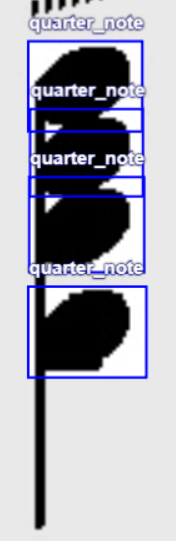
    <p><i>Hình ảnh gán nhãn cho một nốt nhạc có đầu nốt nằm sát nhau</i></p>
</div>

Khi các ảnh đã được gán nhãn đầy đủ, ta tiến hành xuất bộ dữ liệu này với một số tinh chỉnh cho mỗi ảnh để giảm thời gian huấn luyện và cải thiện hiệu suất:
- Tự động định hướng nhằm loại bỏ các ảnh bị nghiêng hoặc không nằm ngang.
- Căn chỉnh kích thước về **1080x480 pixel** (nền đen). Kich thước này được chọn vì nó ưu tiên chiều rộng hơn chiều cao, phù hợp với vùng khuôn nhạc trong ảnh cũng như đủ độ sắc nét để nhận diện các ký hiệu âm nhạc.
## 1.3.2.4. Huấn luyện mô hình
Mô hình YOLOv8 được huấn luyện trên bộ dữ liệu đã chuẩn bị với các thông số cấu hình sau:

```yaml
# Dataset
train: train/images  # thư mục chứa ảnh huấn luyện
val: val/images  # thư mục chứa ảnh kiểm định
test: test/images # thư mục chứ ảnh kiểm tra

# Classes
names:
    0: barline
    1: bass_clef
    2: decrescendo
    3: dotted_half_note
    4: dotted_quarter_note
    5: eight_beam
    6: eight_flag
    7: eight_rest
    8: flat
    9: half_note
    10: natural
    11: quarter_note
    12: quarter_rest
    13: sharp
    14: sixteenth_beam
    15: sixteenth_flag
    16: sixteenth_rest
    17: thirty_second_beam
    18: treble_clef
    19: whole_half_rest
    20: whole_note
```

### Cấu trúc mô hình YOLOv8

YOLOv8 là phiên bản cải tiến mới nhất của họ YOLO với nhiều cải tiến về kiến trúc và hiệu năng. Kiến trúc cơ bản của YOLOv8 bao gồm:

- **Backbone**: Sử dụng CSPDarknet để trích xuất đặc trưng từ ảnh đầu vào. Backbone này áp dụng kỹ thuật Cross Stage Partial Network (CSP) giúp cải thiện hiệu suất và giảm kích thước mô hình.

- **Neck**: Sử dụng Path Aggregation Network (PANet) để kết hợp các đặc trưng từ nhiều lớp khác nhau, giúp mô hình có thể phát hiện các đối tượng ở nhiều kích thước khác nhau.

- **Head**: Đầu ra của mô hình gồm hai nhánh:
   - Nhánh phân loại (Classification branch): Dự đoán xác suất thuộc về từng lớp đối tượng
   - Nhánh hồi quy (Regression branch): Dự đoán tọa độ và kích thước của bounding box

<div align="center">
    
    <p><i>Kiến trúc tổng quan của YOLOv8</i></p>
</div>

### Quá trình huấn luyện

Quá trình huấn luyện được thực hiện theo các bước sau:

1. **Phân chia dữ liệu**: Bộ dữ liệu được chia thành 3 phần:
   - Train: 80%
   - Validation: 10%
   - Test: 10%

2. **Khởi tạo mô hình**: Sử dụng mô hình **YOLOv8 Nano** - phiên bản nhỏ nhất và nhanh nhất của YOLOv8 - từ COCO dataset để khởi tạo mô hình, áp dụng kỹ thuật transfer learning để tận dụng các đặc trưng cơ bản đã được học.

3. **Các tham số**:
    - `data`: Đường dẫn đến file cấu hình dữ liệu (thường là `data.yaml`).
    - `epochs=300`: Huấn luyện mô hình trong 300 epochs (số lần mô hình đi qua toàn bộ tập dữ liệu huấn luyện).
    - `device=cuda`: Sử dụng GPU thông qua CUDA để tăng tốc quá trình huấn luyện. GPU được sử dụng là NVIDIA Telsa T4 với 16GB RAM, chuyên xử lí các tác vụ đòi hỏi nhiều tính toán.

4. **Kết quả huấn luyện**: Các số liệu trả về sau khi mô hình đã được huấn luyện bao gồm:
    - **Độ chính xác (precision)**: Đo lường tỉ lệ dự đoán đúng trên tổng số dự đoán của mô hình.

    - **Độ phủ (recall)**: Đo lường tỉ lệ đối tượng thực tế được phát hiện bởi mô hình. Độ phủ cao nghĩa là mô hình có thể phát hiện hầu hết các kí hiệu trong bản nhạc.

    - **mAP (mean Average Precision)**: Độ chính xác trung bình trên tất cả các lớp. Một giá trị mAP cao cho thấy mô hình hoạt động tốt trong việc xác định và định vị các đối tượng một cách chính xác trên nhiều lớp khác nhau.
        - **mAP50:** Độ chính xác trung bình ở ngưỡng IoU = 0.5. Đây có thể coi là thước đo độ chính xác của mô hình trong các mức độ "dễ" phát hiện.
        - **mAP50-90:** Độ chính xác trung bình được tính toán ở các ngưỡng IoU khác nhau, trong khoảng từ 0.50 đến 0.95. Nó cung cấp cái nhìn toàn diện về hiệu suất của mô hình ở các mức độ "khó" phát hiện khác nhau.

    - **Loss values**: Các giá trị hàm mất mát được sử dụng để tối ưu hóa mô hình trong quá trình huấn luyện. Sự giảm dần của các giá trị loss trong quá trình huấn luyện cho thấy mô hình đang học tốt.
        - **Box Loss**: Đo lường sai số trong dự đoán vị trí và kích thước bounding box.
        - **Classification Loss**: Đo lường sai số trong việc phân loại đối tượng.
        - **Objectness Loss**: Đo lường sai số trong việc xác định liệu có đối tượng hay không.

    - Các thông số khác

5. **Đánh giá quá trình thông qua biểu đồ**: 

<div align="center">
    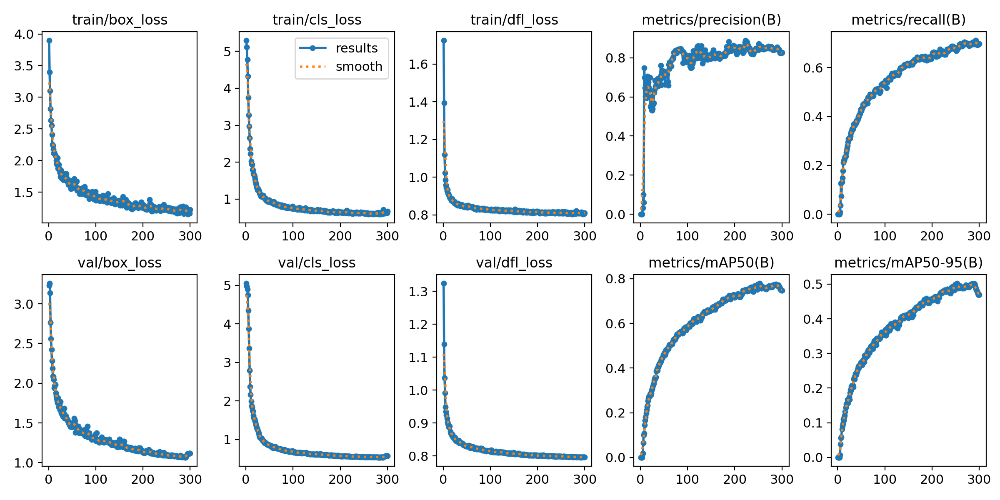
    <p><i>Biểu đồ thể hiện sự thay đổi của các thông số trong quá trình huấn luyện</i></p>
</div>

Các thông số đáng chú ý trong biểu đồ trên bao gồm:
- `train/box_loss`: Giảm nhanh chóng ở những **epochs** đầu tiên và sau đó tiếp tục giảm chậm hơn, có vẻ như đang hội tụ. Điều này cho thấy việc dự đoán vị trí bounding box ngày càng chính xác hơn.

- `val/box_loss`: Giảm tương tự như trên tập huấn luyện, nhưng có vẻ như bắt đầu ổn định hoặc giảm rất chậm ở những epochs cuối.

- `metrics/precision(B)`: Tăng nhanh chóng và sau đó có thể dao động nhẹ hoặc ổn định ở một mức tương đối cao. Điều này cho thấy độ chính xác của việc dự đoán đang dần được cải thiện.

- `metrics/recall(B)`: Tăng nhanh chống và tiến gần đến một điểm ổn định. Điều này cho thấy mô hình ngày càng ít bỏ sót kí hiệu hơn.

- `metrics/mAP50(B)`: Tăng lên và có dấu hiệu đạt đến một mức ổn định (~ 0.75), cho thấy hiệu suất tốt trên dữ liệu mới ở ngưỡng IoU 0.5.

- `metrics/mAP50-95(B)`: Tăng lên nhưng có dấu hiệu không vượt qua mức 0.5, cho thấy mô hình chưa đủ tốt trong nhận diện các trường hợp phức tạp.

### Đánh giá mô hình chi tiết

Sau khi hoàn tất quá trình huấn luyện, mô hình được đánh giá trên tập test để có cái nhìn toàn diện về hiệu suất:

| Class             | Precision | Recall     | mAP50 | mAP50-95 |
|-------------------|--------|-------|-------|----------|
| barline           | 0.822  | 0.781 | 0.836 | 0.479    |
| bass_clef         | 0.984  | 0.984 | 0.987 | 0.786    |
| decrescendo       | 0.7    | 0.624 | 0.662 | 0.328    |
| dotted_half_note  | 0.803  | 0.137 | 0.431 | 0.225    |
| dotted_quarter_note| 0.595  | 0.762 | 0.755 | 0.447    |
| eighth_beam       | 0.955  | 0.997 | 0.993 | 0.743    |
| eighth_flag       | 0.869  | 0.952 | 0.962 | 0.602    |
| eighth_rest       | 0.978  | 0.962 | 0.991 | 0.58     |
| flat              | 0.847  | 0.914 | 0.95  | 0.592    |
| half_note         | 0.705  | 0.818 | 0.783 | 0.452    |
| natural           | 0.618  | 0.344 | 0.473 | 0.245    |
| quarter_note      | 0.933  | 0.953 | 0.971 | 0.655    |
| quarter_rest      | 0.937  | 0.648 | 0.756 | 0.424    |
| sharp             | 0.8    | 0.978 | 0.976 | 0.664    |
| sixteenth_beam    | 0.914  | 0.996 | 0.991 | 0.765    |
| sixteenth_flag    | 1      | 0     | 0.828 | 0.514    |
| sixteenth_rest    | 1      | 0     | 0.23  | 0.154    |
| thirty_second_beam| 1      | 0     | 0.182 | 0.14     |
| treble_clef       | 0.989  | 0.993 | 0.995 | 0.866    |
| whole_half_rest   | 1      | 0.568 | 0.773 | 0.419    |
| whole_note        | 0.703  | 0.795 | 0.839 | 0.452    |
| **all**           | **0.864**  | **0.676** | **0.779** | **0.502**    |

Từ bảng kết quả, ta có thể thấy:
- Các ký hiệu phổ biến như eighth_beam, eighth_flag, eighth_rest, flat, sharp, sixteenth_beam, quarter_note, treble_clef, bass_clef có độ chính xác cao (**mAP50 > 0.9**) và độ phủ tốt (**recall > 0.9**), cho thấy mô hình có khả năng phát hiện tốt các ký hiệu này.

- Các ký hiệu hiếm gặp như sixteenth_flag, sixteenth_rest, thirty_second_beam có hiệu suất thấp hơn (**mAP50 < 0.5**) do thiếu dữ liệu huấn luyện.

- Nhìn chung, mô hình có độ chính xác trung bình (mAP50) đạt 0.779 và độ phủ (recall) đạt 0.676, cho thấy mô hình có khả năng phát hiện các ký hiệu âm nhạc với độ chính xác là chấp nhận được với một bộ dữ liệu nhỏ.

### Phân tích lỗi

Để hiểu rõ hơn về các lỗi của mô hình, ta tiến hành phân tích confusion matrix và các trường hợp dự đoán sai:

<div align="center">
    
    <p><i>Confusion matrix trên tập test</i></p>
</div>

Các lỗi thường gặp bao gồm:
1. **False Negatives**: Mô hình bỏ sót một số ký hiệu, đặc biệt là các ký hiệu nhỏ hoặc bị che khuất một phần, và nhận diện chúng là nền (background).

2. **False Positives**: Mô hình đôi khi nhận diện nhầm giữa các ký hiệu có hình dạng tương tự như:
   - Nhầm lẫn giữa dotted_quarter_note và quarter_note, giữa dotted_half_note và half_note.
   - Nhầm lẫn giữa quarter_note và whole_half_rest.


### Kết luận về hiệu suất mô hình

Mặc dù được huấn luyện trên bộ dữ liệu còn hạn chế về số lượng và sự cân bằng, mô hình YOLOv8 Nano đã thể hiện khả năng nhận diện ký hiệu âm nhạc khá tốt với mAP50 đạt gần 80% và mAP50-95 đạt 50%. Mô hình có khả năng phát hiện tốt các ký hiệu phổ biến như khoá Sol, khoá Fa, nốt nhạc, dấu hoá, v.v. với độ chính xác cao và độ phủ tốt.

Tuy nhiên, vẫn còn những thách thức cần khắc phục như hiệu suất thấp đối với các ký hiệu hiếm gặp, khả năng phân biệt giữa các ký hiệu có hình dạng tương tự, và độ chính xác trong việc xác định vị trí của các ký hiệu phức tạp.

## 1.3.3. Xuất mô hình
Mô hình sau khi được huấn luyện sẽ được xuất ra dưới dạng file `.pt` để có thể sử dụng cho các ứng dụng thực tế. File này chứa tất cả các trọng số và cấu trúc của mô hình, cho phép người dùng dễ dàng tải và sử dụng mô hình mà không cần phải huấn luyện lại từ đầu.

Mô hình được lưu trong thư mục `runs/detect/train/weights/` với hai phiên bản:
- `best.pt`: Mô hình với hiệu suất tốt nhất trong quá trình huấn luyện (dựa trên mAP50-95)

- `last.pt`: Mô hình tại thời điểm kết thúc huấn luyện (epoch cuối cùng)

Để sử dụng trong môi trường sản xuất, mô hình có thể được chuyển đổi sang các định dạng khác nhau tùy theo nền tảng triển khai:
```python
# Xuất sang ONNX để triển khai đa nền tảng
model.export(format='onnx')

# Xuất sang TensorRT để tối ưu hiệu suất trên GPU NVIDIA
model.export(format='engine')
```

Mô hình đã xuất có thể được sử dụng trực tiếp trong code Python thông qua thư viện Ultralytics:

```python
from ultralytics import YOLO

# Tải mô hình
model = YOLO('path/to/best.pt')

# Thực hiện dự đoán trên một ảnh
results = model('path/to/image.jpg')
```

# 2. Quá trình tiền xử lý dữ liệu cho bản nhạc
## 2.1 Nguyên nhân và mục đích của quá trình tiền xử lý
### 2.1.1. Nguyên nhân
Trong quá trình phát triển hệ thống, việc sử dụng mô hình YOLOv8 để phát hiện ký hiệu âm nhạc là một giải pháp rất hiệu quả. Tuy nhiên, kết quả đầu ra từ các mô hình không phải lúc nào cũng đạt độ chính xác tuyệt đối, đặc biệt trong bối cảnh dữ liệu bản nhạc có đặc điểm riêng biệt so với các đối tượng thông thường trong thị giác máy tính. Các ký hiệu âm nhạc thường có kích thước nhỏ, hình dạng đa dạng và dễ bị chồng lấp hoặc mờ do chất lượng quét không đồng đều của bản nhạc.

Trên thực tế, ta dễ dàng nhận thấy rằng mô hình có thể dự đoán sai lệch ở một số tình huống điển hình: 
- Ký hiệu bị phát hiện lệch vị trí
- Ký hiệu bị phát hiện chồng lấp (một ký hiệu bị phát hiện nhiều lần)
- Không phát hiện (thiếu nhãn), phát hiện dư (đánh nhãn vào vùng trắng hoặc nhiễu)
- Nhận diện sai loại ký hiệu (ví dụ: nhầm lẫn giữa nốt đen và nốt chấm đen). 

| | Lệch vị trí | Chồng lấp | Thiếu nhãn | Sai ký hiệu |
| --- | --- | --- | --- | --- |
| Hình ảnh |  |  |  |  |
| Mô tả | Đuôi nốt của nốt nhạc bị lệch vị trí | Hai dấu giáng chồng lấp lên nhau | Một dấu gạch đôi không được phát hiện | Hai đầu nốt bị phát hiện sai loại |


Các sai lệch này nếu không được xử lý sẽ ảnh hưởng nghiêm trọng đến quá trình huấn luyện mô hình, làm giảm độ chính xác và khả năng tổng quát của hệ thống OMR.

### 2.1.2. Mục đích
Từ nhu cầu thực tiễn đó, chúng tôi phát triển một công cụ chỉnh sửa nhãn thủ công nhằm hỗ trợ người dùng có thể trực tiếp can thiệp vào từng hình ảnh, đánh giá lại tính chính xác của từng bounding box, và thực hiện chỉnh sửa khi cần thiết. 

Việc xây dựng công cụ này không chỉ giúp cải thiện độ chính xác của các nhãn mà còn tạo điều kiện thuận lợi cho quá trình chuyển đổi dữ liệu sang dạng âm thanh ở phần sau.

## 2.2. Trang hỗ trợ chỉnh sửa nhãn ảnh
### 2.2.1. Giới thiệu
Trang web này là một giao diện được thiết kế tương tự với các nền tảng như **Roboflow**. Nó cho phép người dùng chỉnh sửa các hình ảnh và nhãn đã được phát hiện từ mô hình YOLOv8, sau đó thực hiện các thao tác chỉnh sửa như thêm, xóa hoặc thay đổi vị trí của các bounding box. Trang được xây dựng bằng **React, API Canvas** của HTML5 và thư viện Material UI, hỗ trợ các chế độ tương tác như kéo, chỉnh sửa, và cắt ảnh, cùng các chức năng nâng cao về quản lý lớp, tìm kiếm và lưu trữ dữ liệu thông qua bộ nhớ cục bộ (local storage). 

### 2.2.2. Kiến trúc của trang
Trang được tổ chức dưới dạng một SPA sử dụng React, khai thác API Canvas của HTML5 để hiển thị ảnh và vùng chú thích, Material-UI để tạo các nút điều khiển bằng biểu tượng, và React-Toastify để cung cấp phản hồi tương tác cho người dùng. Dữ liệu được lưu trữ dưới dạng đối tượng JSON trong bộ nhớ cục bộ của trình duyệt, đảm bảo khả năng lưu trữ mà không cần phụ thuộc vào máy chủ. Giao diện được chia thành hai khu vực chính:

- **Thanh bên (Sidebar):** Cung cấp điều khiển tìm kiếm lớp, chọn biểu tượng và quản lý chú thích.
- **Khu vực Canvas chính:** Hiển thị ảnh và hỗ trợ các thao tác tương tác như thu phóng, kéo, và thao tác trên hộp giới hạn.

Trang hoạt động với ba chế độ tương tác, có thể chuyển đổi thông qua thanh công cụ dưới cùng:

- **Chế độ kéo (Drag Mode):** Hỗ trợ kéo và thu phóng để điều hướng ảnh.
- **Chế độ chỉnh sửa (Edit Mode):** Cho phép tạo mới, thay đổi kích thước và di chuyển hộp giới hạn.
- **Chế độ cắt (Cut Mode):** Cho phép cắt ngang ảnh tại một tọa độ y xác định để chia một ảnh thành hai ảnh độc lập.

Ngoài ra, trang còn hỗ trợ các chức năng khác như:

- Xoá tất cả các nhãn và ảnh hiện tại.
- Thiết lập lại các nhãn vê trạng thái ban đầu: Nếu người dùng chưa lưu, các nhãn sẽ được khôi phục về trạng thái ban đầu. Nếu đã lưu, các nhãn sẽ được khôi phục về trạng thái đã lưu gần nhất.
- Lưu lại các nhãn hiện tại vào bộ nhớ cục bộ.
- Di chuyển giữa các ảnh trong bộ nhớ cục bộ.

### 2.2.3. Các chức năng cốt lõi
### 2.2.3.1. Tải và hiển thị ảnh
Dữ liệu sau khi được nhận diện từ mô hình sẽ được lưu trữ dưới dạng **JSON** trong bộ nhớ cục bộ của trình duyệt với cấu trúc như sau:

```json
[
    {
        filename: "08bbb514-119b-4924-aefe-655e2c96a149_401566457-Rewrite-the-Stars-Piano-Music-Sheet.pdf",
        image: "iVBORw0KGgoAAAANSUhEUgAACOMAAAGFCAIAAAA..."
        page: 1,
        zone: 1,
        boxes: [
            [[833.1720581054688, 35.45665532879812, 843.1866239323696, 341.8385009765625], [1573.6785888671875, 38.5394401550293, 1586.66552734375, 346.52252197265625], ...],
            [],
            [],
            [[251.1866239323696, 315.4566553287981, 327.1866239323696, 345.4566553287981]].
            ...
        ],
        staff_lines: [
            [55, 45, 2201, 2]
            [55, 66, 2201, 2]
            [55, 87, 2201, 1]
            [55, 108, 2201, 1]
            [55, 128, 2201, 2],
            ...
        ]
    },
    {
        ...
    },
    ...
]
```

Trong đó, mỗi phần tử của danh sách đại diện cho một trang trong bản nhạc, bao gồm các thuộc tính sau:

- `filename`: Tên tệp của bản nhạc.

- `image`: Chuỗi base64 của ảnh.

- `page`: Số trang của bản nhạc.

- `zone`: Số thứ tự của khu vực trong trang.

- `boxes`: Danh sách các bounding box đã được phát hiện. Mỗi phần tử trong danh sách (theo thứ tự) đại diện cho một ký hiệu đã được ghi ở phần trước và các hộp có định dạng `(x1, y1, x2, y2)` là vị trí của các ký hiệu trong ảnh.

- `staff_lines`: Danh sách các đường kẻ nhạc, có định dạng tương tự như `boxes`.

Dữ liệu này được lưu trong localStorage của trình duyệt. Khi một ảnh được sử dụng, nó sẽ được chuyển đổi từ chuỗi **base64** sang đối tượng ảnh và hiển thị trên Canvas. Sau đó, Canvas được điều chỉnh sao cho hình ảnh được hiện thị ở giữa phần tử cha và được căn theo tỉ lệ thu phóng ban đầu `scale = 0.5`, ràng buộc trong khoảng từ **0.1** đến **2.0**. Công thức căn giữa ảnh như sau:

```
start.x = canvas_width / 2 - (img_width * s) / 2
start.y = canvas_height / 2 - (img_height * s) / 2
```

<div align="center">
    
    <p>Vị trí ảnh so với canvas</i></p>
</div>

Thực tế, việc hiển thị ảnh trên Canvas gồm 2 loại: ảnh chứa nhãn thông thường và ảnh chứa nhãn được "focus".

- **Ảnh chứa nhãn thông thường:** Là ảnh được hiển thị trên Canvas mà không có bất kỳ thao tác nào từ người dùng. Trong đó, các bounding box được hiển thị đồng đều với nhau thông qua hàm `drawImage`. Hàm này duyệt qua tất cả các bounding box trong danh sách `boxes` và vẽ chúng lên Canvas với màu sắc khác nhau.

<div align="center">
    
    <p>Hình ảnh chứa nhãn thông thường</i></p>
</div>

- **Ảnh chứa nhãn được "focus":** Là ảnh được hiển thị trên Canvas với một bounding box được chọn (focus box). Trong trường hợp này, các bounding box khác sẽ được làm mờ đi bằng cách sử dụng hàm `drawImageWithFocus` với độ mờ (opacity) thấp hơn. Điều này giúp người dùng dễ dàng nhận diện và chỉnh sửa bounding box đang được chọn. Ngoài ra, khi người dùng nhấn vào một bounding box, nó sẽ hiển thị tên của ký hiệu tương ứng bên cạnh.

<div align="center">
    
    <p>Hình ảnh chứa nhãn được "focus"</i></p>
</div>

### 2.2.3.2. Thu phóng và kéo ảnh
Thu phóng ảnh điều chỉnh tỷ lệ `scale` theo bước **0.05**, thông qua sự kiện cuộn chuột (`wheel`). Hệ thống duy trì vị trí trung tâm canvas trong quá trình phóng to/thu nhỏ, sử dụng công thức:

```
new_start.x = old_start.x - (center.x - old_start.x) * (delta_s / new_s)
new_start.y = old_start.y - (center.y - old_start.y) * (delta_s / new_s)
```

Trong đó, `delta_s = new_s - old_s` là sự thay đổi tỷ lệ. Việc kéo ảnh được kích hoạt ở chế độ Drag, cập nhật toạ độ ảnh theo vị trí chuột. Tuy nhiên, vị trí `new_start.x` và `new_start.y` chỉ mang tính chất tương đối, không phải là vị trí chính giữa tuyệt đối của canvas.

### 2.2.3.2. Di chuyển ảnh trong canvas
Việc di chuyển ảnh trong canvas được thực hiện thông qua sự kiện chuột và hàm `handleMouseMove`. Do API canvas chỉ cung cấp toạ độ chuột so với toàn bộ trang thông qua `event.clientX` và `event.clientY`, nên ta cần tính toán lại toạ độ chuột so với canvas. Để làm điều này, ta sử dụng hàm `getBoundingClientRect()` để lấy vị trí của canvas trong trang và sau đó tính toán toạ độ chuột tương đối với canvas.

```javascript 
const getRelativeCoords = (e) => {
    const canvas = canvasRef.current;
    const rect = canvas.getBoundingClientRect();
    const x = e.clientX - rect.left; // Toạ độ x tương đối với canvas
    const y = e.clientY - rect.top; // Toạ độ y tương đối với canvas

    return {x, y};
}
```

Sau đó, ta có thể sử dụng toạ độ này để cập nhật `new_start.x` và `new_start.y` trong hàm `handleMouseMove`. Tuy nhiên, khi sự kiện `mousedown` xảy ra, ta phải lưu toạ độ chuột hiện tại để tính toán sự thay đổi toạ độ trong quá trình di chuyển. Do đó, ta cần xử lí thao tác này trong hàm `handleMouseDown`.

```javascript
// handleMouseDown
coords.x, coords.y = getRelativeCoords(e)

anchor.x = coords.x
anchor.y = coords.y
```

Bây giờ, ta có thể cập nhật `new_start.x` và `new_start.y` trong hàm `handleMouseMove`. Đồng thời, ta cũng cập nhật `anchor` ngay lập tức để đảm bảo rằng vị trí của ảnh luôn bám sát với chuyển động của chuột nhất có thể.

```javascript
// handleMouseMove
coords.x, coords.y = getRelativeCoords(e)

new_start.x = prev_start.x + (coords.x - anchor.x)
new_start.y = prev_start.y + (coords.y - anchor.y)

anchor.x = coords.x
anchor.y = coords.y
```

### 2.2.3.3. Chỉnh sửa nhãn
Việc chỉnh sửa nhãn được thực hiện thông qua chế độ Edit. Trong chế độ này, người dùng có thể tạo mới, thay đổi kích thước và di chuyển các bounding box. Để thực hiện điều này, ta cần xác định vị trí của chuột trong canvas và kiểm tra xem nó có nằm trong một bounding box nào không.

```javascript
if (coords.x >= box.x 
    && coords.x <= box.x + box.width 
    && coords.y >= box.y 
    && coords.y <= box.y + box.height):
        // Đã tìm thấy bounding box
```


Nếu vị trí không nằm trong bounding box nào, ta sẽ thực hiện các bước sau:
- Với sự kiện `mousedown`, trước tiên ta phải kiểm tra xem vị trí chuột có nằm trong `focus box` hiện tại không bằng cách so sánh với toạ độ 4 góc (đã được điều chỉnh theo tỷ lệ):

    ```javascript
    x1 = focusBox.x1 * scale, y1 = focusBox.y1 * scale
    x2 = focusBox.x2 * scale, y2 = focusBox.y1 * scale
    x3 = focusBox.x2 * scale, y3 = focusBox.y2 * scale
    x4 = focusBox.x1 * scale, y4 = focusBox.y2 * scale

    handleEdge = 8;

    if (abs(coords.x - x1) <= handleEdge && abs(coords.y - y1) <= handleEdge):
        BOX_ZONE.TOP_LEFT

    else if (abs(coords.x - x2) <= handleEdge && abs(coords.y - y2) <= handleEdge):
        BOX_ZONE.TOP_RIGHT

    else if (abs(coords.x - x3) <= handleEdge && abs(coords.y - y3) <= handleEdge):
        BOX_ZONE.BOTTOM_RIGHT

    else if (abs(coords.x - x4) <= handleEdge && abs(coords.y - y4) <= handleEdge):
        BOX_ZONE.BOTTOM_LEFT
    
    ```

- Nếu có, ta đã xác định được bounding box cần chỉnh sửa và điều này sẽ được mô tả ở phần sau. Nếu không, ta phải tiếp tục kiểm tra xem vị trí chuột có nằm trong một trong các bounding box không bằng cách duyệt qua tất cả và so sánh toạ độ.

    ```javascript
    for symbol in boxes:
        for box in symbol:
            box.x = box.x1 * scale
			box.y = box.y1 * scale
			box_width = (box.x2 - box.x1) * scale
			box_height = (box.y2 - box.y1) * scale

            if (coords.x >= b_x && coords.x <= b_x + b_width 
            && coords.y >= b_y && coords.y <= b_y + b_height):
                // Đã tìm thấy bounding box
    ```

- Nếu có, ta sẽ chọn bounding box đó và đặt nó thành `focus box`. Nếu không, ta sẽ tạo một bounding box mới. Ta đặt `anchor` và đặt chỗ tạm thời cho bounding box mới bằng cách sử dụng `symbolIndex` của bounding box được chọn gần nhất (tức là cùng loại ký hiệu).

- Với sự kiện `mousemove`, ta sẽ xây dựng một bounding box mới với 4 điểm `(x1, y1, x2, y2)` và chiều dài, chiều rộng hộp phải từ 5 pixel trở lên:

    ```javascript
    x1 = min(anchor.x, coords.x) / scale
    y1 = min(anchor.y, coords.y) / scale
    x2 = max(anchor.x, coords.x) / scale
    y2 = max(anchor.y, coords.y) / scale

    if (x2 - x1 >= 5 && y2 - y1 >= 5):
        // Bounding box hợp lệ
    ```

- Cuối cùng, một bounding box mới sẽ được tạo ra và trang sẽ tự định hướng người dùng đến phần chọn tên ký hiệu cho bounding box mới này. Điều này có nghĩa là người dùng sẽ được yêu cầu nhập tên ký hiệu cho bounding box mới thì mới có thể lưu lại. Nếu không, bounding box sẽ không được lưu lại và sẽ bị xóa đi. Ngoài ra, người dùng có thể xoá bỏ bounding box đang được chọn và nó sẽ biến mất ngay lập tức.

Nếu vị trí nằm trong một bounding box (không phải handles ở 4 góc), tức là người dùng muốn di chuyển bounding box đó. Ta sẽ thực hiện các bước sau:

- Với sự kiện `mousedown`, ta vẫn đặt `anchor` như trên.

- Với sự kiện `mousemove`, ta tiến hành cập nhật vị trí mới của bounding box bằng cách sử dụng toạ độ chuột hiện tại và toạ độ `anchor` đã lưu trước đó. Một điều cần lưu ý là ta phải đảm bảo rằng vị trí mới của bounding box không vượt quá kích thước của ảnh. Nếu vượt quá, ta sẽ không cho phép di chuyển:

    ```javascript
    b_width = focusBox.x2 - focusBox.x1
    b_height = focusBox.y2 - focusBox.y1

    // Giới hạn x1 (góc trên bên trái) trong khoảng (0, image.width - b_width)
    focusBox.x1 = min(image.width - b_width, max(0, coords.x / scale - b_width / 2));

    // Giới hạn y1 (góc trên bên trái) trong khoảng (0, image.height - b_height)
    focusBox.y1 = min(image.height - b_height, max(0, coords.y / scale - b_height / 2));

    // Giới hạn x2 (góc dưới bên phải) trong khoảng (b_width, image.width)
    focusBox.x2= min(image.width, max(b_width, coords.x / scale + b_width / 2));

    // Giới hạn y2 (góc dưới bên phải) trong khoảng (b_height, image.height)
    focusBox.y2 = min(image.height, max(b_height, coords.y / scale + b_height / 2));
    ```

Nếu vị trí nằm trong một trong các handles ở 4 góc, tức là người dùng muốn thay đổi kích thước bounding box đó. Ta sẽ thực hiện các bước sau:

- Với sự kiện `mousedown`, ta sẽ xác định được handle nào đang được chọn (đã được mô tả ở phần trước).

- Với sự kiện `mousemove`, ta sẽ cập nhật toạ độ của bounding box dựa trên handle đã chọn. Tương tự như trên, ta cũng cần đảm bảo rằng chiều dài và chiều rộng của bounding box vẫn phải từ 5 pixel trở lên:

    ```javascript
    // Giới hạn x1 (góc trên bên trái) trong khoảng (0, x2 - 5)
    // Giới hạn y1 (góc trên bên trái) trong khoảng (0, y2 - 5)
    if (boxZone == BOX_ZONE.TOP_LEFT):
        focusBox.x1 = min(focusBox.x2 - 5, max(0, coords.x / scale))
        focusBox.y1 = min(focusBox.y2 - 5, max(0, coords.y / scale))

    // Giới hạn x2 (góc trên bên phải) trong khoảng (x1 + 5, image.width)
    // Giới hạn y1 (góc trên bên phải) trong khoảng (0, y2 - 5)
    else if (boxZone == BOX_ZONE.TOP_RIGHT):
        focusBox.y1 = min(focusBox.y2 - 5, max(0, coords.y / scale))
        focusBox.x2 = max(focusBox.x1 + 5, min(image.width, coords.x / scale))

    // Giới hạn x2 (góc dưới bên phải) trong khoảng (x1 + 5, image.width)
    // Giới hạn y2 (góc dưới bên phải) trong khoảng (y1 + 5, image.height)
    else if (boxZone == BOX_ZONE.BOTTOM_RIGHT):
        focusBox.x2 = max(focusBox.x1 + 5, min(image.width, coords.x / scale))
        focusBox.y2 = max(focusBox.y1 + 5, min(image.height, coords.y / scale))

    // Giới hạn x1 (góc dưới bên trái) trong khoảng (0, x2 - 5)
    // Giới hạn y2 (góc dưới bên trái) trong khoảng (y1 + 5, image.height)
    else if (boxZone == BOX_ZONE.BOTTOM_LEFT):
        focusBox.x1 = min(focusBox.x2 - 5, max(0, coords.x / scale))
        focusBox.y2 = max(focusBox.y1 + 5, min(image.height, coords.y / scale))
    
    ```

### 2.2.3.4. Cắt ảnh
Việc cắt ảnh được thực hiện thông qua chế độ Cut. Trong chế độ này, người dùng có thể cắt ngang ảnh tại một tọa độ y xác định để chia ảnh thành hai phần độc lập. Để thực hiện điều này, ta sẽ thực hiện các bước sau:

- Với sự kiện `mousemove`, ta sẽ xác định toạ độ `y` của chuột thông qua đường ngang được di chuyển theo chuột. Đường ngang này sẽ được vẽ trên canvas với màu sắc khác biệt để người dùng dễ dàng nhận diện. Ta cũng cần đảm bảo rằng toạ độ `y` này nằm trong khoảng từ 0 đến chiều cao của ảnh.

- Với sự kiện `mousedown`, ta sẽ lưu toạ độ `y` này và một thông báo xác nhận sẽ được hiển thị để người dùng xác nhận việc cắt ảnh. Nếu người dùng đồng ý, ta sẽ thực hiện cắt ảnh bằng cách tạo 2 ảnh mới với các bounding box và đường kẻ nhạc tương ứng.

    > Lưu ý: toạ độ của `boxes` và `staff_lines` của ảnh mới được tạo ra từ phần cắt phía dưới sẽ được điều chỉnh lại, lấy gốc trục y là toạ độ `y` của đường cắt. Điều này có nghĩa là các toạ độ `y` của các bounding box và đường kẻ nhạc sẽ được điều chỉnh lại theo công thức:

    ```javascript
    belowHalfBoxes.x1 = box.x1
    belowHalfBoxes.y1 = box.y1 - cutPosition.y / scale
    belowHalfBoxes.x2 = box.x2
    belowHalfBoxes.y2 = box.y2 - cutPosition.y / scale

    belowHalfStaffLines.x1 = line.x1
    belowHalfStaffLines.y1 = line.y1 - cutPosition.y / scale
    belowHalfStaffLines.x2 = line.x2
    belowHalfStaffLines.y2 = line.y2 - cutPosition.y / scale
    ```

- Cuối cùng, ta sẽ lưu lại các ảnh mới vào bộ nhớ cục bộ và hiển thị chúng trên canvas.

# 3. Phân tích và xử lý âm thanh
## 3.1 Chuyển đổi dữ liệu từ dạng thông số kỹ thuật sang dạng nhạc lý
### 3.1.1. Tổng quan
Quá trình chuyển đổi dữ liệu từ dạng thông số kỹ thuật sang dạng nhạc lý là một bước quan trọng trong việc xử lý âm thanh. Dữ liệu đầu vào là danh sách các toạ độ bounding box của các ký hiệu âm nhạc trong ảnh, và đầu ra là danh sách các thông số nhác lý như tên nốt nhạc, cao độ, trường độ và các thông tin khác liên quan đến âm nhạc. Để thực hiện quá trình này, chương trình được xây dựng thông qua các bước sau:

1. **Tạo dòng kẻ khuông nhạc**: Trích xuất ra 5 dòng kẻ khuông nhạc chính của khoá Sol và khoá Fa. Sau đó, tiến hành thêm một số dòng kẻ phụ để mở rộng cao độ của khuông nhạc. Các dòng kẻ này sẽ được sử dụng để xác định cao độ của các nốt nhạc.

2. **Gom nhóm các ký hiệu âm nhạc**: Dựa trên toạ độ của các ký hiệu âm nhạc, ta sẽ gom nhóm các ký hiệu âm nhạc để đặt vào khuông nhạc khoá Sol hoặc khoá Fa. Việc này giúp xác định được vị trí của các ký hiệu âm nhạc trên khuông nhạc.

3. **Xác định âm giai**: Dựa trên số lượng các dấu thăng và dấu giáng ở đầu khuông nhạc, ta sẽ xác định được âm giai của bản nhạc. Điều này rất quan trọng để xác định cao độ của các nốt nhạc.

4. **Gom nhóm và xác định cao độ của các nốt nhạc**: Dựa trên toạ độ của nốt nhạc, dòng kẻ khuông nhạc và dấu hoá trước nó, ta sẽ xác định được cao độ của các nốt nhạc. Ngoài ra, một số nốt nhạc sẽ được gom nhóm lại với nhau để tạo thành các hợp âm hoặc các cụm nốt nhạc.

5. **Xác định trường độ của các nốt nhạc**: Dựa trên toạ độ của các ký hiệu âm nhạc và đuôi nốt hay dấu nối được gắn với nó, ta sẽ xác định được trường độ của các nốt nhạc. Đây là một bước khó khăn vì có rất nhiều trường hợp khác nhau mà chương trình cần phải xử lý.

6. **Thêm các dấu lặng và vạch nhịp**: Dựa trên toạ độ, ta sẽ thêm các dấu lặng vào vị trí thích hợp. Tương tự, dựa trên toạ độ, ta sẽ thêm các vạch nhịp vào vị trí thích hợp. Đây là một bước quan trọng để phân chia khuông nhạc thành các ô nhịp để ta có thể kiểm tra trường độ của toàn bộ ô nhịp.

7. **Kiểm tra trường độ ô nhịp**: Dựa trên các nốt nhạc và dấu lặng trong ô nhịp, ta sẽ kiểm tra xem trường độ của ô nhịp có hợp lệ hay không. Nếu không hợp lệ, chương trình sẽ thông báo lỗi và yêu cầu người dùng sửa lại.

8. **Xuất kết quả**: Cuối cùng, chương trình sẽ xuất kết quả dưới dạng một danh sách các thông số nhạc lý, bao gồm tên nốt nhạc, cao độ, trường độ và các thông tin khác liên quan đến âm nhạc.

### 3.1.2. Chi tiết
### 3.1.2.1. Tạo dòng kẻ khuông nhạc
Bước đầu tiên là tạo các dòng kẻ khuông nhạc cho cả khoá Sol và khoá Fa, bao gồm các dòng kẻ chính và các dòng kẻ phụ để mở rộng phạm vi cao độ.

- **Khoá Sol:** Được tạo ra từ 5 dòng kẻ chính **(E4, G4, B4, D5, F5)**, 6 dòng phụ phía trên **(A5, C6, E6, G6, B6, D7)** và 3 dòng phụ phía dưới **(F3, A3, C4)**. Khoảng cách giữa các dòng k3 được xác định bởi `line_space` (đơn vị là pixel).

- **Khoá Fa:** Được tạo ra từ 5 dòng kẻ chính **(A3, F3, D3, B2, G2)**, 3 dòng phụ phía trên **(G4, E4, C4)**, và 6 dòng phụ phía dưới **(E2, C2, A1, F1, D1, B0)**.

Việc mở rộng này đảm bảo rằng chương trình phát hiện đầy đủ các nốt nhạc trong ảnh, bao gồm cả các nốt nhạc cao và thấp hơn so với khuông nhạc chính. Tuy nhiên, khoảng mở rộng này chưa đáp ứng được tất cả các cao đồ từ `A0` đến `C8`, mà chỉ dừng lại ở `D7` cho khoá Sol và `B0` cho khoá Fa.

### 3.1.2.2. Gom nhóm các ký hiệu âm nhạc
Các ký hiệu âm nhạc được gom nhóm dựa trên toạ độ của chúng so với các dòng kẻ khuông nhạc. Ví dụ, nếu một ký hiệu âm nhạc nằm trong khoảng từ toạ độ của `C4` (khoá Sol) đến `D7` thì nó thuộc khoá Sol. Nếu nó nằm trong khoảng từ `B0` đến `G4` (khoá Fa) thì nó thuộc khoá Fa.

Bounding box của các ký hiệu này sẽ được đưa vào một **dictionary** được phân loại như sau:
```python
treble_zone = bass_zone = {
    "note": [], # Danh sách các nốt nhạc
    "flag": [], # Danh sách các đuôi nốt
    "beam": [], # Danh sách các dấu nối
    "rest": [], # Danh sách các dấu lặng
    "sharp": [], # Danh sách các dấu thăng
    "flat": [], # Danh sách các dấu giáng
    "natural": [], # Danh sách các dấu bình
    "clef": [], # Danh sách các khoá nhạc
    "barline": [], # Danh sách các vạch nhịp
    "sign": [], # Danh sách các ký nhịp
}
```

> Lưu ý: Vạch nhịp kéo dài từ khuông nhạc khoá Sol xuống khuông nhạc khoá Fa, vì vậy nó sẽ được đưa vào cả hai khuông nhạc. Ngoài ra, ta cũng điều chỉnh độ rộng của `dotted_note` để tương đồng với các nốt nhạc khác.

Sau đó, toạ độ các bounding box sẽ được sắp xếp theo thứ tự từ trái sang phải và từ trên xuống dưới. Điều này giúp cho việc xác định vị trí của các ký hiệu âm nhạc trong khuông nhạc đúng thứ tự.

### 3.1.2.3. Xác định âm giai
Âm giai của bản nhạc được xác định dựa trên số lượng các dấu thăng và dấu giáng ở đầu khuông nhạc. Lưu ý, các dấu hoá này phải được sắp xếp liền kề nhau và dường như không có khoảng cách nào quá lớn giữa chúng (thường nhỏ hơn `line_space / 2`). 

<div align="center">
    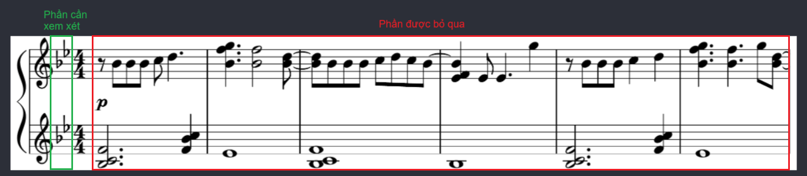
    <p><i>Vùng để xác định âm giai</i></p>
</div>

Sau khi chương trình thu thập được nhóm các dấu hoá này, nó sẽ đếm số **lượng dấu + kí hiệu dấu** và ánh xạ chúng vào một dictionary `SCALE` để xác định âm giai của bản nhạc. Các âm giai được hỗ trợ bao gồm:
```python
SCALE = {
    "0": " C major",  # Không có dấu hoá -> Đô trưởng (La thứ)
    "1b": "F major",  # 1 dấu giáng -> Fa trưởng (Rê thứ)
    "2b": "Bb major", # 2 dấu giáng -> Si giáng trưởng (Sol thứ)
    "3b": "Eb major", # 3 dấu giáng -> Mi giáng trưởng (Đô thứ)
    "4b": "Ab major", # 4 dấu giáng -> La giáng trưởng (Fa thứ)
    "5b": "Db major", # 5 dấu giáng -> Rê giáng trưởng (Si giáng thứ)
    "6b": "Gb major", # 6 dấu giáng -> Sol giáng trưởng (Mi giáng thứ)
    "7b": "Cb major", # 7 dấu giáng -> Đô giáng trưởng (Sol thăng thứ)
    "1s": "G major",  # 1 dấu thăng -> Sol trưởng (Mi thứ)
    "2s": "D major",  # 2 dấu thăng -> Rê trưởng (Si thứ)
    "3s": "A major",  # 3 dấu thăng -> La trưởng (Fa thăng thứ)
    "4s": "E major",  # 4 dấu thăng -> Mi trưởng (Đô thăng thứ)
    "5s": "B major",  # 5 dấu thăng -> Si trưởng (Sol thăng thứ)
    "6s": "F# major", # 6 dấu thăng -> Fa thăng trưởng (Rê thăng thứ)
    "7s": "C# major"  # 7 dấu thăng -> Đô thăng trưởng (La thăng thứ)
}
```

Âm giai này sẽ được sử dụng để xác định cao độ của các nốt nhạc trong bản nhạc.

### 3.1.2.4. Gom nhóm và xác định cao độ của các nốt nhạc
Để xác định cao độ của nốt nhạc, ta phải xem xét vị trị của nó trên khuông nhạc và các dấu hoá đi kèm. Tại một vị trí, có thể có nhiều hơn một nốt nhạc (thường là hợp âm) kết nối với nhau bằng một thân nốt (stem). Các bước thực hiện như sau:

1. **Duyệt và gom nhóm các nốt nhạc**

    Duyệt qua tất cả các nốt nhạc trong khuông nhạc và gom nhóm chúng lại với nhau nếu chúng nằm sát nhau (nếu có). Các nốt nhạc này sẽ được đặt vào một dictionary `notes_data`.

    ```python
    notes_data = {
        "notes": [], # Danh sách tên nốt nhạc
        "head_type": "", # Kiểu đầu nốt nhạc (tròn, trắng, đen, v.v.)
        "flag_type": "", # Kiểu dấu nối (nối, không nối)
        "x1": 0, 
        "x2": 0,
    }
    ```

2. **Xác định cao độ**

    Duyệt qua danh sách các dòng kẻ khuông nhạc và xác định xem nốt nhạc nằm trên dòng kẻ hay nằm giữa 2 dòng kẻ. Trong quá trình gán nhãn của model, do các bounding box luôn có một khoảng cách nhất định so với ký hiệu, nên nếu nốt nhạc **nằm giữa 2 dòng kẻ** thì bounding box sẽ **chứa cả 2 dòng kẻ** này. Ngược lại, nếu nốt nhạc **nằm trên 1 dòng kẻ** thì bounding box sẽ chỉ **chứa 1 dòng kẻ**.

    | | Nốt nằm trên dòng kẻ | Nốt nằm giữa 2 dòng kẻ |
    | --- | --- | --- |
    | Hình ảnh | 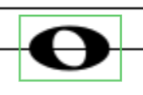 |  |

    Hai trường hợp này sẽ được xử lý như sau:

    - **Trường hợp nốt nằm trên dòng kẻ**: Ta sẽ xác định cao độ của nốt nhạc dựa trên dòng kẻ mà nó nằm trên. Ví dụ, nếu nốt nhạc nằm trên dòng kẻ `D5` thì nó sẽ được gán cao độ là `D5`.
    
    - **Trường hợp nốt nằm giữa 2 dòng kẻ**: Ta sẽ xác định cao độ của nốt nhạc dựa trên dòng kẻ phía dưới nó. Ví dụ, nếu nốt nhạc nằm giữa dòng kẻ `E4` và `G4`, thì nó sẽ được gán cao độ là `F4` dựa vào danh sách thứ tự các nốt `["C", "D", "E", "F", "G", "A", "B"]`. Ngoài ra, nếu nốt nhạc nằm giữa 2 dòng kẻ khác quãng tám (octave) như `B4` và `D5`, thì nốt đó sẽ được gán cao độ là `C5` thay vì `C4`.

    Tuy nhiên, cao độ của các nốt này chưa thực sự chính xác vì nó chưa được xét trên **âm giai** của bản nhạc. Do đó, ta cần ánh xạ các nốt nhạc này vào âm giai của bản nhạc để xác định cao độ chính xác thông qua `NOTES_ON_SCALE`.

    ```python
    NOTES_ON_SCALE = {
        "0": ["C", "D", "E", "F", "G", "A", "B"],
        "1b": ["C", "D", "E", "F", "G", "A", "As"],
        "2b": ["C", "D", "Ds", "F", "G", "A", "As"],
        "3b": ["C", "D", "Ds", "F", "G", "Gs", "As"],
        "4b": ["C", "Cs", "Ds", "F", "G", "Gs", "As"],
        "5b": ["C", "Cs", "Ds", "F", "Fs", "Gs", "As"],
        "6b": ["B", "Cs", "Ds", "F", "Fs", "Gs", "As"],
        "7b": ["B", "Cs", "Ds", "E", "Fs", "Gs", "As"],
        "1s": ["C", "D", "E", "Fs", "G", "A", "B"],
        "2s": ["Cs", "D", "E", "Fs", "G", "A", "B"],
        "3s": ["Cs", "D", "E", "Fs", "Gs", "A", "B"],
        "4s": ["Cs", "Ds", "E", "Fs", "Gs", "A", "B"],
        "5s": ["Cs", "Ds", "E", "Fs", "Gs", "As", "B"],
        "6s": ["Cs", "Ds", "F", "Fs", "Gs", "As", "B"],
        "7s": ["Cs", "Ds", "F", "Fs", "Gs", "As", "Bs"]
    }
    ```

    Tương ứng với mỗi âm giai, các nốt nhạc có thể được **thăng hoặc giáng nửa tông** (semitone) để tạo thành các nốt nhạc khác. Ví dụ, trong âm giai `C major`, nốt nhạc `C` có thể được thăng thành `Cs` hoặc giáng thành `B`. Nhưng có những trường hợp đặc biệt khi một khuông nhạc chứa nhiều hơn 1 khoá nhạc, ví dụ như cả khoá Sol và khoá Fa.

    <div align="center">
        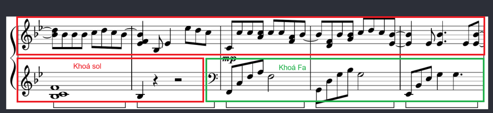
        <p><i>Hai khoá nhạc khác nhau trong cùng một khuông nhạc</i></p>
    </div>

    Trong trường hợp này, ta sẽ phải lưu trữ một **khuông nhạc dự phòng** mà toạ độ dòng kẻ và nốt nhạc được ánh xạ khác với thông thường. Ví dụ, khuông nhạc khoá Fa nhưng lại chứa các nốt nhạc khoá Sol.

    ```python
    # Ví dụ về 5 dòng kẻ chính của 2 khuông nhạc gốc
    treble_staff_lines = { "F5": 0, "D5": 10, "B4": 20, "G4": 30, "E4": 40 }
    bass_staff_lines = { "A3": 80, "F3": 90, "D3": 100, "B2": 110, "G2": 120 }

    # Sau khi ánh xạ lại
    treble_staff_lines_modified = { "F5": 80, "D5": 90, "B4": 100, "G4": 110, "E4": 120 }
    bass_staff_lines_modified = { "A3": 0, "F3": 10, "D3": 20, "B2": 30, "G2": 40 }
    ```

    Không chỉ vậy, trong một số bản nhạc cũng tồn tại những nốt **"ngoại giọng"** (non-scale note) không nằm trong âm giai của bản nhạc. Những nốt này thường được sử dụng để tạo ra những âm thanh đặc biệt để làm phong phú thêm cho bản nhạc. Chúng luôn có dấu hoá đi kèm như **dấu thăng, dấu giáng hoặc dấu bình**. Do đó, ta sẽ không xét đến những nốt này trong quá trình xác định cao độ.

    - Nếu dấu hoá là dấu thăng, ta sẽ thăng nốt nhạc lên nửa tông (semitone).
    - Nếu dấu hoá là dấu giáng, ta sẽ giáng nốt nhạc xuống nửa tông (semitone).
    - Nếu dấu hoá là dấu bình, ta chuyển đổi nốt nhạc về trạng thái không có thăng hoặc giáng.

    Trong một hợp âm, nơi mà các nốt nhạc xếp chồng lên nhau, các dấu hoá cũng xếp chồng lên nhau. Do đó, ta phải xác định đúng dấu hoá tương ứng với nốt nhạc mà nó đi kèm. Thông thường, ta sẽ so sánh xem toạ độ bounding box của nốt nhạc có nằm trong khoảng giữa của dấu hoá hay không, thông qua điều kiện:

    ```python
    if (note.y1 - curr_sharp.y1 >= line_space / 2 and curr_sharp.y2 - note.y2 >= line_space / 2):
        # Xử lý cao độ nốt nhạc
    ```

    <div align="center">
        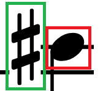
        <p><i>Dấu thăng nằm trước nốt nhạc</i></p>
    </div>

### 3.1.2.5. Xác định trường độ của các nốt nhạc

Đây là một bước khó khăn vì có rất nhiều trường hợp khác nhau mà chương trình cần phải xử lý. Trước tiên, ta sẽ duyệt qua danh sách `flag` và `beam` để xác định vị trí của chúng so với các nốt nhạc. Lúc này, ta sẽ có 2 trường hợp:

1. **Xử lí đuôi nốt**

    Nếu nốt nhạc đi liền với đuôi nốt (`flag`) thì trường độ của nó sẽ được xác định dựa trên kiểu đuôi nốt đó. Các kiểu đuôi nốt đi liền với đầu nốt đen được hỗ trợ bao gồm:

    - **Đuôi nốt đơn**: Có trường độ là `1/8` (eighth note).

    - **Đuôi nốt đôi**: Có trường độ là `1/16` (sixteenth note).

    - **Đuôi nốt ba**: Có trường độ là `1/32` (thirty-second note).

2. **Xử lí dấu nối**

    Nếu nốt nhạc đi liền với dấu nối (`beam`) thì trường độ của nó sẽ được xác định dựa trên kiểu dấu nối đó. Vì dấu nối gồm phần đầu và phần cuối, nên ta phải xử lí chính xác cả hai phần này nếu không muốn có sự sai lệch trong tổng trường độ của ô nhịp. Các bước đễ xử lý như sau:

    Đối với mỗi dấu nối, ta sẽ dùng 2 biến là `start_available` và `end_available` để xác định xem vị trí đầu và cuối của nó còn trống hay không (tức là chưa có nốt nhạc nào được xử lí tại vị trí đó). Tiếp theo, ta sẽ dùng 1 biến `turned_side` để xác định xem dấu nối này có bị lật ngược hay không (hoặc có thể coi là đầu nốt quay về bên trái hay bên phải). Nếu `turned_side` là `True`, thì đầu nốt sẽ quay về bên trái, ngược lại nếu là `False` thì đầu nốt sẽ quay về bên phải.

    <div align="center">
        
        <p><i>Đầu nốt quay về bên trái và phải</i></p>
    </div>
    
    Trong trường hợp có các dấu nối liền nhau, chúng sẽ có những ảnh hưởng với nhau. Ví dụ, `end_available` của dấu nối này sẽ là `start_available` của dấu nối tiếp theo; hay `turned_side` trong một cụm dấu nối sẽ là giống nhau như hình trên.

    Tiếp theo, ta cần xác định **3 trạng thái của dấu nối** trong bản nhạc thông qua các bước sau:

    1. **Trạng thái 1**: Dấu nối có nốt nhạc ở vị trí đầu (thường là dấu hiệu bắt đầu một cụm dấu nối mới)

         Khi này, ta cần xem xét `turned_side` của dấu nối dựa trên bounding box của nốt nhạc và dấu nối. Cụ thể:

        ```python
        beam_start_box_start = abs(curr_beam.x1 - curr_note.x1)
        beam_start_box_end = abs(curr_beam.x1 - curr_note.x2)

        if (beam_start_box_start <= max_space):
            curr_flag["turned_side"] = "right"

        elif (beam_start_box_end <= max_space):
            curr_flag["turned_side"] = "left"
        ```

        | | Nốt nhạc bên trái | Nốt nhạc bên phải |
        | --- | --- | --- |
        | Hình ảnh | 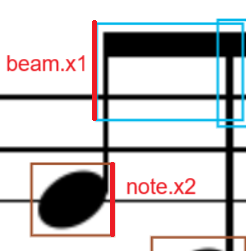 | 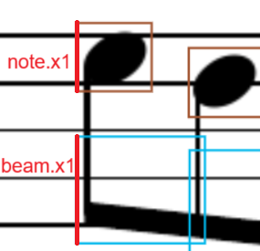 |

        Cuối cùng, trường độ của nốt nhạc sẽ được xác định dựa trên kiểu dấu nối đó, như `eighth note`, `sixteenth note`, `thirty-second note`.
    
    2. **Trạng thái 2**: Dấu nối có nốt nhạc ở vị trí đầu và có nốt nhạc ở vị trí cuối
    
         Trước hết, ta phải kiểm tra `turned_side` xem các nốt này có đang cùng nằm trong cụm dấu nối hay không.
        
        ```python
        beam_end_box_start_next = abs(curr_beam.x2 - next_note.x1) if next_note is not None else 1000
        beam_end_box_end_next = abs(curr_beam.x2 - next_note.x2) if next_note is not None else 1000

        if (
            (curr_flag.turned_side == "right" and beam_end_box_start_next <= max_space) 
            or (curr_flag.turned_side == "left" and beam_end_box_end_next <= max_space)
            ):

            # Xử lý trường hợp nốt nhạc ở vị trí cuối
        ```
        
        Nếu có cùng `turned_side`, ta sẽ xác định xem trường độ của nốt nhạc ở cuối bằng cách so sánh dấu nối hiện tại `curr_beam` và dấu nối kế tiếp `next_beam`. Nếu không có `next_beam` thì trường độ của nốt sẽ là giá trị của dấu nối hiện tại. Nếu có tồn tại, người ta sẽ ưu tiên tính trường độ của nốt nhạc dựa trên **dấu nối có giá trị nhỏ hơn** (ví dụ `sixteenth_beam` sẽ được ưu tiên hơn `eighth_beam`).

        ```python
        BEAM_WEIGHT = {
            "eight": 1/8,
            "sixteenth": 1/16,
            "thirty_second": 1/32,
        }

        def compare_flag_weight(curr_beam, next_beam):
            return BEAM_WEIGHT[next_beam] < BEAM_WEIGHT[curr_beam]
        ```

        <div align="center">
            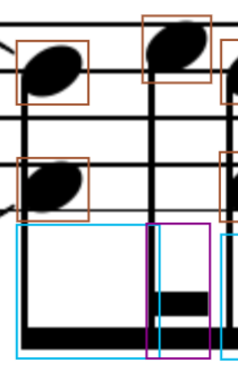
            <p><i>Nốt ở vị trị cuối được ưu tiên trường độ 1/16 thay vì 1/8</i></p>
        </div>
    
    3. **Trạng thái 3**: Dấu nối không có nốt nhạc ở vị trí đầu (hoặc `start_available = False` tức là vị trí đầu đã có nốt nhạc được xử lí trước đó) nhưng lại có nốt nhạc ở vị trí cuối

        Trường hợp này được xử lí tương tự như **Trạng thái 2**. Dưới đây là ví dụ về 2 trường hợp này:

        | | Dấu nối đôi không có nốt nhạc ở vị trí đầu | Dấu nối có nốt nhạc ở vị trí đầu nhưng đã được xử lí |
        | --- | --- | --- |
        | Hình ảnh |  | 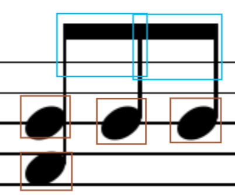 |

    Các nốt nhạc sau khi được xử lí (tức là đã xác định được trường độ) thì sẽ được ghi nhận thông qua biến `start_available` và `end_available` của chúng. Hơn nữa, biến này còn có tác dụng như mốt **"checkpoint"**, kết hợp với `last_valid_note_idx` để đánh dấu vị trí nốt nhạc cuối cùng đã được xử lí. Điều này giúp cho việc quay lại xử lí nốt nhạc tiếp theo của `last_valid_note_idx` được tiếp tục trong trường hợp chương trình bị "mất dấu" nốt nhạc khi xử lí dấu nối.

    <div align="center">
        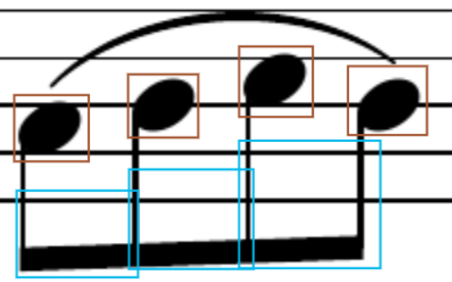
        <p><i>Nốt nhạc cuối cùng bị "mất dấu"</i></p>
    </div>

    Hình ảnh trên là một ví dụ tiêu biểu cho trường hợp này, khi mà có sự sai lệch đủ lớn trong công đoạn gán nhãn dẫn đến `abs(curr_beam.x2 - next_note.x1) > max_space`. Khi này, chương trình sẽ quay lại xử lí nốt nhạc cuối cùng đã được xử lí - nốt thứ 3 - và tiếp tục xử lí nốt nhạc thứ 4.

### 3.1.2.6. Thêm các dấu lặng và vạch nhịp

Các dấu lặng được thêm vào vị trí thích hợp trong `sheet` dựa trên toạ độ của chúng. Do các dấu lặng đã có giá trị trường độ riêng, nên ta không cần phải xử lí thêm gì nữa. Quá trình này sẽ được thực hiện tương tự cho các vạch nhịp.

### 3.1.2.7. Kiểm tra trường độ ô nhịp

Dựa trên toạ độ các vạch nhịp, các kí hiệu trong một ô nhịp sẽ được gom nhóm lại với nhau để kiểm tra trường độ của ô nhịp. Để kiểm tra, ta cần 2 biến là `measure_duration` là **tổng trường độ thực tế** của các nốt nhạc và dấu lặng trong ô nhịp, và `measure_playtime` là **tổng trường độ lý thuyết** của ô nhịp. Thông thường, ta sẽ cho `measure_playtime = 1 * TIME_COEFF`, với `TIME_COEFF` là hệ số thời gian của ô nhịp, được xác định dựa trên kí hiệu nhịp ở đầu khuông nhạc. 

Các kí hiệu nhịp được hỗ trợ bao gồm:
```python
TIME_SIGNATURE_WEIGHT = {
    "two_four": 2/4,
    "three_four": 3/4,
    "four_four": 4/4,
    "five_four": 5/4,
    "six_eight": 6/8,
}
```

Trường độ các nốt nhạc được hỗ trợ bao gồm:
```python
note_playtime = {
    "whole": 1 * measure_playtime,
    "half": 0.5 * measure_playtime,
    "quarter": 0.25 * measure_playtime,
    "eighth": 0.125 * measure_playtime,
    "sixteenth": 0.0625 * measure_playtime,
    "thirty_second": 0.03125 * measure_playtime,
}
```

> Lưu ý: Các nốt nhạc có dấu chấm dôi (dotted note) có trường độ bằng trường độ của nốt nhạc đó cộng với một nửa trường độ của nó. Ví dụ, nốt nhạc `quarter` có trường độ là `0.25 * measure_playtime`, thì nốt nhạc `dotted quarter` sẽ có trường độ là `0.25 * measure_playtime + 0.125 * measure_playtime = 0.375 * measure_playtime`.

Trong một số bản nhạc, đôi khi có sự xuất hiện của nhiều hơn 1 kí hiệu nhịp (tương tự như trường hợp có nhiều hơn 1 khoá nhạc). Khi này, ta sẽ phải xử lí tương tự như trường hợp có nhiều hơn 1 khoá nhạc bằng các cập nhật `TIME_COEFF` dựa trên `TIME_SIGNATURE_WEIGHT`để tính `measure_playtime`. Hình ảnh dưới đây là một ví dụ cho trường hợp này:

<div align="center">
    
    <p><i>Bản nhạc ban đầu có nhịp 4/4</i></p>
</div>

<div align="center">
    
    <p><i>Bản nhạc sau đó có nhịp 2/4</i></p>
</div>


Cuối cùng, ta sẽ thêm ô nhịp này vào `sheet` với định dạng như sau:

```python
symbols = [
    {
        "barline": "barline", # Vạch nhịp
    },
    {
        "notes": [ # Danh sách các nốt nhạc của hợp âm
            "As4",
            "F4",
            "Ds5",
        ],
        "head_type": "black", # Kiểu đầu nốt nhạc (tròn, trắng, đen, v.v.)
        "flag_type": "eighth", # Trường độ nốt nhạc (1/8, 1/16, 1/32, v.v.)
    },
    {
        "rest": "quarter", # Dấu lặng
    },
    # ... Các ký hiệu khác trong ô nhịp
]

measure = {
    "measure": measure_idx, # Số thứ tự ô nhịp
    "symbols": symbols, # Danh sách các ký hiệu trong ô nhịp
    "measure_duration": measure_duration, # Tổng trường độ thực tế của ô nhịp
    "measure_playtime": measure_playtime * TIME_COEFF[0], # Tổng trường độ lý thuyết của ô nhịp
}

sheet.append(measure)
```

### 3.1.2.8. Xuất kết quả

Cuối cùng, sau khi đã xử lí xong tất cả các ô nhịp trong bản nhạc, ta sẽ xuất kết quả ra file JSON với định dạng như sau:

```json
{
    "sheet": [
        {
            "measure": 1,
            "symbols": [
                {
                    "barline": "barline",
                },
                {
                    "notes": [
                        "As4",
                        "F4",
                        "Ds5",
                    ],
                    "head_type": "black",
                    "flag_type": "eighth",
                },
                {
                    "rest": "quarter",
                },
            ],
            "measure_duration": 0.5,
            "measure_playtime": 1.0,
        },
        # ... Các ô nhịp khác
    ]
}
```

Hệ thống chuyển đổi dữ liệu JSON này sang định dạng âm thanh sẽ dùng các audio của nốt nhạc được lưu trữ sẵn và kết hợp chúng lại với các khoảng thời gian tương ứng để tạo thành bản nhạc hoàn chỉnh.

## 3.2. Xây dựng đầu ra âm thanh của bản nhạc
### 3.2.1. Tổng quan

Việc xây dựng đầu ra âm thanh của bản nhạc là bước cuối cùng trong quy trình chuyển đổi từ ảnh sang âm thanh. Sau khi đã chuyển đổi dữ liệu từ dạng thông số kỹ thuật sang dạng nhạc lý, ta sẽ tiến hành tạo ra âm thanh tương ứng với các ký hiệu âm nhạc. Quá trình này được thực hiện thông qua các bước sau:

1. **Lựa chọn âm thanh của nhạc cụ**: Chọn âm thanh của nhạc cụ mà ta muốn sử dụng để phát bản nhạc theo lựa chọn của người dùng. Các nhạc cụ được hỗ trợ bao gồm piano, guitar, violin, v.v. Nhưng mặc định sẽ là `classical_piano`.

2. **Kết hợp nốt nhạc và quãng nghỉ**: Dựa trên các ký hiệu âm nhạc trong bản nhạc, ta sẽ kết hợp các nốt nhạc và quãng nghỉ lại với nhau để tạo thành âm thanh hoàn chỉnh. Các nốt nhạc sẽ được phát theo thứ tự đúng với dữ liệu đầu vào. Quá trình này bao gồm các thao tác xử lí một số hiệu ứng làm hư âm thanh như rè (buzzing), có tiếng nổ lách tách (crackling), chói tai (distortion), v.v.

3. **Kết hợp khuông nhạc Treble và Bass**: Chồng 2 khuông nhạc Treble và Bass lại với nhau để tạo thành một bản nhạc hoàn chỉnh. Quá trình này cũng có các thao tác giới hạn mức âm lượng của khuông nhạc và tổng thể bản nhạc để tránh việc âm thanh bị chói.

4. **Xuất âm thanh**: Cuối cùng, ta sẽ xuất âm thanh đã tạo ra thành một file âm thanh với định dạng MP3 và trả về cho người dùng.

### 3.2.2. Chi tiết
### 3.2.2.1. Lựa chọn âm thanh của nhạc cụ

Mỗi nhạc cụ có một âm thanh riêng biệt và chúng mang lại những cảm xúc khác nhau cho người nghe. Do đó, việc lựa chọn âm thanh của nhạc cụ là rất quan trọng trong quá trình tạo ra âm thanh của bản nhạc. Hệ thống sẽ cung cấp cho người dùng một danh sách các nhạc cụ có sẵn và cho phép họ chọn nhạc cụ mà họ muốn sử dụng. Các nhạc cụ được hỗ trợ bao gồm:

- **Classical Piano**: Âm thanh của đàn piano cổ điển, rất phổ biến trong âm nhạc cổ điển và hiện đại.

- **Auditorium Piano**: Âm thanh của đàn piano trong một không gian lớn, tạo ra âm thanh vang vọng và mạnh mẽ.

- **Upright Piano**: Âm thanh của đàn piano đứng, thường được sử dụng trong các bản nhạc nhẹ nhàng và tình cảm.

- **Jazz Piano**: Âm thanh của đàn piano jazz, mang lại cảm giác ấm áp với những âm thanh ngọt ngào và du dương.

- **Organ**: Âm thanh của đàn organ, thường được sử dụng trong các bản nhạc rock và pop.

- **Classical Guitar**: Âm thanh của đàn guitar cổ điển, rất phổ biến trong âm nhạc dân gian và cổ điển.

- **Harp**: Âm thanh của đàn hạc, mang lại cảm giác nhẹ nhàng và thanh thoát.

- **Violin**: Âm thanh của đàn violin, thường được sử dụng trong các bản nhạc cổ điển và hiện đại.

Với mỗi nhạc cụ, hệ thống sẽ lưu trữ 88 âm thanh trải dài từ `A0` đến `C8` (tương ứng với 88 phím đàn piano) trong một thư mục riêng biệt. Mỗi âm thanh đều có trường độ phù hợp để đáp ứng đầy đủ các nốt trong bản nhạc. Tuy nhiên, đối với một số nhạc cụ như violin, guitar, v.v. thì ta cần giảm mức âm thanh của dải tần số thấp (bass) xuống để làm nổi bật hơn dải tần số cao (treble), vốn là đặc trưng của các nhạc cụ này.

Trong hệ thống này, ta sẽ sử dụng thư viện `pydub` để xử lý âm thanh. Thư viện này cho phép ta dễ dàng kết hợp các âm thanh lại với nhau và xuất chúng thành file âm thanh với định dạng MP3. Để giảm thời gian xử lý, ta sẽ sử dụng `ThreadPoolExecutor` để xử lí song song đầu ra của các khuông nhạc và một dictionary `USED_NOTES` được sử dụng chung giữa các `thread` để lưu trữ những âm thanh đã được tải từ file mp3, tránh việc tải lại nhiều lần cùng một âm thanh. 

```python
from concurrent.futures import ThreadPoolExecutor

# Xử lí song song các khuông nhạc
with ThreadPoolExecutor() as executor:
    results = list(executor.map(process_zone, music_sheet, [measure_playtime] * len(music_sheet), [note_playtime] * len(music_sheet)))
```

```python
import threading
from pydub import AudioSegment

# Shared dictionary
USED_NOTES = {}
USED_NOTES_LOCK = threading.Lock()

with USED_NOTES_LOCK:
    if note not in USED_NOTES:
        USED_NOTES[note] = AudioSegment.from_mp3(f"{instrument_path}/{note}.mp3")
```

### 3.2.2.2. Kết hợp nốt nhạc và quãng nghỉ

Thời gian thể hiện của mỗi ô nhịp được xác định bằng `measure_playtime`, tương ứng với tổng thời gian lý thuyết của ô nhịp. Tuy nhiên, nếu thời gian chỉ đúng bằng `measure_playtime`, thì âm thanh ở cuối ô nhịp sẽ bị ngắt quãng và chuyển qua ô nhịp tiếp theo ngay lập tức. Điều này sẽ làm cho âm thanh nghe không được tự nhiên và không có độ ngân vang (sustain). Do đó, ta sẽ thêm một khoảng duy trì âm, bằng `0.25` lần thời gian ô nhịp, vào cuối ô nhịp hiện tại và chồng ô nhịp tiếp theo lên ngay sau `measure_playtime` của ô nhịp hiện tại.

<div align="center">
    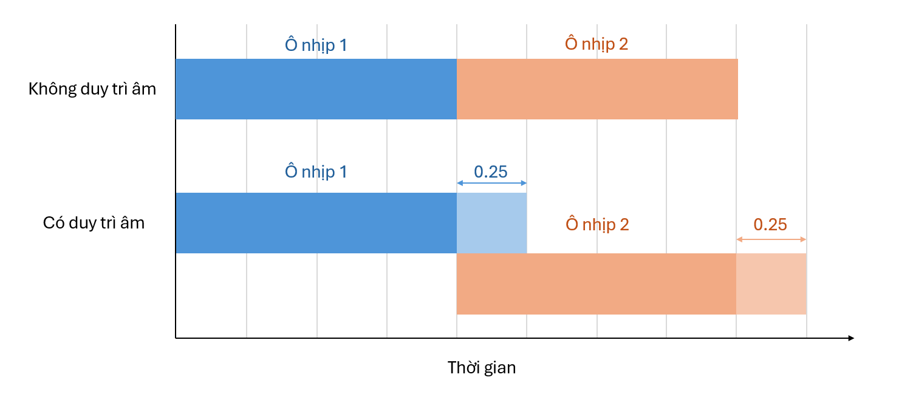
    <p><i>Ô nhịp không được duy trì âm thanh và ô nhịp được duy trì âm thanh</i></p>
</div>

Trước khi thêm âm thanh của các nốt vào ô nhịp, ta sẽ tạo ra một ô nhịp trống với thời gian bằng `measure_playtime * 1.25`. Sau đó, ta duyệt qua các ký hiệu trong ô nhịp và thêm vào ô nhịp trống theo các bước sau:

1. **Xử lí độ lớn của âm thanh gốc**:

    Nếu ký hiệu là một hoặc nhiều nốt nhạc, ta sẽ tải âm thanh của nốt nhạc từ file có định dạng `{instrument}/{note}.mp3` và thêm nó vào `USED_NOTES` để tránh việc tải lại nhiều lần cùng một âm thanh. Sau này khí phát âm thanh, ta sẽ sử dụng âm thanh đã được tải từ `USED_NOTES`.

    Tiếp theo, ta sẽ chồng âm thanh của các nốt nhạc này lên nhau để tạo ra một hợp âm (chord). Trước khi làm điều này, ta phải đảm bảo rằng âm lượng của các âm thanh này không được phép vượt quá ngưỡng cho phép, để tránh việc âm thanh quá lớn gây méo (distortion). Do đó ứng với mỗi nốt trong hợp âm, ta sẽ sử dụng `apply_gain` để điều chỉnh âm lượng của nó về mức tối ưu nhất dựa trên số lượng nốt nhạc trong hợp âm.

    ```python
    note_audio = USED_NOTES[note].apply_gain(-4 * (num_notes - 1))
    ```

    Để làm rõ hơn về việc độ lớn của hợp âm sẽ giảm đi bao nhiêu, ta sẽ dùng công thức **Mức cường độ âm**:

    ```math
    L = 10 \cdot log_{10} \left( \frac{I}{I_0} \right) \text{ (dB)}
    ```

    Trong đó:
    - `L`: Mức cường độ âm (đơn vị là dB).
    - `I`: Cường độ âm (đơn vị là W/m²).
    - `I0`: Cường độ âm chuẩn (đơn vị là W/m²), thường được lấy là `10^-12 W/m²`.

    Từ đó, ta có thể tính được

    ```math
    I_{i} = 10^{\frac{L_{i}}{10}} \cdot I_0 \text{ (W/m²)}
    ```

    Do đó, ta dễ dàng tính ra được tổng cường độ âm của các âm thanh có cùng mức cường độ âm là:

    ```math
    I_{total} = \sum_{i=1}^{n} I_{i} = n \cdot 10^{\frac{L_{i}}{10}} \cdot I_0 \text{ (W/m²)}
    ```

    Như vậy, ta có thể tính được mức cường độ âm của hợp âm là:

    ```math
    L_{total} = 10 \cdot log_{10} \left( \frac{I_{total}}{I_0} \right) = 10 \cdot log_{10} \left( n \cdot 10^{\frac{L_{i}}{10}} \right) = L_{i} + 10 \cdot log_{10}(n)
    ```

    Ví dụ, một hợp âm có 4 nốt nhạc và mỗi nốt được giảm đi `-4 * (4 - 1) = -12 dB`, thì mức cường độ âm của hợp âm sẽ giảm gần `6 db`:

    ```math
    L_{total} = L_{i} + 10 \cdot log_{10}(4) = (L_{i} - 12) + 10 \cdot log_{10}(4) = L_{i} - 12 + 6.0205 = L_{i} - 5.9795 \approx L_{i} - 6 (dB)
    ```

2. **Phân bố âm thanh stereo**:

    Âm thanh stereo là âm thanh được phát ra từ hai kênh âm thanh khác nhau, tạo ra hiệu ứng không gian cho người nghe. Để tạo ra âm thanh stereo, ta sẽ phân bố các nốt nhạc trong hợp âm vào hai kênh trái và phải của âm thanh.

    ```python
    pan_value = random.uniform(-0.15, 0.15)
    note_audio = note_audio.pan(pan_value)
    ```

    Trong đó, `pan_value` là giá trị phân bố âm thanh, có thể nằm trong khoảng từ `-1` đến `1`, với `-1` là âm thanh chỉ phát ra từ kênh trái và `1` là âm thanh chỉ phát ra từ kênh phải. Ta sẽ sử dụng hàm `random.uniform(-0.15, 0.15)` để tạo ra một giá trị ngẫu nhiên trong khoảng này, giúp ngăn chặn việc âm thanh bị lệch quá nhiều về một bên gây chói tai cho người nghe.

3. **Xây dựng hợp âm**:

    Sau khi đã xử lí độ lớn của âm thanh gốc và phân bố âm thanh stereo, ta sẽ tạo ra một hợp âm bằng cách chồng các nốt nhạc lại với nhau. Để làm điều này, ta sẽ sử dụng hàm `overlay` với các offset khác nhau trong khoảng từ `5ms` đến `25ms`. Điều này giúp tạo ra hiệu ứng âm thanh tự nhiên hơn, giống như khi người chơi ấn các nốt nhạc cùng một lúc nhưng không hoàn toàn đồng bộ với nhau.

    ```python
    chord = notes[0]
    for i, note in enumerate(notes[1:], 1):
        chord = chord.overlay(note, position=random.uniform(5, 25))
    ```

4. **Thiết lập trường độ cho hợp âm**:

    Trước hết, ta sẽ tính toán trường độ lý thuyết của hợp âm bằng cách lấy trường độ của nốt nhạc đầu tiên trong hợp âm và xử lí các nốt có dấu chấm dôi (dotted note) bằng cách cộng thêm một nửa trường độ của nó.

    ```python
    note_type = symbol.flag_type if symbol.flag_type else symbol.head_type # Kiểu nốt nhạc (có đuôi nốt hay không có đuôi nốt)

    chord_duration = note_playtime[note_type]

    # Tăng trường độ cho nốt nhạc có dấu chấm dôi
    if "dotted" in symbol.head_type:
        chord_duration += note_playtime[note_type] / 2
    ```

    Tương tự như xây dựng ô nhịp, ta sẽ điều chỉnh trường độ cho hợp âm bằng cách thêm một khoảng duy trì âm vào cuối hợp âm. Khoảng duy trì âm này sẽ được tính bằng `chord_duration * 1.5` nếu có thể. Hơn nữa, ta áp dụng `fade_in` và `fade_out` bằng `50ms` để tạo ra hiệu ứng mờ dần cho âm thanh, giúp âm thanh nghe tự nhiên hơn. Cuối cùng, ta sẽ thêm hợp âm này vào ô nhịp trống đã tạo ở bước 1.

    ```python
    # Thêm khoảng duy trì âm vào cuối hợp âm
    chord = chord[:int(chord_duration * 1.5)]

    # Fade in và fade out
    chord = chord.fade_in(50).fade_out(50)
    ```

    <div align="center">
        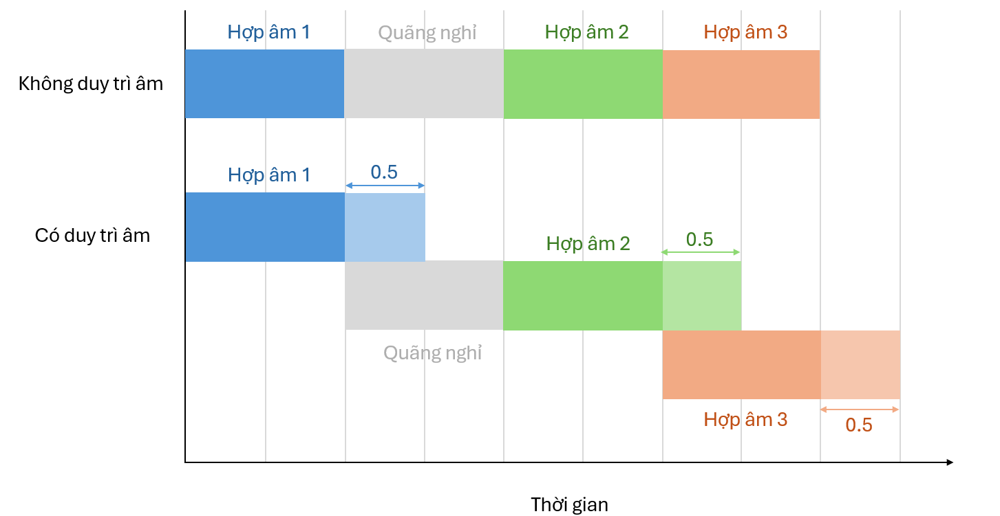
        <p><i>Hợp âm không được duy trì âm thanh và hợp âm được duy trì âm thanh</i></p>
    </div>

5. **Thêm quãng nghỉ (nếu có)**:

    Nếu ký hiệu là một quãng nghỉ, ta sẽ tạo ra một âm thanh trống với thời gian bằng trường độ của quãng nghỉ.
    
### 3.2.2.3. Kết hợp khuông nhạc Treble và Bass

Sau khi đã xử lí xong tất cả ô nhịp của mỗi khuông nhạc, ta sẽ kết hợp 2 khuông nhạc Treble và Bass lại với nhau. Tuy nhiên, trước khi chồng 2 âm thanh này lên nhau, ta cần đảm bảo rằng mức âm lượng không vượt quá ngưỡng cho phép. Do đó, ta sẽ điều chỉnh mức âm lượng của `treble_audio` và `bass_audio` về mức âm tối ưu.

```python
treble_audio = treble_audio.apply_gain(TARGET_DBFS.treble - treble_audio.dBFS)
bass_audio = bass_audio.apply_gain(TARGET_DBFS.bass - bass_audio.dBFS)
```

Để đảm bảo hơn nữa, ta sẽ kiểm soát mức âm lượng tối đa của âm thanh sau khi chồng 2 khuông nhạc lại với nhau bằng cách điều chỉnh `max_dBFS` của âm thanh tổng hợp. Nếu mức âm lượng vượt quá ngưỡng cho phép, ta sẽ giảm âm lượng của âm thanh tổng hợp về mức tối ưu.

```python
if mix_audio.max_dBFS > -0.1:
    mix_audio = mix_audio.apply_gain(-mix_audio.max_dBFS - 0.5)
```

### 3.2.2.4. Xuất âm thanh

Cuối cùng, ta sẽ xuất âm thanh đã tạo ra thành một file âm thanh với định dạng `mp3`, bitrate là `320kbps` và trả về cho người dùng. Tên của file sẽ được đặt dựa trên `uuid` của hệ thống nên sẽ không bị trùng lặp với các file âm thanh khác.

```python
final_audio.export(f"output/{str(uuid4())}.mp3", format="mp3", bitrate="320k")
```

# 4. Một số kỹ thuật và thư viện được sử dụng trong hệ thống
## 4.1. Server-Sent Events (SSE)
### 4.1.1. Giới thiệu

Server-Sent Events (SSE) là một công nghệ giao tiếp web một chiều cho phép server chủ động đẩy dữ liệu đến client mà không cần client phải liên tục gửi yêu cầu mới. SSE được xây dựng trên nền tảng HTTP và sử dụng một kết nối duy nhất, được duy trì trong thời gian dài để truyền dữ liệu theo thời gian thực.

SSE được giới thiệu như một phần của đặc tả HTML5, với mục tiêu cung cấp một phương thức đơn giản hơn WebSockets cho các tình huống chỉ cần giao tiếp một chiều từ server đến client. Công nghệ này được phát triển để thay thế các kỹ thuật polling truyền thống, vốn kém hiệu quả và tạo nhiều tải cho server.

SSE hoạt động theo nguyên tắc sau:

- **Thiết lập kết nối:** Client khởi tạo một kết nối HTTP đến server với header `Accept: text/event-stream`.

- **Duy trì kết nối:** Server giữ kết nối HTTP mở và không đóng sau khi gửi response.

- **Truyền dữ liệu:** Server gửi dữ liệu theo định dạng đặc biệt qua kết nối này, mỗi thông điệp bắt đầu bằng `data:` và kết thúc bằng hai ký tự xuống dòng (`\n\n`).

- **Xử lý dữ liệu:** Client nhận và xử lý các thông điệp này theo thời gian thực thông qua JavaScript API `EventSource`.

- **Kết nối lại tự động:** Nếu kết nối bị mất, trình duyệt tự động thử kết nối lại theo một thuật toán chờ tăng dần.

### 4.1.2. Hoạt động của SSE trong hệ thống
### Phía client

Quy trình hoàn chỉnh khi người dùng tải lên file PDF được mô tả như sau:

1. **Khởi tạo request upload:**

- User chọn file PDF và nhấn nút "Upload File"
- Client tạo FormData và gửi file lên endpoint `/api/upload` qua POST request

2. **Xử lý file trên server:**

- Server nhận file, lưu và trả về `session_id` để định danh phiên xử lý

3. **Thiết lập kết nối SSE:**

- Client tạo đối tượng `EventSource` kết nối tới endpoint `/api/stream/${sessionId}`
Server giữ kết nối này mở và bắt đầu xử lý PDF

4. **Stream dữ liệu theo thời gian thực:**

- Server xử lý PDF, tách thành các ảnh, phân tích từng vùng chứa ký hiệu âm nhạc
- Mỗi khi xử lý xong một vùng, server gửi dữ liệu qua kết nối SSE với định dạng:
    ```json
    {
        "filename": filename,
        "page": i + 1,
        "zone": j + 1,
        "image": image_base64,
        "boxes": extract_boxes,
        "staff_lines": staff_lines
    }
    ```

5. **Client nhận và xử lý dữ liệu:**

- Client nhận được sự kiện `onmessage` cho mỗi chunk dữ liệu gửi từ server
- Dữ liệu được parse từ JSON và thêm vào state `images`
- UI cập nhật để hiển thị hình ảnh và các box nhận diện được
- Dữ liệu được lưu vào localStorage để sử dụng sau này

6. **Kết thúc luồng SSE:**

- Khi xử lý tất cả vùng trên các trang PDF, server gửi message "done"
- Client nhận được thông báo này, đóng kết nối SSE và cập nhật trạng thái UI

7. **Xử lý lỗi:**

- Nếu có lỗi xảy ra, sự kiện onerror được kích hoạt
- Client đóng kết nối và hiển thị thông báo lỗi

### Phía server

Quy trình xử lý file PDF và gửi dữ liệu qua SSE được thực hiện như sau:

1. **Nhận file PDF:**

- Server nhận file PDF từ client qua endpoint `/api/upload`
- Lưu file vào thư mục và tạo một cặp `(key, value)` với `session_id` là key và value là một đối tượng chứa thông tin về file PDF, bao gồm đường tên file, đường dẫn lưu trữ và trạng thái xử lý
    ```json
    {
        "filename": saved_filename,
        "path": save_path,
        "status": "uploaded" 
    }
    ```

2. **Xác thực và lấy dữ liệu từ phiên:**

- Khi client gửi yêu cầu đến endpoint `/api/stream/${sessionId}`, server xác thực `session_id`
- Nếu hợp lệ, server lấy thông tin của file PDF cần được xử lý

3. **Truyền dữ liệu theo thời gian thực:**

- **Xử lý tuần tự các trang PDF:**

    Chuyển đổi PDF thành danh sách các ảnh sử dụng thư viện `pdf2image` và `poppler`

    ```python
    images = convert_from_path(pdf_path, dpi=300, fmt='png')
    ```

    Với mỗi ảnh đại diện cho mỗi trang, hệ thống chuyển đổi ảnh thành định dạng `byte` và phân tách thành các vùng khuông nhạc

    ```python
    img_io = io.BytesIO()
    img.save(img_io, "PNG")
    staff_zones = separate_staff_zones(img_io)
    ```

- **Xử lý chi tiết từng vùng:**

    Trích xuất thông tin và loại bỏ các dòng kẻ khuông nhạc

    ```python
    staff_lines = extract_staff_lines(zone)
    zone_no_lines = remove_staff_lines(zone)
    ```

    Trích xuất các box chứa ký hiệu âm nhạc

    ```python
    zone_io = io.BytesIO()
    zone_image.save(zone_io, "PNG")
    extrac_boxes = extract_boxes(zone_io)
    ```

- **Gửi dữ liệu từng phần:**

    Mỗi khi xử lý xong một vùng, server đóng gói kết quả vào `json` và sử dụng `yeild` để gửi dữ liệu ngay lập tức qua kết nối SSE

    ```python
    yield f"data: {json.dumps(data)}\n\n"
    ```

- **Báo hiệu hoàn thành:**

    Khi xử lý xong tất cả trang và vùng, server gửi thông báo `"data:done\n\n"`
    
    Xoá file PDF gốc và các thông tin phiên xử lý trong bộ nhớ

    ```python
    os.remove(pdf_path)
    del sessions[session_id]
    ```

## 4.2. WebSocket
### 4.2.1. Giới thiệu

WebSocket là một giao thức truyền thông hai chiều, thời gian thực cho phép giao tiếp song song giữa client và server qua một kết nối TCP duy nhất. Khác với HTTP truyền thống, WebSocket cung cấp kênh giao tiếp liên tục và không cần thiết lập lại kết nối cho mỗi tương tác.

WebSocket được giới thiệu trong HTML5 nhằm giải quyết các hạn chế của các kỹ thuật trước đây như polling và long polling, vốn không hiệu quả và tốn tài nguyên. Giao thức này được thiết kế để hoạt động trên cơ sở hạ tầng web hiện có, tương thích với proxy và tường lửa.

WebSocket hoạt động theo nguyên tắc sau:

- **Thiết lập kết nối:** Client khởi tạo "handshake" HTTP đến server với header `Upgrade: websocket`, yêu cầu nâng cấp kết nối HTTP thành WebSocket.

- **Chuyển đổi giao thức:** Server chấp nhận yêu cầu và trả về status code 101 (Switching Protocols), chuyển đổi kết nối HTTP thành WebSocket.

- **Truyền dữ liệu hai chiều:** Sau khi thiết lập, cả client và server đều có thể chủ động gửi dữ liệu cho nhau bất kỳ lúc nào mà không cần chờ yêu cầu.

- **Gửi tin nhắn có cấu trúc:** Dữ liệu được truyền dưới dạng "tin nhắn" riêng biệt trong các khung (frames), không phải dòng dữ liệu liên tục.

- **Đóng kết nối:** Bất kỳ bên nào cũng có thể chủ động đóng kết nối bằng cách gửi khung đóng kết nối.

### 4.2.2. Hoạt động của WebSocket trong hệ thống
### Phía client

- **Thiết lập kết nối:**

    Client khởi tạo kết nối WebSocket đến server với URL `/audio` và sử dụng thư viện `socket.io-client` để quản lý kết nối.

    ```javascript
    const socket = io("/audio", {
        transports: ["websocket"],
    });
    ```

    Sau khi kết nối thành công, client sẽ lưu `socketId` nhận được từ server, được sử dụng để xác định phiên làm việc cụ thể.

    ```javascript
    socket.on("connect", () => {
        sessionStorage.setItem('socketId', socket.id);
    });
    ```

- **Gửi yêu cầu tạo audio:**

    Khi người dùng nhấn nút "Create Audio", client gửi yêu cầu POST đến endpoint `/api/audio` với `socketId` trong body. Server sẽ sử dụng `socketId` này để gửi dữ liệu về trạng thái tiến trình tạo audio.

    ```javascript
    const socketId = sessionStorage.getItem('socketId');

    const data = {
        "music_sheet": musicSheetData,
        "measure_playtime": measurePlaytime,
        "audio_theme": selectedAudioTheme,
        "socket_id": socketId,
    }

    const response = await fetch("/api/generate-audio", {
        method: "POST",
        headers: {
            "Content-Type": "application/json",
        },
        body: JSON.stringify(data),
    });
    ```

- **Nhận dữ liệu từ server:**

    Client sẽ nhận về phản hồi loại `multipart/mixed` có chứa các checkpoints (loại `application/json`) và audio (loại `audio/mp3`).

    ```python
    response_body = (
        f"--{boundary}\r\n"
        "Content-Type: application/json\r\n\r\n"
        f"{json.dumps(checkpoints)}\r\n"
        f"--{boundary}\r\n"
        "Content-Type: audio/mp3\r\n"
        f"Content-Disposition: attachment; filename={filename}\r\n\r\n"
    ).encode("utf-8") + audio_data + f"\r\n--{boundary}--\r\n".encode("utf-8")

    response = Response(
        response_body,
        mimetype=f"multipart/mixed; boundary={boundary}",
        headers={"Content-Length": str(len(response_body))},
    )
    ```

    Client khởi tạo audio blob từ phản hồi và tạo URL cho nó, sau đó sử dụng `Audio` API để phát âm thanh.

    ```javascript
    const audioBlob = new Blob([audioResponse], { type: "audio/mp3" });
    const audioUrl = URL.createObjectURL(audioBlob);
    ```

### Phía server

- **Khởi tạo WebSocket server:**

    Hệ thống sử dụng `socketio` bằng `SocketIO()` từ một model riêng biệt, hỗ trợ đa luồng (`async_mode='threading'`) vì quá trình tạo ra âm thanh của các khuông nhạc cũng dùng **đa luống**. Ngoài ra, nó còn tránh **circular import** khi import và cho phép sử dụng đối tượng `socketio` trong nhiều file khác nhau.    

- **Truyền dữ liệu qua WebSocket:**

    Server lấy `socket_id` từ POST request để xác định chính xác client đang kết nối. Sau đó, server gửi dữ liệu bằng phương thức `emit` của `socketio` với tên sự kiện là `status_update` và dữ liệu là một dictionary chứa thông tin về quá trình tạo ra audio của bản nhạc.

    ```python
    socket_io.emit(
        "status_update", 
        {
            "message": f"Processing sheet {i+1}/{len(music_sheet)}",
            "progress": progress
        }, 
        namespace="/audio", 
        to=socket_id
    )
    ```

- **Đóng kết nối:**

    Khi quá trình tạo audio hoàn tất, server gửi thông báo `"done"` qua WebSocket và đóng kết nối. Client sẽ nhận được thông báo này và có thể thực hiện các hành động tiếp theo như tải xuống file audio hoặc cập nhật giao diện người dùng.

    ```python
    socket_io.emit(
        "status_update", 
        {"message": "done"}, 
        namespace="/audio", 
        to=socket_id
    )
    ```

## 4.3. Multi-threading
### 4.3.1. Giới thiệu

Multi-threading là một kỹ thuật lập trình cho phép thực hiện nhiều luồng (thread) song song trong cùng một tiến trình (process). Mỗi luồng có thể thực hiện một tác vụ riêng biệt, giúp tăng hiệu suất và khả năng phản hồi của ứng dụng. Kỹ thuật này rất hữu ích trong các ứng dụng yêu cầu xử lý đồng thời nhiều tác vụ, như tải lên file, xử lý dữ liệu, hoặc giao tiếp mạng.

Trong quá trình tạo ra âm thành cho bản nhạc, `ThreadPoolExecutor` được sử dụng để tạo ra một nhóm các luồng (thread) để xử lý các khuông nhạc một cách song song. Điều này giúp giảm thời gian xử lý tổng thể và cải thiện hiệu suất của hệ thống, đặc biệt là khi các nốt nhạc có thể được sử dụng lại thông qua `USED_NOTES` dùng chung cho tất cả các `thread` đang chạy.

### 4.3.2. Sự phù hợp của multi-threading trong hệ thống

Một điểm nổi bật trong việc triển khai `ThreadPoolExecutor` là cách thu thập và kết hợp kết quả:

- **Thu thập theo thứ tự:** Mặc dù các tác vụ được thực hiện song song, kết quả được thu thập và sắp xếp theo thứ tự ban đầu của khuông nhạc để đảm bảo tính nhất quán của bản nhạc.

- **Cập nhật tiến trình hai giai đoạn:** Quá trình được chia thành hai giai đoạn: xử lý song song (0-50%) và kết hợp kết quả (50-100%), cho phép hiển thị tiến trình chính xác hơn.

- **Quản lý checkpoints:** Các checkpoint được điều chỉnh để phản ánh vị trí chính xác trong file âm thanh cuối cùng, cho phép người dùng nhảy đến các phần cụ thể của bản nhạc khi phát lại.

## 4.4. Các thư viện khác
### 4.4.1. React JSON View

React JSON View là một thư viện React cho phép hiển thị và tương tác với dữ liệu JSON một cách dễ dàng và trực quan. Thư viện này cung cấp một giao diện người dùng đẹp mắt để xem cấu trúc của dữ liệu JSON, cho phép người dùng mở rộng/thu gọn các phần tử, sao chép dữ liệu và thậm chí chỉnh sửa trực tiếp trong giao diện.

Trong hệ thống, React JSON View được sử dụng để hiển thị dữ liệu JSON của bản nhạc đã được xử lý. Người dùng có thể di chuyển qua các ô nhịp, khuông nhạc, trang khác nhau và xem các thông tin chi tiết về từng ký hiệu âm nhạc. Điều này giúp người dùng dễ dàng theo dõi và kiểm tra dữ liệu mà hệ thống đã nhận diện được.

### 4.4.2. React Toastify

React Toastify là một thư viện React cho phép hiển thị thông báo (toast notifications) một cách dễ dàng và tùy chỉnh. Thư viện này cung cấp nhiều tùy chọn để hiển thị thông báo với các kiểu dáng khác nhau, thời gian tự động đóng, vị trí hiển thị và nhiều tính năng khác.

Trong hệ thống, React Toastify được sử dụng để hiển thị các thông báo cho người dùng trong quá trình tải lên file PDF, xử lý âm thanh và các thông báo lỗi. Điều này giúp người dùng nhận biết được trạng thái của hệ thống và có thể thực hiện các hành động tiếp theo một cách dễ dàng hơn.

### 4.4.3. WaveSurfer.js

WaveSurfer.js là một thư viện JavaScript cho phép hiển thị và tương tác với sóng âm thanh trong trình duyệt. Thư viện này cung cấp nhiều tính năng như phóng to/thu nhỏ, kéo thả, tạo điểm đánh dấu và nhiều tính năng khác để làm việc với âm thanh.

Trong hệ thống, WaveSurfer.js được sử dụng để hiển thị sóng âm thanh của bản nhạc đã được xử lý. Người dùng có thể tương tác với sóng âm thanh, chọn các đoạn âm thanh cụ thể và phát lại chúng. Điều này giúp người dùng dễ dàng kiểm tra và chỉnh sửa âm thanh của bản nhạc theo ý muốn.

### 4.4.4. pdf2image

pdf2image là một thư viện Python cho phép chuyển đổi file PDF thành các hình ảnh (image) với độ phân giải cao. Thư viện này sử dụng `poppler` để thực hiện việc chuyển đổi và hỗ trợ nhiều định dạng hình ảnh khác nhau như PNG, JPEG, BMP, v.v.
Thư viện này rất hữu ích trong việc xử lý các file PDF, đặc biệt là trong các ứng dụng cần phân tích nội dung của file PDF như OMR.

# 5. Kết luận

Dự án "Hệ thống Nhận diện bản nhạc quang học và Xử lý âm thanh cho Piano" đã thành công trong việc kết hợp nhiều công nghệ hiện đại để tạo ra một hệ thống hoàn chỉnh có khả năng chuyển đổi bản nhạc từ hình ảnh sang âm thanh. Mặc dù còn một số hạn chế, hệ thống đã chứng minh tiềm năng của công nghệ OMR trong việc số hóa và phát triển nguồn tài nguyên âm nhạc.

Về mặt kỹ thuật, dự án đã thành công trong việc áp dụng mô hình YOLOv8 cho việc nhận diện ký hiệu âm nhạc, đạt mAP50 hơn 85% trên tập dữ liệu kiểm thử. Hệ thống cũng giải quyết hiệu quả các thách thức trong việc xử lý dữ liệu âm nhạc như xác định cao độ, trường độ của các nốt nhạc, và kết hợp các khuông nhạc khác nhau. Công cụ chỉnh sửa nhãn trực quan đã cung cấp giải pháp hữu ích cho việc cải thiện độ chính xác của quá trình nhận diện.

Phần xử lý âm thanh đã thành công trong việc chuyển đổi dữ liệu nhạc lý thành âm thanh chất lượng cao, với khả năng tùy chọn nhạc cụ và tạo hiệu ứng âm thanh tự nhiên. Kiến trúc đa luồng kết hợp với các công nghệ web hiện đại như SSE và WebSocket đã cho phép hệ thống xử lý dữ liệu hiệu quả và cung cấp trải nghiệm người dùng mượt mà. Dự án này không chỉ là một minh chứng cho tiềm năng của công nghệ AI trong lĩnh vực âm nhạc mà còn mở ra hướng phát triển cho các ứng dụng nhận diện và xử lý âm nhạc trong tương lai.
