# 1. Hệ thống nhận diện bản nhạc quang học (OMR)
## 1.1. Khái quát về OMR

Nhận diện bản nhạc quang học (Optical Music Recognition - OMR) là một lĩnh vực nghiên cứu thuộc giao thoa giữa **thị giác máy tính** (computer vision), **xử lý ảnh** (image processing), **âm nhạc học** (musicology) và **xử lý dữ liệu** (data processing). Mục tiêu của OMR là tự động phân tích hình ảnh chứa các bản nhạc — có thể là bản in hoặc bản viết tay (báo cáo này chỉ thực hiện với bản in) — và chuyển đổi các ký hiệu âm nhạc thành định dạng kỹ thuật số có thể chỉnh sửa.
Quá trình này không đơn giản chỉ là nhận diện từng ký hiệu đơn lẻ, mà còn phải hiểu và tái hiện cấu trúc âm nhạc tổng thể của bản nhạc gốc, bao gồm nhịp điệu, cao độ, hợp âm và các giá trị nhịp.

Thông thường, một hệ thống OMR hoàn chỉnh bao gồm ba giai đoạn chính:
- **Xử lý ảnh (Image Processing)**: Ở giai đoạn này, hình ảnh bản nhạc được xử lý để cải thiện chất lượng và loại bỏ nhiễu. Các kỹ thuật như chuyển đổi ảnh về nhị phân, loại bỏ nhiễu, áp dụng các phép toán hình thái học (morphological operations), làm mờ Gauss thường được sử dụng.

- **Phân đoạn và nhận diện ký hiệu (Segmentation and Symbol Recognition)**: Sau khi xử lý ảnh, hệ thống sẽ chia bản nhạc thành các phần nhỏ hơn, thông thường là cặp khuông nhạc, và nhận diện các ký hiệu âm nhạc trong từng phần. Trong báo cáo này, ta sử dụng thuật toán YOLO (You Only Look Once) để nhận diện các ký hiệu âm nhạc.

- **Giải mã ngữ cảnh (Musical Reconstruction)**: Đây là bước tái tạo ý nghĩa âm nhạc từ các ký hiệu đã nhận diện. Ví dụ, xác định vị trí cao độ từ vị trí đầu nốt nhạc trên khuông nhạc, xác định nhịp điệu từ các ký hiệu thời gian, và xác định các hợp âm từ các nốt nhạc được nhóm lại của từng giai đoạn. Tuy nhiên, trong thực tế, mỗi giai đoạn đều có những khó khăn và thách thức riêng mà ngay cả những hệ thống OMR tiên tiến nhất cũng không thể giải quyết hoàn toàn.

## 1.2. Những thách thức trong OMR
### 1.2.1. Sự đa dạng và phức tạp của ký hiệu âm nhạc
Khác với văn bản tự nhiên vốn có hệ thống chữ cái đơn giản và nhất quán, ký hiệu âm nhạc có một sự phong phú về hình dạng, kích thước và cách biểu diễn. Bên cạnh các nốt nhạc cơ bản, bản nhạc còn chứa nhiều yếu tố phức tạp như dấu luyến, dấu nối, dấu chấm, các chỉ thị nhịp độ, biểu cảm, v.v.

Hơn nữa, nhiều ký hiệu có thể trông rất giống nhau về mặt hình học nhưng có ý nghĩa âm nhạc hoàn toàn khác biệt. Ví dụ, một dấu chấm đặt sau một nốt có ý nghĩa kéo dài trường độ, trong khi một dấu chấm đặt gần hoặc trên nốt có thể biểu diễn kỹ thuật staccato. Ngoài ra, trong một số bản nhạc, dấu nối (beam) có thể trải dài từ khuông nhạc trên xuống khuông nhạc dưới, trong khi trong các bản nhạc thông thường, dấu nối chỉ kéo dài giữa các nốt nhạc trên cùng một khuông nhạc.

Điều này đòi hỏi hệ thống OMR không chỉ nhận diện hình dạng thuần túy, mà còn phải hiểu ngữ cảnh không gian và quy tắc ký hiệu học âm nhạc.

### 1.2.2. Khó khăn trong việc xác định các ký hiệu âm nhạc
Trong một bản nhạc, tất cả các ký hiệu đều có vai trò quan trọng và có mối quan hệ chặt chẽ với nhau. Không giống như các hệ thống nhận diện vật thể khác, sự thiếu sót của một vật thể thường chỉ làm giảm độ chính xác của hệ thống vì các vật thể này không có mối liên hệ chặt chẽ với nhau. Tuy nhiên, sự thiếu hụt của một ký hiệu có thể dẫn đến việc hiểu sai hoặc không hiểu được toàn bộ bản nhạc. Điều này đòi hỏi hệ thống OMR phải có khả năng nhận diện với độ chính xác cao trong nhiều ngữ cảnh khác nhau.

Ví dụ, âm giai trong một bản nhạc được xác định bởi các dấu hoá (dấu thăng, dấu giáng). Nếu hệ thống không nhận diện đúng các dấu hoá này, nó có thể dẫn đến việc hiểu sai cao độ của các nốt nhạc. Tương tự, nếu hệ thống nhận diện sai một đuôi nốt (stem) hoặc một dấu hoá, nó sẽ khiến cho bản nhạc bị sai lệch hoàn toàn về mặt ý nghĩa.

Trong một số trường hợp, các quy tắc trong âm nhạc có thể bị phá vỡ hoặc thay đổi do người soạn nhạc sáng tạo. Điều này làm cho việc nhận diện trở nên khó khăn hơn, vì hệ thống OMR cần phải có khả năng thích ứng với những thay đổi này mà vẫn đảm bảo tính chính xác của cao độ và trường độ.

### 1.2.3. Thiếu dữ liệu để huấn luyện mô hình
Sự thành công của các hệ thống OMR hiện đại, đặc biệt các mô hình học sâu, phụ thuộc vào việc có bộ dữ liệu lớn, đa dạng và gán nhãn chính xác. Tuy nhiên, bộ dữ liệu để huấn luyện mô hình YOLO rất hạn chế, đặc biệt là trong lĩnh vực âm nhạc. Các bộ dữ liệu hiện có thường không đồng nhất về chất lượng, độ phân giải và định dạng, điều này có thể dẫn đến việc mô hình không hoạt động tốt trong các tình huống thực tế.

Ngoài ra, việc gán nhãn các ký hiệu âm nhạc trong hình ảnh cũng là một thách thức lớn. Các ký hiệu có thể bị che khuất, biến dạng hoặc bị nhiễu, làm cho việc xác định vị trí và loại ký hiệu trở nên khó khăn hơn. Điều này đòi hỏi người gán nhãn phải có kiến thức sâu về âm nhạc và kỹ năng xử lý ảnh để đảm bảo tính chính xác của dữ liệu huấn luyện.

Hơn nữa, không phải ký hiệu nào cũng xuất hiện nhiều lần trong các bản nhạc, điều này có thể dẫn đến việc mô hình không được huấn luyện đầy đủ cho tất cả các ký hiệu âm nhạc. Điều này đặc biệt quan trọng trong các bản nhạc phức tạp hoặc ít phổ biến, nơi mà một số ký hiệu có thể xuất hiện rất hiếm.

# 1.3. Các công đoạn xây dựng hệ thống
## 1.3.1. Xử lý ảnh
## 1.3.1.1. Phân vùng cho khuông nhạc

Công đoạn đầu tiên trong xử lý ảnh là phân chia ảnh thành các khu vực nhỏ hơn, thường là cặp khuông nhạc. Sau đó, các ký hiệu âm nhạc trong từng khu vực sẽ được nhận diện và phân loại. Để làm điều này, bức ảnh sẽ xử lí từng bước như sau:

- Đây là ảnh gốc, được chụp lấy từ một trang của bản nhạc. Ảnh này có độ phân giải cao và chứa nhiều ký hiệu âm nhạc khác nhau.

<figure style="text-align: center;">
    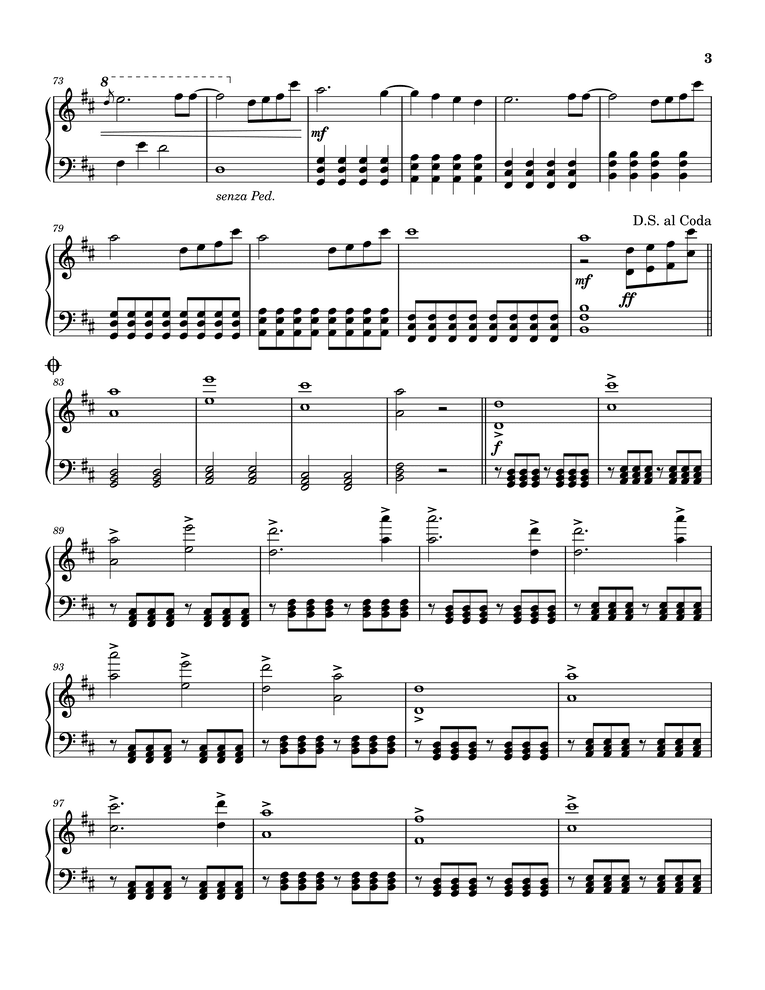
    <figcaption style="font-style: italic">Ảnh gốc</figcaption>
</figure>

- Ảnh được chuyển sang không gian màu xám, sau đó áp dụng **bộ lọc Gaussian** với kernel kích thước (5×5) nhằm làm giảm nhiễu cục bộ.

- Ảnh mờ được **nhị phân hóa** ngược sử dụng phương pháp `Otsu` (kí hiệu trắng trên nền đen). Các vùng tối trong ảnh sẽ trở thành màu trắng (255), trong khi các vùng sáng sẽ trở thành màu đen (0), và không có kí hiệu nào nằm trong khoảng "màu xám" (khoảng giữa 0 và 255). Mục đích của bước này là làm nổi bật các ký hiệu âm nhạc trong ảnh.

<figure style="text-align: center;">
    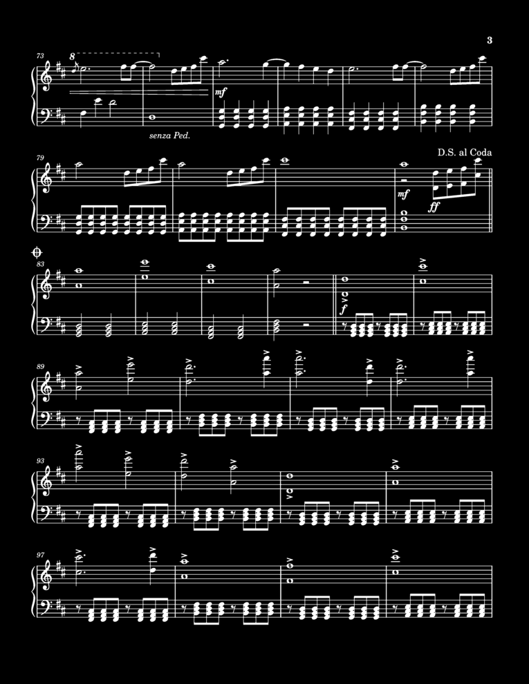
    <figcaption style="font-style: italic">Ảnh nhị phân</figcaption>
</figure>

- **Phép toán giãn nở** (dilation) được sử dụng với một ma trận nhị phân kích thước (40x10) (`cv2.MORPH_RECT`) chứa toàn giá trị 1. "Hình chữ nhật" này sẽ kết nối các thành phần nằm gần nhau và làm cho chúng liên kết với nhau thành một khối liên tục. Điều này giúp làm nổi bật các cặp khuông nhạc, thuận lợi cho việc tìm đường biên và tách bản nhạc thành các phần nhỏ hơn để nhận diện.

<figure style="text-align: center;">
    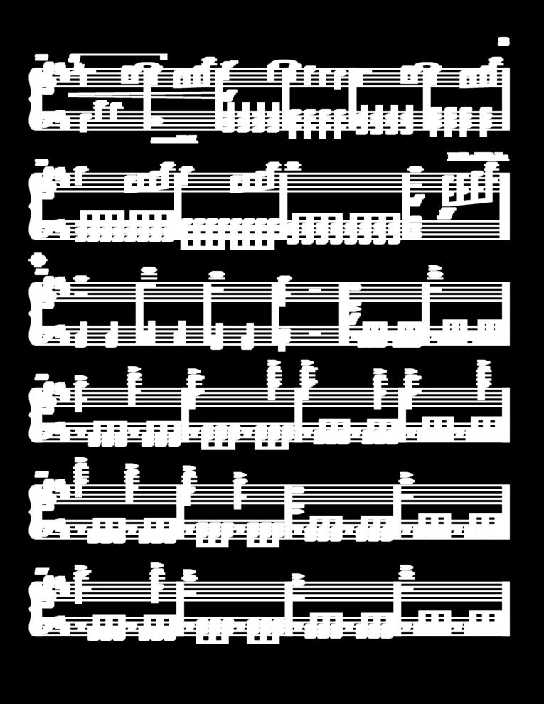
    <figcaption style="font-style: italic">Ảnh sau khi giãn nở</figcaption>
</figure>

- Từ ảnh nhị phân đã được xử lý, ta sử dụng **phương pháp tìm đường biên** (contour) để xác định các vùng chứa khuông nhạc. Với tham số `cv2.RETR_EXTERNAL`, chỉ trích xuất các đường biên ngoài cùng, bỏ qua các đường biên bên trong. Điều này giúp loại bỏ các chi tiết không cần thiết và chỉ giữ lại các khuôn nhạc chính. Ngoài ra, ta cũng sử dụng tham số `cv2.CHAIN_APPROX_SIMPLE` để giảm số lượng điểm trong đường biên, giúp tiết kiệm bộ nhớ và tăng tốc độ xử lý. Lưu ý, ta sẽ chỉ lấy các đường biên có độ dài bằng 80% so với chiều rộng của ảnh vì các khuông nhạc thường có chiều dài như vậy.

<figure style="text-align: center;">
    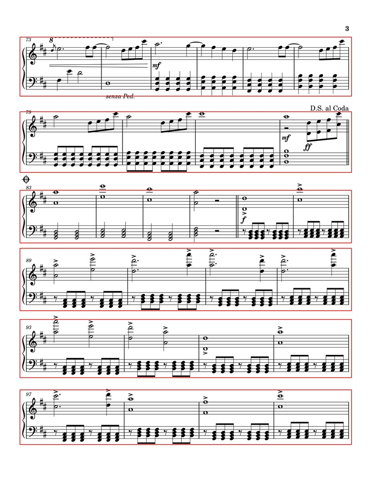
    <figcaption style="font-style: italic">Ảnh sau khi tìm đường biên</figcaption>
</figure>

## 1.3.1.2. Trích xuất dòng kẻ khuông nhạc
Ta sẽ thực hiện trich xuất các dòng kẻ khuông nhạc từ ảnh gốc. Các bước thực hiện như sau:

- Vùng khuông nhạc được chuyển sang ảnh xám và sau đó nhị phân hóa với ngưỡng **210** (chủ yếu là các ký hiệu đủ lớn và sắc nét) kết hợp Otsu để làm nổi bật các đối tượng tối trên nền sáng.

- Một phần tử cấu trúc hình chữ nhật (với chiều dài khoảng 80% chiều rộng ảnh và chiều cao 1 pixel) cùng với **phép co** (erosion) và **phép giãn** (dilation) được sử dụng để làm nổi bật các đường kẻ khuông nhạc.

- Các đường biên được tìm kiếm và sắp xếp theo thứ tự tọa độ đứng. Các hộp (bounding box) có chiều rộng nhỏ (dưới 80% chiều rộng ảnh) hoặc có độ dày lớn hơn 4 pixel sẽ bị loại bỏ để tránh nhầm lẫn với các yếu tố không phải đường khuông (ví dụ như thanh nối nhịp trong các nốt nhóm).

- Các dòng kẻ khuông hợp lệ (theo các tiêu chí hình học) được lưu trữ dưới dạng danh sách các bounding box `(x, y, width, height)`. Dưới đây là một ví dụ về các dòng kẻ khuông nhạc được trích xuất từ một vùng khuông nhạc:

    ```python
    # 5 dòng kẻ của khuôn nhạc treble - khoá Sol (phía trên)
    (50, 83, 2636, 3)
    (50, 108, 2636, 2)
    (50, 132, 2636, 3)
    (50, 157, 2636, 3)
    (50, 182, 2636, 3)

    # 5 dòng kẻ của khuôn nhạc bass - khoá Fa (phía dưới)
    (50, 326, 2636, 3)
    (50, 351, 2636, 3)
    (50, 376, 2636, 2)
    (50, 400, 2636, 3)
    (50, 425, 2636, 3)
    ```

## 1.3.1.3. Loại bỏ dòng kẻ khuông nhạc
Sau khi đã lọc ra các dòng kẻ, ta tiến hành loại bỏ các dòng kẻ khuông nhạc và chỉ giữ lại các ký hiệu âm nhạc. Cụ thể:

- Vùng khuông nhạc được chuyển sang ảnh xám và sau đó nhị phân hóa với ngưỡng 210 (chủ yếu là các ký hiệu đủ lớn và sắc nét) kết hợp Otsu để làm nổi bật các đối tượng tối trên nền sáng.

- Ta sử dụng một ma trận có kích thước (1x4) (đường kẻ thường có độ rộng khoảng 4 pixel), ảnh được co lại (erosion) rồi giãn nở (dilation) theo chiều dọc để làm mờ hoặc loại bỏ các đường kẻ ngang mỏng (tức đường khuông).

- Do thao tác co có thể làm mất chi tiết của các nốt, ảnh được phục hồi bằng giãn nở sử dụng phần tử hình elip (2×2) nhằm khôi phục hình dạng các notehead và các chi tiết nhạc cụ. Thao tác này tuy giúp khôi phục các chi tiết bị mất, nhưng nó cũng làm cho các chi tiết này bị đôi chút biến dạng (mặc dù không đáng kể).

- Cuối cùng, ảnh được đảo ngược lại về nền trắng - đối tượng đen, thuận tiện cho các bước phân tích sau này. Dưới đây là các vùng khuông nhạc đã được loại bỏ dòng kẻ:

    <figure style="text-align: center;">
        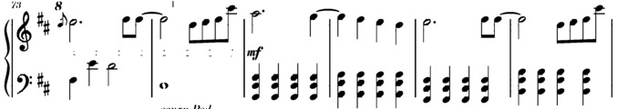
        <figcaption style="font-style: italic">Vùng 0</figcaption>
    </figure>

    <figure style="text-align: center;">
        
        <figcaption style="font-style: italic">Vùng 1</figcaption>
    </figure>

    <figure style="text-align: center;">
        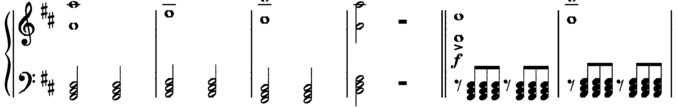
        <figcaption style="font-style: italic">Vùng 2</figcaption>
    </figure>

    <figure style="text-align: center;">
        
        <figcaption style="font-style: italic">Vùng 3</figcaption>
    </figure>

    <figure style="text-align: center;">
        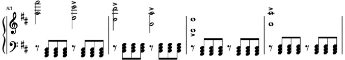
        <figcaption style="font-style: italic">Vùng 4</figcaption>
    </figure>

    <figure style="text-align: center;">
        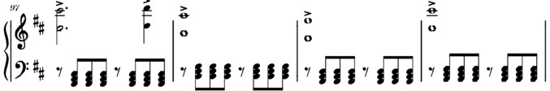
        <figcaption style="font-style: italic">Vùng 5</figcaption>
    </figure>

## 1.3.2. Huấn luyện mô hình YOLO
## 1.3.2.1. Giới thiệu về YOLO
**YOLO (You Only Look Once)** là một thuật toán nổi tiếng trong lĩnh vực phát hiện đối tượng (object detection), được giới thiệu lần đầu tiên vào năm 2016 bởi Joseph Redmon và cộng sự. Khác với các phương pháp hai giai đoạn truyền thống (như **R-CNN** hay **Faster R-CNN**), YOLO áp dụng cách tiếp cận **phát hiện một giai đoạn** (single-stage detection), trong đó toàn bộ ảnh đầu vào được xử lý chỉ trong một lần suy luận duy nhất.

Cụ thể, YOLO chia ảnh thành một lưới (grid) đều đặn và với mỗi ô lưới, mô hình dự đoán các bounding box ứng viên cùng với xác suất tồn tại của các lớp đối tượng. Tất cả các bước — từ phát hiện tới phân loại đối tượng — được thực hiện đồng thời trong một mạng nơ-ron tích chập duy nhất.

Điểm mạnh lớn nhất của YOLO là tốc độ rất cao, nhờ vào tính chất "end-to-end" của quá trình suy luận, khiến nó đặc biệt phù hợp với các ứng dụng yêu cầu xử lý thời gian thực. Tuy nhiên, YOLO cũng có một số hạn chế, đặc biệt trong việc phát hiện các đối tượng nhỏ hoặc đối tượng có kích thước rất biến thiên.

Kể từ phiên bản đầu tiên, YOLO đã trải qua nhiều thế hệ cải tiến (YOLOv2, YOLOv3, YOLOv4, YOLOv5, YOLOv7, YOLOv8...), mỗi phiên bản đều nâng cao độ chính xác, khả năng tổng quát và tốc độ xử lý.

## 1.3.2.2. Chuẩn bị dữ liệu
Vì YOLO là một mô hình học sâu, nó yêu cầu một lượng lớn dữ liệu được gán nhãn để huấn luyện. Dữ liệu này bao gồm các ảnh chứa các ký hiệu âm nhạc và các bounding box tương ứng với vị trí của các ký hiệu trong ảnh. Tuy nhiên, do sự thiếu hụt về nhân lực và thời gian, model trong báo cáo này được huấn luyện trên một bộ dữ liệu nhỏ hơn, bao gồm **135 ảnh** và **14749 bounding box** (được gán nhãn hoàn toàn thủ công). Cụ thể:

| STT | Ký hiệu | Số lượng |
| --- | -------- | -------- |
| 1 | barline | 638 |
| 2 | bass_clef | 122 |
| 3 | decrescendo | 165 |
| 4 | dotted_half_note | 30 |
| 5 | dotted_quarter_note | 172 |
| 6 | eight_beam | 1,990 |
| 7 | eight_flag | 355 |
| 8 | eight_rest | 275 |
| 9 | flat | 532 |
| 10 | half_note | 327 |
| 11 | natural | 32 |
| 12 | quarter_note | 8,307 |
| 13 | quarter_rest | 23 |
| 14 | sharp | 457 |
| 15 | sixteenth_beam | 957 |
| 16 | sixteenth_flag | 2 |
| 17 | sixteenth_rest | 6 |
| 18 | thirty_second_beam | 5 |
| 19 | treble_clef | 151 |
| 20 | whole_half_rest | 32 |
| 21 | whole_note | 171 |

Trong triển khai thực tế, bộ dữ liệu sẽ tốt hơn nếu số lượng các ký hiệu được phân bố đồng đều hơn. Tuy nhiên, do thời gian hạn chế, bộ dữ liệu này chỉ được xây dựng thông qua một số bản nhạc nên một số ký hiệu sẽ xuất hiện nhiều hơn các ký hiệu khác. **Vì vậy, mô hình này chỉ được coi là một mô hình thử nghiệm, chưa sử dụng cho các ứng dụng thực tế.**

## 1.3.2.3. Gán nhãn dữ liệu
Ở mỗi ảnh, các ký hiệu âm nhạc sẽ được gán nhãn bằng cách sử dụng các bounding box. Mỗi bounding box theo định dạng YOLOv8, bao gồm các thông tin sau: 

```bash
(class, x_center, y_center, width, height)

# Trong đó:
#   class: chỉ số lớp của ký hiệu âm nhạc (0-20)
#   x_center và y_center: tọa độ trung tâm của bounding box (tính theo tỷ lệ so với kích thước ảnh gốc)
#   width và height: kích thước của bounding box (tính theo tỷ lệ so với kích thước ảnh gốc)
```

Dưới đây là ví dụ về 1 đoạn trong file text gán nhãn cho một ảnh:

```bash
17 0.0359375 0.503125  0.0234375 0.05625
1  0.0359375 0.578125  0.021875  0.0296875
0  0.0203125 0.4859375 0.0046875 0.228125
0  0.4015625 0.54375   0.003125  0.1140625
0  0.70625   0.5421875 0.0046875 0.1140625
0  0.990625  0.54375   0.00625   0.115625
7  0.05625   0.4984375 0.0078125 0.021875
...
```

Ứng với mỗi ảnh, ta sẽ có một file text tương ứng chứa các thông tin về các ký hiệu âm nhạc trong ảnh đó.

Với các kí hiệu đơn lẻ như **khoá Sol**, khoá Fa, dấu hoá, nốt tròn, nốt trắng, v.v., ta sẽ sử dụng các hình chữ nhật (bounding box) để bao quanh chúng. Đối với các nốt nhạc có đuôi nốt hoặc dấu nối, ta sẽ gán nhãn riêng cho phần đầu nốt và phần đuôi nốt/dấu nối. Điều này giúp mô hình có thể nhận diện và phân loại các ký hiệu một cách chính xác hơn.

<figure style="text-align: center;">
    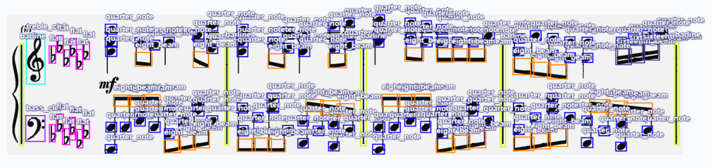
    <figcaption style="font-style: italic">Hình ảnh gán nhãn cho một vùng khuôn nhạc</figcaption>
</figure>

<figure style="text-align: center;">
    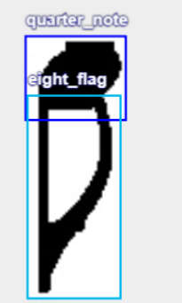
    <figcaption style="font-style: italic">Hình ảnh gán nhãn cho một nốt nhạc có đuôi nốt</figcaption>
</figure>

<figure style="text-align: center;">
    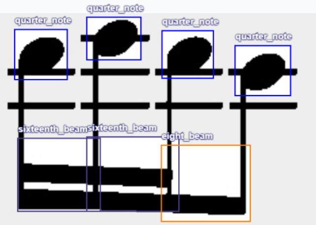
    <figcaption style="font-style: italic">Hình ảnh gán nhãn cho một nốt nhạc có dấu nối</figcaption>
</figure>

> Lưu ý: Bounding box thường không bám sát với cạnh của ký hiệu âm nhạc, mà thường có khoảng cách nhất định. Điều này là do các ký hiệu âm nhạc có thể bị biến dạng hoặc che khuất bởi các yếu tố khác trong ảnh, và việc gán nhãn chính xác là rất khó khăn. 

Trong một số trường hợp, khi các đầu nốt nằm sát nhau (biểu diễn hợp âm), các bounding box sẽ bị chồng lên nhau. Điều này có thể dẫn đến việc mô hình không nhận diện được các ký hiệu âm nhạc một cách chính xác.

<figure style="text-align: center;">
    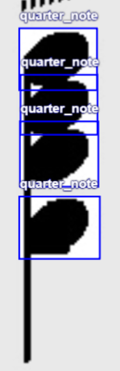
    <figcaption style="font-style: italic">Hình ảnh gán nhãn cho một nốt nhạc có đầu nốt nằm sát nhau</figcaption>
</figure>

Khi các ảnh đã được gán nhãn đầy đủ, ta tiến hành xuất bộ dữ liệu này với một số tinh chỉnh cho mỗi ảnh để giảm thời gian huấn luyện và cải thiện hiệu suất:
- Tự động định hướng nhằm loại bỏ các ảnh bị nghiêng hoặc không nằm ngang.
- Căn chỉnh kích thước về **1080x480 pixel** (nền đen). Kich thước này được chọn vì nó ưu tiên chiều rộng hơn chiều cao, phù hợp với vùng khuôn nhạc trong ảnh cũng như đủ độ sắc nét để nhận diện các ký hiệu âm nhạc.
## 1.3.2.4. Huấn luyện mô hình
Mô hình YOLOv8 được huấn luyện trên bộ dữ liệu đã chuẩn bị với các thông số cấu hình sau:

```yaml
# Dataset
train: train/images  # thư mục chứa ảnh huấn luyện
val: val/images  # thư mục chứa ảnh kiểm định
test: test/images # thư mục chứ ảnh kiểm tra

# Classes
names:
    0: barline
    1: bass_clef
    2: decrescendo
    3: dotted_half_note
    4: dotted_quarter_note
    5: eight_beam
    6: eight_flag
    7: eight_rest
    8: flat
    9: half_note
    10: natural
    11: quarter_note
    12: quarter_rest
    13: sharp
    14: sixteenth_beam
    15: sixteenth_flag
    16: sixteenth_rest
    17: thirty_second_beam
    18: treble_clef
    19: whole_half_rest
    20: whole_note
```

### Cấu trúc mô hình YOLOv8

YOLOv8 là phiên bản cải tiến mới nhất của họ YOLO với nhiều cải tiến về kiến trúc và hiệu năng. Kiến trúc cơ bản của YOLOv8 bao gồm:

- **Backbone**: Sử dụng CSPDarknet để trích xuất đặc trưng từ ảnh đầu vào. Backbone này áp dụng kỹ thuật Cross Stage Partial Network (CSP) giúp cải thiện hiệu suất và giảm kích thước mô hình.

- **Neck**: Sử dụng Path Aggregation Network (PANet) để kết hợp các đặc trưng từ nhiều lớp khác nhau, giúp mô hình có thể phát hiện các đối tượng ở nhiều kích thước khác nhau.

- **Head**: Đầu ra của mô hình gồm hai nhánh:
   - Nhánh phân loại (Classification branch): Dự đoán xác suất thuộc về từng lớp đối tượng
   - Nhánh hồi quy (Regression branch): Dự đoán tọa độ và kích thước của bounding box

<figure style="text-align: center;">
    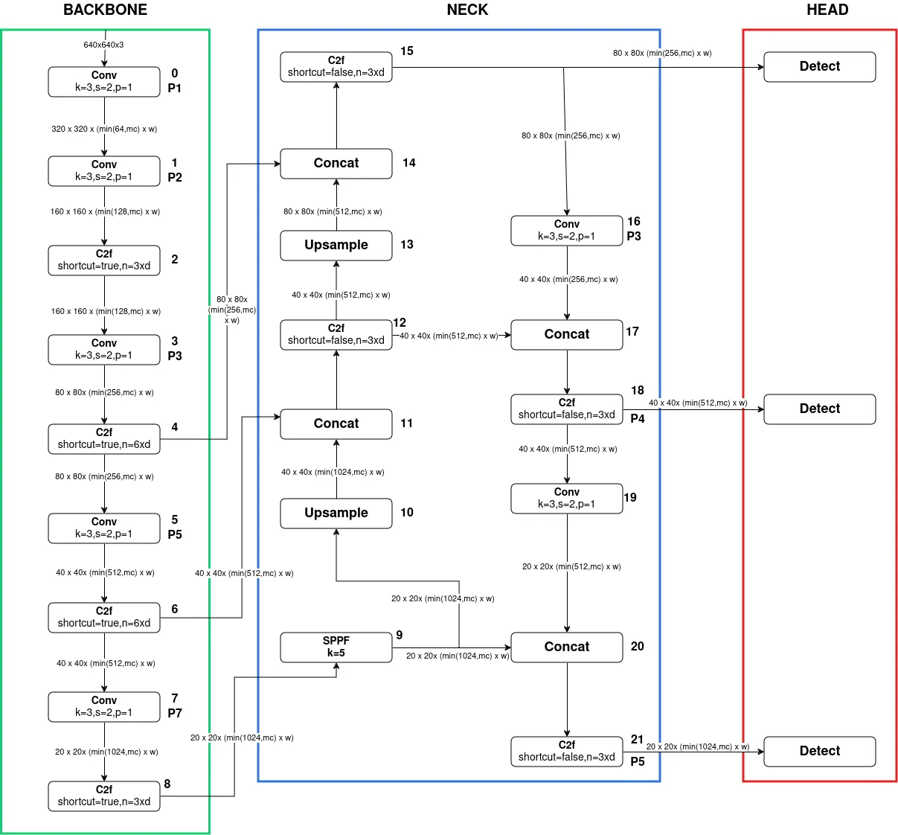
    <figcaption style="font-style: italic">Kiến trúc tổng quan của YOLOv8</figcaption>
</figure>

### Quá trình huấn luyện

Quá trình huấn luyện được thực hiện theo các bước sau:

1. **Phân chia dữ liệu**: Bộ dữ liệu được chia thành 3 phần:
   - Train: 80%
   - Validation: 10%
   - Test: 10%

2. **Khởi tạo mô hình**: Sử dụng mô hình **YOLOv8 Nano** - phiên bản nhỏ nhất và nhanh nhất của YOLOv8 - từ COCO dataset để khởi tạo mô hình, áp dụng kỹ thuật transfer learning để tận dụng các đặc trưng cơ bản đã được học.

3. **Các tham số**:
    - `data`: Đường dẫn đến file cấu hình dữ liệu (thường là `data.yaml`).
    - `epochs=300`: Huấn luyện mô hình trong 300 epochs (số lần mô hình đi qua toàn bộ tập dữ liệu huấn luyện).
    - `device=cuda`: Sử dụng GPU thông qua CUDA để tăng tốc quá trình huấn luyện. GPU được sử dụng là NVIDIA Telsa T4 với 16GB RAM, chuyên xử lí các tác vụ đòi hỏi nhiều tính toán.

4. **Kết quả huấn luyện**: Các số liệu trả về sau khi mô hình đã được huấn luyện bao gồm:
    - **Độ chính xác (precision)**: Đo lường tỉ lệ dự đoán đúng trên tổng số dự đoán của mô hình.

    - **Độ phủ (recall)**: Đo lường tỉ lệ đối tượng thực tế được phát hiện bởi mô hình. Độ phủ cao nghĩa là mô hình có thể phát hiện hầu hết các kí hiệu trong bản nhạc.

    - **mAP (mean Average Precision)**: Độ chính xác trung bình trên tất cả các lớp. Một giá trị mAP cao cho thấy mô hình hoạt động tốt trong việc xác định và định vị các đối tượng một cách chính xác trên nhiều lớp khác nhau.
        - **mAP50:** Độ chính xác trung bình ở ngưỡng IoU = 0.5. Đây có thể coi là thước đo độ chính xác của mô hình trong các mức độ "dễ" phát hiện.
        - **mAP50-90:** Độ chính xác trung bình được tính toán ở các ngưỡng IoU khác nhau, trong khoảng từ 0.50 đến 0.95. Nó cung cấp cái nhìn toàn diện về hiệu suất của mô hình ở các mức độ "khó" phát hiện khác nhau.

    - **Loss values**: Các giá trị hàm mất mát được sử dụng để tối ưu hóa mô hình trong quá trình huấn luyện. Sự giảm dần của các giá trị loss trong quá trình huấn luyện cho thấy mô hình đang học tốt.
        - **Box Loss**: Đo lường sai số trong dự đoán vị trí và kích thước bounding box.
        - **Classification Loss**: Đo lường sai số trong việc phân loại đối tượng.
        - **Objectness Loss**: Đo lường sai số trong việc xác định liệu có đối tượng hay không.

    - Các thông số khác

5. **Đánh giá quá trình thông qua biểu đồ**: 

<figure style="text-align: center;">
    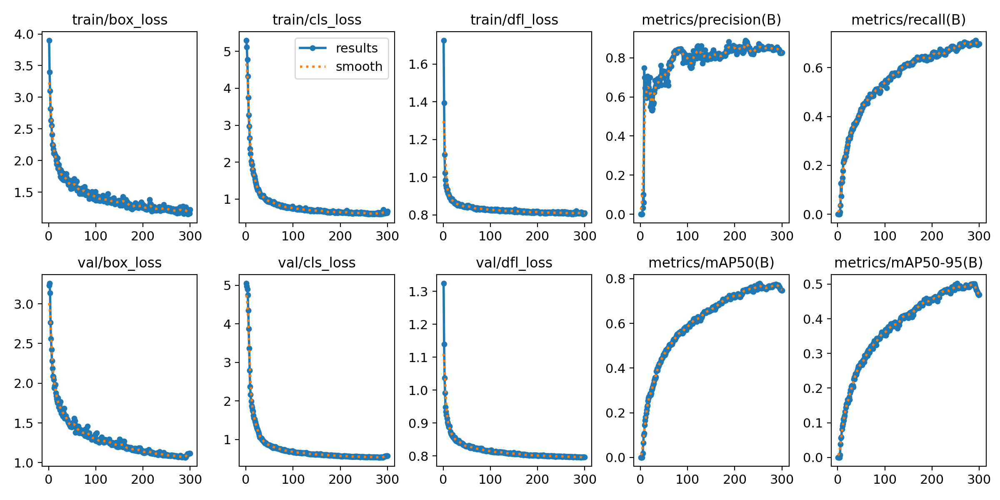
    <figcaption style="font-style: italic">Biểu đồ thể hiện sự thay đổi của các thông số trong quá trình huấn luyện</figcaption>
</figure>

Các thông số đáng chú ý trong biểu đồ trên bao gồm:
- `train/box_loss`: Giảm nhanh chóng ở những **epochs** đầu tiên và sau đó tiếp tục giảm chậm hơn, có vẻ như đang hội tụ. Điều này cho thấy việc dự đoán vị trí bounding box ngày càng chính xác hơn.

- `val/box_loss`: Giảm tương tự như trên tập huấn luyện, nhưng có vẻ như bắt đầu ổn định hoặc giảm rất chậm ở những epochs cuối.

- `metrics/precision(B)`: Tăng nhanh chóng và sau đó có thể dao động nhẹ hoặc ổn định ở một mức tương đối cao. Điều này cho thấy độ chính xác của việc dự đoán đang dần được cải thiện.

- `metrics/recall(B)`: Tăng nhanh chống và tiến gần đến một điểm ổn định. Điều này cho thấy mô hình ngày càng ít bỏ sót kí hiệu hơn.

- `metrics/mAP50(B)`: Tăng lên và có dấu hiệu đạt đến một mức ổn định (~ 0.75), cho thấy hiệu suất tốt trên dữ liệu mới ở ngưỡng IoU 0.5.

- `metrics/mAP50-95(B)`: Tăng lên nhưng có dấu hiệu không vượt qua mức 0.5, cho thấy mô hình chưa đủ tốt trong nhận diện các trường hợp phức tạp.

### Đánh giá mô hình chi tiết

Sau khi hoàn tất quá trình huấn luyện, mô hình được đánh giá trên tập test để có cái nhìn toàn diện về hiệu suất:

| Class             | Precision | Recall     | mAP50 | mAP50-95 |
|-------------------|--------|-------|-------|----------|
| barline           | 0.822  | 0.781 | 0.836 | 0.479    |
| bass_clef         | 0.984  | 0.984 | 0.987 | 0.786    |
| decrescendo       | 0.7    | 0.624 | 0.662 | 0.328    |
| dotted_half_note  | 0.803  | 0.137 | 0.431 | 0.225    |
| dotted_quarter_note| 0.595  | 0.762 | 0.755 | 0.447    |
| eighth_beam       | 0.955  | 0.997 | 0.993 | 0.743    |
| eighth_flag       | 0.869  | 0.952 | 0.962 | 0.602    |
| eighth_rest       | 0.978  | 0.962 | 0.991 | 0.58     |
| flat              | 0.847  | 0.914 | 0.95  | 0.592    |
| half_note         | 0.705  | 0.818 | 0.783 | 0.452    |
| natural           | 0.618  | 0.344 | 0.473 | 0.245    |
| quarter_note      | 0.933  | 0.953 | 0.971 | 0.655    |
| quarter_rest      | 0.937  | 0.648 | 0.756 | 0.424    |
| sharp             | 0.8    | 0.978 | 0.976 | 0.664    |
| sixteenth_beam    | 0.914  | 0.996 | 0.991 | 0.765    |
| sixteenth_flag    | 1      | 0     | 0.828 | 0.514    |
| sixteenth_rest    | 1      | 0     | 0.23  | 0.154    |
| thirty_second_beam| 1      | 0     | 0.182 | 0.14     |
| treble_clef       | 0.989  | 0.993 | 0.995 | 0.866    |
| whole_half_rest   | 1      | 0.568 | 0.773 | 0.419    |
| whole_note        | 0.703  | 0.795 | 0.839 | 0.452    |
| **all**           | **0.864**  | **0.676** | **0.779** | **0.502**    |

Từ bảng kết quả, ta có thể thấy:
- Các ký hiệu phổ biến như eighth_beam, eighth_flag, eighth_rest, flat, sharp, sixteenth_beam, quarter_note, treble_clef, bass_clef có độ chính xác cao (**mAP50 > 0.9**) và độ phủ tốt (**recall > 0.9**), cho thấy mô hình có khả năng phát hiện tốt các ký hiệu này.

- Các ký hiệu hiếm gặp như sixteenth_flag, sixteenth_rest, thirty_second_beam có hiệu suất thấp hơn (**mAP50 < 0.5**) do thiếu dữ liệu huấn luyện.

- Nhìn chung, mô hình có độ chính xác trung bình (mAP50) đạt 0.779 và độ phủ (recall) đạt 0.676, cho thấy mô hình có khả năng phát hiện các ký hiệu âm nhạc với độ chính xác là chấp nhận được với một bộ dữ liệu nhỏ.

### Phân tích lỗi

Để hiểu rõ hơn về các lỗi của mô hình, ta tiến hành phân tích confusion matrix và các trường hợp dự đoán sai:

<figure style="text-align: center;">
    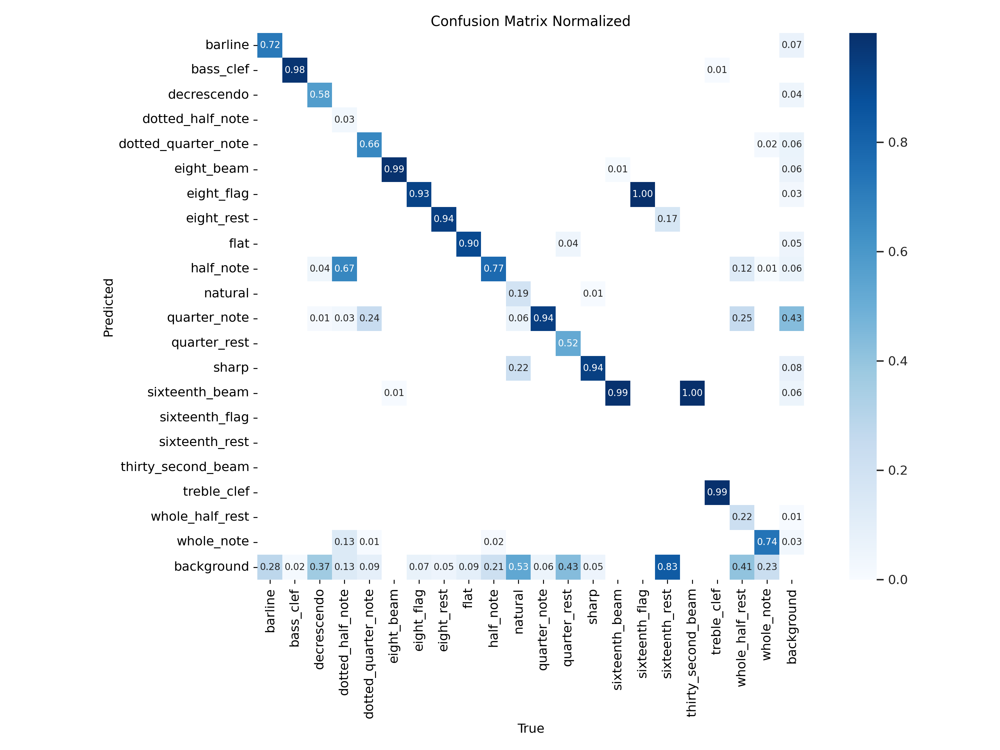
    <figcaption style="font-style: italic">Confusion matrix trên tập test</figcaption>
</figure>

Các lỗi thường gặp bao gồm:
1. **False Negatives**: Mô hình bỏ sót một số ký hiệu, đặc biệt là các ký hiệu nhỏ hoặc bị che khuất một phần, và nhận diện chúng là nền (background).

2. **False Positives**: Mô hình đôi khi nhận diện nhầm giữa các ký hiệu có hình dạng tương tự như:
   - Nhầm lẫn giữa dotted_quarter_note và quarter_note, giữa dotted_half_note và half_note.
   - Nhầm lẫn giữa quarter_note và whole_half_rest.


### Kết luận về hiệu suất mô hình

Mặc dù được huấn luyện trên bộ dữ liệu còn hạn chế về số lượng và sự cân bằng, mô hình YOLOv8 Nano đã thể hiện khả năng nhận diện ký hiệu âm nhạc khá tốt với mAP50 đạt gần 80% và mAP50-95 đạt 50%. Mô hình có khả năng phát hiện tốt các ký hiệu phổ biến như khoá Sol, khoá Fa, nốt nhạc, dấu hoá, v.v. với độ chính xác cao và độ phủ tốt.

Tuy nhiên, vẫn còn những thách thức cần khắc phục như hiệu suất thấp đối với các ký hiệu hiếm gặp, khả năng phân biệt giữa các ký hiệu có hình dạng tương tự, và độ chính xác trong việc xác định vị trí của các ký hiệu phức tạp.

## 1.3.3. Xuất mô hình
Mô hình sau khi được huấn luyện sẽ được xuất ra dưới dạng file `.pt` để có thể sử dụng cho các ứng dụng thực tế. File này chứa tất cả các trọng số và cấu trúc của mô hình, cho phép người dùng dễ dàng tải và sử dụng mô hình mà không cần phải huấn luyện lại từ đầu.

Mô hình được lưu trong thư mục `runs/detect/train/weights/` với hai phiên bản:
- `best.pt`: Mô hình với hiệu suất tốt nhất trong quá trình huấn luyện (dựa trên mAP50-95)

- `last.pt`: Mô hình tại thời điểm kết thúc huấn luyện (epoch cuối cùng)

Để sử dụng trong môi trường sản xuất, mô hình có thể được chuyển đổi sang các định dạng khác nhau tùy theo nền tảng triển khai:
```python
# Xuất sang ONNX để triển khai đa nền tảng
model.export(format='onnx')

# Xuất sang TensorRT để tối ưu hiệu suất trên GPU NVIDIA
model.export(format='engine')
```

Mô hình đã xuất có thể được sử dụng trực tiếp trong code Python thông qua thư viện Ultralytics:

```python
from ultralytics import YOLO

# Tải mô hình
model = YOLO('path/to/best.pt')

# Thực hiện dự đoán trên một ảnh
results = model('path/to/image.jpg')
```
