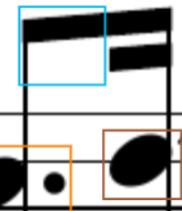
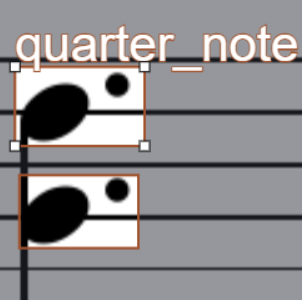
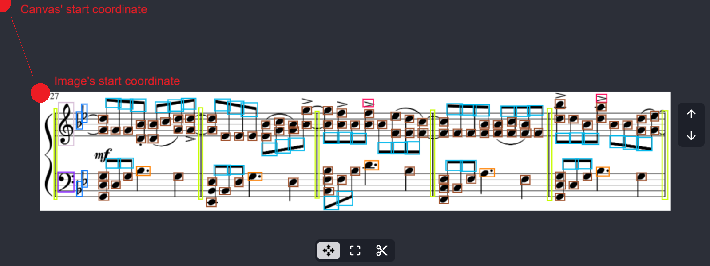
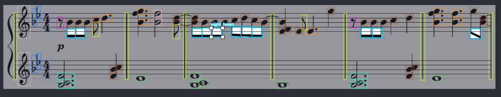

# 2. Quá trình tiền xử lý dữ liệu cho bản nhạc
## 2.1 Nguyên nhân và mục đích của quá trình tiền xử lý
### 2.1.1. Nguyên nhân
Trong quá trình phát triển hệ thống, việc sử dụng mô hình YOLOv8 để phát hiện ký hiệu âm nhạc là một giải pháp rất hiệu quả. Tuy nhiên, kết quả đầu ra từ các mô hình không phải lúc nào cũng đạt độ chính xác tuyệt đối, đặc biệt trong bối cảnh dữ liệu bản nhạc có đặc điểm riêng biệt so với các đối tượng thông thường trong thị giác máy tính. Các ký hiệu âm nhạc thường có kích thước nhỏ, hình dạng đa dạng và dễ bị chồng lấp hoặc mờ do chất lượng quét không đồng đều của bản nhạc.

Trên thực tế, ta dễ dàng nhận thấy rằng mô hình có thể dự đoán sai lệch ở một số tình huống điển hình: 
- Ký hiệu bị phát hiện lệch vị trí
- Ký hiệu bị phát hiện chồng lấp (một ký hiệu bị phát hiện nhiều lần)
- Không phát hiện (thiếu nhãn), phát hiện dư (đánh nhãn vào vùng trắng hoặc nhiễu)
- Nhận diện sai loại ký hiệu (ví dụ: nhầm lẫn giữa nốt đen và nốt chấm đen). 

| | Lệch vị trí | Chồng lấp | Thiếu nhãn | Sai ký hiệu |
| --- | --- | --- | --- | --- |
| Hình ảnh |  |  |  |  |
| Mô tả | Đuôi nốt của nốt nhạc bị lệch vị trí | Hai dấu giáng chồng lấp lên nhau | Một dấu gạch đôi không được phát hiện | Hai đầu nốt bị phát hiện sai loại |


Các sai lệch này nếu không được xử lý sẽ ảnh hưởng nghiêm trọng đến quá trình huấn luyện mô hình, làm giảm độ chính xác và khả năng tổng quát của hệ thống OMR.

### 2.1.2. Mục đích
Từ nhu cầu thực tiễn đó, chúng tôi phát triển một công cụ chỉnh sửa nhãn thủ công nhằm hỗ trợ người dùng có thể trực tiếp can thiệp vào từng hình ảnh, đánh giá lại tính chính xác của từng bounding box, và thực hiện chỉnh sửa khi cần thiết. 

Việc xây dựng công cụ này không chỉ giúp cải thiện độ chính xác của các nhãn mà còn tạo điều kiện thuận lợi cho quá trình chuyển đổi dữ liệu sang dạng âm thanh ở phần sau.

## 2.2. Trang hỗ trợ chỉnh sửa nhãn ảnh
### 2.2.1. Giới thiệu
Trang web này là một giao diện được thiết kế tương tự với các nền tảng như **Roboflow**. Nó cho phép người dùng chỉnh sửa các hình ảnh và nhãn đã được phát hiện từ mô hình YOLOv8, sau đó thực hiện các thao tác chỉnh sửa như thêm, xóa hoặc thay đổi vị trí của các bounding box. Trang được xây dựng bằng **React, API Canvas** của HTML5 và thư viện Material UI, hỗ trợ các chế độ tương tác như kéo, chỉnh sửa, và cắt ảnh, cùng các chức năng nâng cao về quản lý lớp, tìm kiếm và lưu trữ dữ liệu thông qua bộ nhớ cục bộ (local storage). 

### 2.2.2. Kiến trúc của trang
Trang được tổ chức dưới dạng một SPA sử dụng React, khai thác API Canvas của HTML5 để hiển thị ảnh và vùng chú thích, Material-UI để tạo các nút điều khiển bằng biểu tượng, và React-Toastify để cung cấp phản hồi tương tác cho người dùng. Dữ liệu được lưu trữ dưới dạng đối tượng JSON trong bộ nhớ cục bộ của trình duyệt, đảm bảo khả năng lưu trữ mà không cần phụ thuộc vào máy chủ. Giao diện được chia thành hai khu vực chính:

- **Thanh bên (Sidebar):** Cung cấp điều khiển tìm kiếm lớp, chọn biểu tượng và quản lý chú thích.
- **Khu vực Canvas chính:** Hiển thị ảnh và hỗ trợ các thao tác tương tác như thu phóng, kéo, và thao tác trên hộp giới hạn.

Trang hoạt động với ba chế độ tương tác, có thể chuyển đổi thông qua thanh công cụ dưới cùng:

- **Chế độ kéo (Drag Mode):** Hỗ trợ kéo và thu phóng để điều hướng ảnh.
- **Chế độ chỉnh sửa (Edit Mode):** Cho phép tạo mới, thay đổi kích thước và di chuyển hộp giới hạn.
- **Chế độ cắt (Cut Mode):** Cho phép cắt ngang ảnh tại một tọa độ y xác định để chia một ảnh thành hai ảnh độc lập.

Ngoài ra, trang còn hỗ trợ các chức năng khác như:

- Xoá tất cả các nhãn và ảnh hiện tại.
- Thiết lập lại các nhãn vê trạng thái ban đầu: Nếu người dùng chưa lưu, các nhãn sẽ được khôi phục về trạng thái ban đầu. Nếu đã lưu, các nhãn sẽ được khôi phục về trạng thái đã lưu gần nhất.
- Lưu lại các nhãn hiện tại vào bộ nhớ cục bộ.
- Di chuyển giữa các ảnh trong bộ nhớ cục bộ.

### 2.2.3. Các chức năng cốt lõi
### 2.2.3.1. Tải và hiển thị ảnh
Dữ liệu sau khi được nhận diện từ mô hình sẽ được lưu trữ dưới dạng **JSON** trong bộ nhớ cục bộ của trình duyệt với cấu trúc như sau:

```json
[
    {
        filename: "08bbb514-119b-4924-aefe-655e2c96a149_401566457-Rewrite-the-Stars-Piano-Music-Sheet.pdf",
        image: "iVBORw0KGgoAAAANSUhEUgAACOMAAAGFCAIAAAA..."
        page: 1,
        zone: 1,
        boxes: [
            [[833.1720581054688, 35.45665532879812, 843.1866239323696, 341.8385009765625], [1573.6785888671875, 38.5394401550293, 1586.66552734375, 346.52252197265625], ...],
            [],
            [],
            [[251.1866239323696, 315.4566553287981, 327.1866239323696, 345.4566553287981]].
            ...
        ],
        staff_lines: [
            [55, 45, 2201, 2]
            [55, 66, 2201, 2]
            [55, 87, 2201, 1]
            [55, 108, 2201, 1]
            [55, 128, 2201, 2],
            ...
        ]
    },
    {
        ...
    },
    ...
]
```

Trong đó, mỗi phần tử của danh sách đại diện cho một trang trong bản nhạc, bao gồm các thuộc tính sau:

- `filename`: Tên tệp của bản nhạc.

- `image`: Chuỗi base64 của ảnh.

- `page`: Số trang của bản nhạc.

- `zone`: Số thứ tự của khu vực trong trang.

- `boxes`: Danh sách các bounding box đã được phát hiện. Mỗi phần tử trong danh sách (theo thứ tự) đại diện cho một ký hiệu đã được ghi ở phần trước và các hộp có định dạng `(x1, y1, x2, y2)` là vị trí của các ký hiệu trong ảnh.

- `staff_lines`: Danh sách các đường kẻ nhạc, có định dạng tương tự như `boxes`.

Dữ liệu này được lưu trong localStorage của trình duyệt. Khi một ảnh được sử dụng, nó sẽ được chuyển đổi từ chuỗi **base64** sang đối tượng ảnh và hiển thị trên Canvas. Sau đó, Canvas được điều chỉnh sao cho hình ảnh được hiện thị ở giữa phần tử cha và được căn theo tỉ lệ thu phóng ban đầu `scale = 0.5`, ràng buộc trong khoảng từ **0.1** đến **2.0**. Công thức căn giữa ảnh như sau:

```
start.x = canvas_width / 2 - (img_width * s) / 2
start.y = canvas_height / 2 - (img_height * s) / 2
```

<div align="center">
    
    <p>Vị trí ảnh so với canvas</i></p>
</div>

Thực tế, việc hiển thị ảnh trên Canvas gồm 2 loại: ảnh chứa nhãn thông thường và ảnh chứa nhãn được "focus".

- **Ảnh chứa nhãn thông thường:** Là ảnh được hiển thị trên Canvas mà không có bất kỳ thao tác nào từ người dùng. Trong đó, các bounding box được hiển thị đồng đều với nhau thông qua hàm `drawImage`. Hàm này duyệt qua tất cả các bounding box trong danh sách `boxes` và vẽ chúng lên Canvas với màu sắc khác nhau.

<div align="center">
    
    <p>Hình ảnh chứa nhãn thông thường</i></p>
</div>

- **Ảnh chứa nhãn được "focus":** Là ảnh được hiển thị trên Canvas với một bounding box được chọn (focus box). Trong trường hợp này, các bounding box khác sẽ được làm mờ đi bằng cách sử dụng hàm `drawImageWithFocus` với độ mờ (opacity) thấp hơn. Điều này giúp người dùng dễ dàng nhận diện và chỉnh sửa bounding box đang được chọn. Ngoài ra, khi người dùng nhấn vào một bounding box, nó sẽ hiển thị tên của ký hiệu tương ứng bên cạnh.

<div align="center">
    
    <p>Hình ảnh chứa nhãn được "focus"</i></p>
</div>

### 2.2.3.2. Thu phóng và kéo ảnh
Thu phóng ảnh điều chỉnh tỷ lệ `scale` theo bước **0.05**, thông qua sự kiện cuộn chuột (`wheel`). Hệ thống duy trì vị trí trung tâm canvas trong quá trình phóng to/thu nhỏ, sử dụng công thức:

```
new_start.x = old_start.x - (center.x - old_start.x) * (delta_s / new_s)
new_start.y = old_start.y - (center.y - old_start.y) * (delta_s / new_s)
```

Trong đó, `delta_s = new_s - old_s` là sự thay đổi tỷ lệ. Việc kéo ảnh được kích hoạt ở chế độ Drag, cập nhật toạ độ ảnh theo vị trí chuột. Tuy nhiên, vị trí `new_start.x` và `new_start.y` chỉ mang tính chất tương đối, không phải là vị trí chính giữa tuyệt đối của canvas.

### 2.2.3.2. Di chuyển ảnh trong canvas
Việc di chuyển ảnh trong canvas được thực hiện thông qua sự kiện chuột và hàm `handleMouseMove`. Do API canvas chỉ cung cấp toạ độ chuột so với toàn bộ trang thông qua `event.clientX` và `event.clientY`, nên ta cần tính toán lại toạ độ chuột so với canvas. Để làm điều này, ta sử dụng hàm `getBoundingClientRect()` để lấy vị trí của canvas trong trang và sau đó tính toán toạ độ chuột tương đối với canvas.

```javascript 
const getRelativeCoords = (e) => {
    const canvas = canvasRef.current;
    const rect = canvas.getBoundingClientRect();
    const x = e.clientX - rect.left; // Toạ độ x tương đối với canvas
    const y = e.clientY - rect.top; // Toạ độ y tương đối với canvas

    return {x, y};
}
```

Sau đó, ta có thể sử dụng toạ độ này để cập nhật `new_start.x` và `new_start.y` trong hàm `handleMouseMove`. Tuy nhiên, khi sự kiện `mousedown` xảy ra, ta phải lưu toạ độ chuột hiện tại để tính toán sự thay đổi toạ độ trong quá trình di chuyển. Do đó, ta cần xử lí thao tác này trong hàm `handleMouseDown`.

```javascript
// handleMouseDown
coords.x, coords.y = getRelativeCoords(e)

anchor.x = coords.x
anchor.y = coords.y
```

Bây giờ, ta có thể cập nhật `new_start.x` và `new_start.y` trong hàm `handleMouseMove`. Đồng thời, ta cũng cập nhật `anchor` ngay lập tức để đảm bảo rằng vị trí của ảnh luôn bám sát với chuyển động của chuột nhất có thể.

```javascript
// handleMouseMove
coords.x, coords.y = getRelativeCoords(e)

new_start.x = prev_start.x + (coords.x - anchor.x)
new_start.y = prev_start.y + (coords.y - anchor.y)

anchor.x = coords.x
anchor.y = coords.y
```

### 2.2.3.3. Chỉnh sửa nhãn
Việc chỉnh sửa nhãn được thực hiện thông qua chế độ Edit. Trong chế độ này, người dùng có thể tạo mới, thay đổi kích thước và di chuyển các bounding box. Để thực hiện điều này, ta cần xác định vị trí của chuột trong canvas và kiểm tra xem nó có nằm trong một bounding box nào không.

```javascript
if (coords.x >= box.x 
    && coords.x <= box.x + box.width 
    && coords.y >= box.y 
    && coords.y <= box.y + box.height):
        // Đã tìm thấy bounding box
```


Nếu vị trí không nằm trong bounding box nào, ta sẽ thực hiện các bước sau:
- Với sự kiện `mousedown`, trước tiên ta phải kiểm tra xem vị trí chuột có nằm trong `focus box` hiện tại không bằng cách so sánh với toạ độ 4 góc (đã được điều chỉnh theo tỷ lệ):

    ```javascript
    x1 = focusBox.x1 * scale, y1 = focusBox.y1 * scale
    x2 = focusBox.x2 * scale, y2 = focusBox.y1 * scale
    x3 = focusBox.x2 * scale, y3 = focusBox.y2 * scale
    x4 = focusBox.x1 * scale, y4 = focusBox.y2 * scale

    handleEdge = 8;

    if (abs(coords.x - x1) <= handleEdge && abs(coords.y - y1) <= handleEdge):
        BOX_ZONE.TOP_LEFT

    else if (abs(coords.x - x2) <= handleEdge && abs(coords.y - y2) <= handleEdge):
        BOX_ZONE.TOP_RIGHT

    else if (abs(coords.x - x3) <= handleEdge && abs(coords.y - y3) <= handleEdge):
        BOX_ZONE.BOTTOM_RIGHT

    else if (abs(coords.x - x4) <= handleEdge && abs(coords.y - y4) <= handleEdge):
        BOX_ZONE.BOTTOM_LEFT
    
    ```

- Nếu có, ta đã xác định được bounding box cần chỉnh sửa và điều này sẽ được mô tả ở phần sau. Nếu không, ta phải tiếp tục kiểm tra xem vị trí chuột có nằm trong một trong các bounding box không bằng cách duyệt qua tất cả và so sánh toạ độ.

    ```javascript
    for symbol in boxes:
        for box in symbol:
            box.x = box.x1 * scale
			box.y = box.y1 * scale
			box_width = (box.x2 - box.x1) * scale
			box_height = (box.y2 - box.y1) * scale

            if (coords.x >= b_x && coords.x <= b_x + b_width 
            && coords.y >= b_y && coords.y <= b_y + b_height):
                // Đã tìm thấy bounding box
    ```

- Nếu có, ta sẽ chọn bounding box đó và đặt nó thành `focus box`. Nếu không, ta sẽ tạo một bounding box mới. Ta đặt `anchor` và đặt chỗ tạm thời cho bounding box mới bằng cách sử dụng `symbolIndex` của bounding box được chọn gần nhất (tức là cùng loại ký hiệu).

- Với sự kiện `mousemove`, ta sẽ xây dựng một bounding box mới với 4 điểm `(x1, y1, x2, y2)` và chiều dài, chiều rộng hộp phải từ 5 pixel trở lên:

    ```javascript
    x1 = min(anchor.x, coords.x) / scale
    y1 = min(anchor.y, coords.y) / scale
    x2 = max(anchor.x, coords.x) / scale
    y2 = max(anchor.y, coords.y) / scale

    if (x2 - x1 >= 5 && y2 - y1 >= 5):
        // Bounding box hợp lệ
    ```

- Cuối cùng, một bounding box mới sẽ được tạo ra và trang sẽ tự định hướng người dùng đến phần chọn tên ký hiệu cho bounding box mới này. Điều này có nghĩa là người dùng sẽ được yêu cầu nhập tên ký hiệu cho bounding box mới thì mới có thể lưu lại. Nếu không, bounding box sẽ không được lưu lại và sẽ bị xóa đi. Ngoài ra, người dùng có thể xoá bỏ bounding box đang được chọn và nó sẽ biến mất ngay lập tức.

Nếu vị trí nằm trong một bounding box (không phải handles ở 4 góc), tức là người dùng muốn di chuyển bounding box đó. Ta sẽ thực hiện các bước sau:

- Với sự kiện `mousedown`, ta vẫn đặt `anchor` như trên.

- Với sự kiện `mousemove`, ta tiến hành cập nhật vị trí mới của bounding box bằng cách sử dụng toạ độ chuột hiện tại và toạ độ `anchor` đã lưu trước đó. Một điều cần lưu ý là ta phải đảm bảo rằng vị trí mới của bounding box không vượt quá kích thước của ảnh. Nếu vượt quá, ta sẽ không cho phép di chuyển:

    ```javascript
    b_width = focusBox.x2 - focusBox.x1
    b_height = focusBox.y2 - focusBox.y1

    // Giới hạn x1 (góc trên bên trái) trong khoảng (0, image.width - b_width)
    focusBox.x1 = min(image.width - b_width, max(0, coords.x / scale - b_width / 2));

    // Giới hạn y1 (góc trên bên trái) trong khoảng (0, image.height - b_height)
    focusBox.y1 = min(image.height - b_height, max(0, coords.y / scale - b_height / 2));

    // Giới hạn x2 (góc dưới bên phải) trong khoảng (b_width, image.width)
    focusBox.x2= min(image.width, max(b_width, coords.x / scale + b_width / 2));

    // Giới hạn y2 (góc dưới bên phải) trong khoảng (b_height, image.height)
    focusBox.y2 = min(image.height, max(b_height, coords.y / scale + b_height / 2));
    ```

Nếu vị trí nằm trong một trong các handles ở 4 góc, tức là người dùng muốn thay đổi kích thước bounding box đó. Ta sẽ thực hiện các bước sau:

- Với sự kiện `mousedown`, ta sẽ xác định được handle nào đang được chọn (đã được mô tả ở phần trước).

- Với sự kiện `mousemove`, ta sẽ cập nhật toạ độ của bounding box dựa trên handle đã chọn. Tương tự như trên, ta cũng cần đảm bảo rằng chiều dài và chiều rộng của bounding box vẫn phải từ 5 pixel trở lên:

    ```javascript
    // Giới hạn x1 (góc trên bên trái) trong khoảng (0, x2 - 5)
    // Giới hạn y1 (góc trên bên trái) trong khoảng (0, y2 - 5)
    if (boxZone == BOX_ZONE.TOP_LEFT):
        focusBox.x1 = min(focusBox.x2 - 5, max(0, coords.x / scale))
        focusBox.y1 = min(focusBox.y2 - 5, max(0, coords.y / scale))

    // Giới hạn x2 (góc trên bên phải) trong khoảng (x1 + 5, image.width)
    // Giới hạn y1 (góc trên bên phải) trong khoảng (0, y2 - 5)
    else if (boxZone == BOX_ZONE.TOP_RIGHT):
        focusBox.y1 = min(focusBox.y2 - 5, max(0, coords.y / scale))
        focusBox.x2 = max(focusBox.x1 + 5, min(image.width, coords.x / scale))

    // Giới hạn x2 (góc dưới bên phải) trong khoảng (x1 + 5, image.width)
    // Giới hạn y2 (góc dưới bên phải) trong khoảng (y1 + 5, image.height)
    else if (boxZone == BOX_ZONE.BOTTOM_RIGHT):
        focusBox.x2 = max(focusBox.x1 + 5, min(image.width, coords.x / scale))
        focusBox.y2 = max(focusBox.y1 + 5, min(image.height, coords.y / scale))

    // Giới hạn x1 (góc dưới bên trái) trong khoảng (0, x2 - 5)
    // Giới hạn y2 (góc dưới bên trái) trong khoảng (y1 + 5, image.height)
    else if (boxZone == BOX_ZONE.BOTTOM_LEFT):
        focusBox.x1 = min(focusBox.x2 - 5, max(0, coords.x / scale))
        focusBox.y2 = max(focusBox.y1 + 5, min(image.height, coords.y / scale))
    
    ```

### 2.2.3.4. Cắt ảnh
Việc cắt ảnh được thực hiện thông qua chế độ Cut. Trong chế độ này, người dùng có thể cắt ngang ảnh tại một tọa độ y xác định để chia ảnh thành hai phần độc lập. Để thực hiện điều này, ta sẽ thực hiện các bước sau:

- Với sự kiện `mousemove`, ta sẽ xác định toạ độ `y` của chuột thông qua đường ngang được di chuyển theo chuột. Đường ngang này sẽ được vẽ trên canvas với màu sắc khác biệt để người dùng dễ dàng nhận diện. Ta cũng cần đảm bảo rằng toạ độ `y` này nằm trong khoảng từ 0 đến chiều cao của ảnh.

- Với sự kiện `mousedown`, ta sẽ lưu toạ độ `y` này và một thông báo xác nhận sẽ được hiển thị để người dùng xác nhận việc cắt ảnh. Nếu người dùng đồng ý, ta sẽ thực hiện cắt ảnh bằng cách tạo 2 ảnh mới với các bounding box và đường kẻ nhạc tương ứng.

    > Lưu ý: toạ độ của `boxes` và `staff_lines` của ảnh mới được tạo ra từ phần cắt phía dưới sẽ được điều chỉnh lại, lấy gốc trục y là toạ độ `y` của đường cắt. Điều này có nghĩa là các toạ độ `y` của các bounding box và đường kẻ nhạc sẽ được điều chỉnh lại theo công thức:

    ```javascript
    belowHalfBoxes.x1 = box.x1
    belowHalfBoxes.y1 = box.y1 - cutPosition.y / scale
    belowHalfBoxes.x2 = box.x2
    belowHalfBoxes.y2 = box.y2 - cutPosition.y / scale

    belowHalfStaffLines.x1 = line.x1
    belowHalfStaffLines.y1 = line.y1 - cutPosition.y / scale
    belowHalfStaffLines.x2 = line.x2
    belowHalfStaffLines.y2 = line.y2 - cutPosition.y / scale
    ```

- Cuối cùng, ta sẽ lưu lại các ảnh mới vào bộ nhớ cục bộ và hiển thị chúng trên canvas.