# 3. Phân tích và xử lý âm thanh
## 3.1 Chuyển đổi dữ liệu từ dạng thông số kỹ thuật sang dạng nhạc lý
### 3.1.1. Tổng quan
Quá trình chuyển đổi dữ liệu từ dạng thông số kỹ thuật sang dạng nhạc lý là một bước quan trọng trong việc xử lý âm thanh. Dữ liệu đầu vào là danh sách các toạ độ bounding box của các ký hiệu âm nhạc trong ảnh, và đầu ra là danh sách các thông số nhác lý như tên nốt nhạc, cao độ, trường độ và các thông tin khác liên quan đến âm nhạc. Để thực hiện quá trình này, chương trình được xây dựng thông qua các bước sau:

1. **Tạo dòng kẻ khuông nhạc**: Trích xuất ra 5 dòng kẻ khuông nhạc chính của khoá Sol và khoá Fa. Sau đó, tiến hành thêm một số dòng kẻ phụ để mở rộng cao độ của khuông nhạc. Các dòng kẻ này sẽ được sử dụng để xác định cao độ của các nốt nhạc.

2. **Gom nhóm các ký hiệu âm nhạc**: Dựa trên toạ độ của các ký hiệu âm nhạc, ta sẽ gom nhóm các ký hiệu âm nhạc để đặt vào khuông nhạc khoá Sol hoặc khoá Fa. Việc này giúp xác định được vị trí của các ký hiệu âm nhạc trên khuông nhạc.

3. **Xác định âm giai**: Dựa trên số lượng các dấu thăng và dấu giáng ở đầu khuông nhạc, ta sẽ xác định được âm giai của bản nhạc. Điều này rất quan trọng để xác định cao độ của các nốt nhạc.

4. **Gom nhóm và xác định cao độ của các nốt nhạc**: Dựa trên toạ độ của nốt nhạc, dòng kẻ khuông nhạc và dấu hoá trước nó, ta sẽ xác định được cao độ của các nốt nhạc. Ngoài ra, một số nốt nhạc sẽ được gom nhóm lại với nhau để tạo thành các hợp âm hoặc các cụm nốt nhạc.

5. **Xác định trường độ của các nốt nhạc**: Dựa trên toạ độ của các ký hiệu âm nhạc và đuôi nốt hay dấu nối được gắn với nó, ta sẽ xác định được trường độ của các nốt nhạc. Đây là một bước khó khăn vì có rất nhiều trường hợp khác nhau mà chương trình cần phải xử lý.

6. **Thêm các dấu lặng và vạch nhịp**: Dựa trên toạ độ, ta sẽ thêm các dấu lặng vào vị trí thích hợp. Tương tự, dựa trên toạ độ, ta sẽ thêm các vạch nhịp vào vị trí thích hợp. Đây là một bước quan trọng để phân chia khuông nhạc thành các ô nhịp để ta có thể kiểm tra trường độ của toàn bộ ô nhịp.

7. **Kiểm tra trường độ ô nhịp**: Dựa trên các nốt nhạc và dấu lặng trong ô nhịp, ta sẽ kiểm tra xem trường độ của ô nhịp có hợp lệ hay không. Nếu không hợp lệ, chương trình sẽ thông báo lỗi và yêu cầu người dùng sửa lại.

8. **Xuất kết quả**: Cuối cùng, chương trình sẽ xuất kết quả dưới dạng một danh sách các thông số nhạc lý, bao gồm tên nốt nhạc, cao độ, trường độ và các thông tin khác liên quan đến âm nhạc.

### 3.1.2. Chi tiết
### 3.1.2.1. Tạo dòng kẻ khuông nhạc
Bước đầu tiên là tạo các dòng kẻ khuông nhạc cho cả khoá Sol và khoá Fa, bao gồm các dòng kẻ chính và các dòng kẻ phụ để mở rộng phạm vi cao độ.

- **Khoá Sol:** Được tạo ra từ 5 dòng kẻ chính **(E4, G4, B4, D5, F5)**, 6 dòng phụ phía trên **(A5, C6, E6, G6, B6, D7)** và 3 dòng phụ phía dưới **(F3, A3, C4)**. Khoảng cách giữa các dòng k3 được xác định bởi `line_space` (đơn vị là pixel).

- **Khoá Fa:** Được tạo ra từ 5 dòng kẻ chính **(A3, F3, D3, B2, G2)**, 3 dòng phụ phía trên **(G4, E4, C4)**, và 6 dòng phụ phía dưới **(E2, C2, A1, F1, D1, B0)**.

Việc mở rộng này đảm bảo rằng chương trình phát hiện đầy đủ các nốt nhạc trong ảnh, bao gồm cả các nốt nhạc cao và thấp hơn so với khuông nhạc chính. Tuy nhiên, khoảng mở rộng này chưa đáp ứng được tất cả các cao đồ từ `A0` đến `C8`, mà chỉ dừng lại ở `D7` cho khoá Sol và `B0` cho khoá Fa.

### 3.1.2.2. Gom nhóm các ký hiệu âm nhạc
Các ký hiệu âm nhạc được gom nhóm dựa trên toạ độ của chúng so với các dòng kẻ khuông nhạc. Ví dụ, nếu một ký hiệu âm nhạc nằm trong khoảng từ toạ độ của `C4` (khoá Sol) đến `D7` thì nó thuộc khoá Sol. Nếu nó nằm trong khoảng từ `B0` đến `G4` (khoá Fa) thì nó thuộc khoá Fa.

Bounding box của các ký hiệu này sẽ được đưa vào một **dictionary** được phân loại như sau:
```python
treble_zone = bass_zone = {
    "note": [], # Danh sách các nốt nhạc
    "flag": [], # Danh sách các đuôi nốt
    "beam": [], # Danh sách các dấu nối
    "rest": [], # Danh sách các dấu lặng
    "sharp": [], # Danh sách các dấu thăng
    "flat": [], # Danh sách các dấu giáng
    "natural": [], # Danh sách các dấu bình
    "clef": [], # Danh sách các khoá nhạc
    "barline": [], # Danh sách các vạch nhịp
    "sign": [], # Danh sách các ký nhịp
}
```

> Lưu ý: Vạch nhịp kéo dài từ khuông nhạc khoá Sol xuống khuông nhạc khoá Fa, vì vậy nó sẽ được đưa vào cả hai khuông nhạc. Ngoài ra, ta cũng điều chỉnh độ rộng của `dotted_note` để tương đồng với các nốt nhạc khác.

Sau đó, toạ độ các bounding box sẽ được sắp xếp theo thứ tự từ trái sang phải và từ trên xuống dưới. Điều này giúp cho việc xác định vị trí của các ký hiệu âm nhạc trong khuông nhạc đúng thứ tự.

### 3.1.2.3. Xác định âm giai
Âm giai của bản nhạc được xác định dựa trên số lượng các dấu thăng và dấu giáng ở đầu khuông nhạc. Lưu ý, các dấu hoá này phải được sắp xếp liền kề nhau và dường như không có khoảng cách nào quá lớn giữa chúng (thường nhỏ hơn `line_space / 2`). 

<div align="center">
    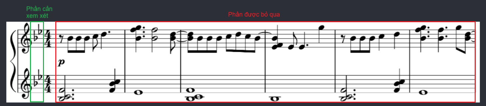
    <p><i>Vùng để xác định âm giai</i></p>
</div>

Sau khi chương trình thu thập được nhóm các dấu hoá này, nó sẽ đếm số **lượng dấu + kí hiệu dấu** và ánh xạ chúng vào một dictionary `SCALE` để xác định âm giai của bản nhạc. Các âm giai được hỗ trợ bao gồm:
```python
SCALE = {
    "0": " C major",  # Không có dấu hoá -> Đô trưởng (La thứ)
    "1b": "F major",  # 1 dấu giáng -> Fa trưởng (Rê thứ)
    "2b": "Bb major", # 2 dấu giáng -> Si giáng trưởng (Sol thứ)
    "3b": "Eb major", # 3 dấu giáng -> Mi giáng trưởng (Đô thứ)
    "4b": "Ab major", # 4 dấu giáng -> La giáng trưởng (Fa thứ)
    "5b": "Db major", # 5 dấu giáng -> Rê giáng trưởng (Si giáng thứ)
    "6b": "Gb major", # 6 dấu giáng -> Sol giáng trưởng (Mi giáng thứ)
    "7b": "Cb major", # 7 dấu giáng -> Đô giáng trưởng (Sol thăng thứ)
    "1s": "G major",  # 1 dấu thăng -> Sol trưởng (Mi thứ)
    "2s": "D major",  # 2 dấu thăng -> Rê trưởng (Si thứ)
    "3s": "A major",  # 3 dấu thăng -> La trưởng (Fa thăng thứ)
    "4s": "E major",  # 4 dấu thăng -> Mi trưởng (Đô thăng thứ)
    "5s": "B major",  # 5 dấu thăng -> Si trưởng (Sol thăng thứ)
    "6s": "F# major", # 6 dấu thăng -> Fa thăng trưởng (Rê thăng thứ)
    "7s": "C# major"  # 7 dấu thăng -> Đô thăng trưởng (La thăng thứ)
}
```

Âm giai này sẽ được sử dụng để xác định cao độ của các nốt nhạc trong bản nhạc.

### 3.1.2.4. Gom nhóm và xác định cao độ của các nốt nhạc
Để xác định cao độ của nốt nhạc, ta phải xem xét vị trị của nó trên khuông nhạc và các dấu hoá đi kèm. Tại một vị trí, có thể có nhiều hơn một nốt nhạc (thường là hợp âm) kết nối với nhau bằng một thân nốt (stem). Các bước thực hiện như sau:

1. **Duyệt và gom nhóm các nốt nhạc**

    Duyệt qua tất cả các nốt nhạc trong khuông nhạc và gom nhóm chúng lại với nhau nếu chúng nằm sát nhau (nếu có). Các nốt nhạc này sẽ được đặt vào một dictionary `notes_data`.

    ```python
    notes_data = {
        "notes": [], # Danh sách tên nốt nhạc
        "head_type": "", # Kiểu đầu nốt nhạc (tròn, trắng, đen, v.v.)
        "flag_type": "", # Kiểu dấu nối (nối, không nối)
        "x1": 0, 
        "x2": 0,
    }
    ```

2. **Xác định cao độ**

    Duyệt qua danh sách các dòng kẻ khuông nhạc và xác định xem nốt nhạc nằm trên dòng kẻ hay nằm giữa 2 dòng kẻ. Trong quá trình gán nhãn của model, do các bounding box luôn có một khoảng cách nhất định so với ký hiệu, nên nếu nốt nhạc **nằm giữa 2 dòng kẻ** thì bounding box sẽ **chứa cả 2 dòng kẻ** này. Ngược lại, nếu nốt nhạc **nằm trên 1 dòng kẻ** thì bounding box sẽ chỉ **chứa 1 dòng kẻ**.

    | | Nốt nằm trên dòng kẻ | Nốt nằm giữa 2 dòng kẻ |
    | --- | --- | --- |
    | Hình ảnh | 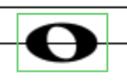 | 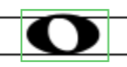 |

    Hai trường hợp này sẽ được xử lý như sau:

    - **Trường hợp nốt nằm trên dòng kẻ**: Ta sẽ xác định cao độ của nốt nhạc dựa trên dòng kẻ mà nó nằm trên. Ví dụ, nếu nốt nhạc nằm trên dòng kẻ `D5` thì nó sẽ được gán cao độ là `D5`.
    
    - **Trường hợp nốt nằm giữa 2 dòng kẻ**: Ta sẽ xác định cao độ của nốt nhạc dựa trên dòng kẻ phía dưới nó. Ví dụ, nếu nốt nhạc nằm giữa dòng kẻ `E4` và `G4`, thì nó sẽ được gán cao độ là `F4` dựa vào danh sách thứ tự các nốt `["C", "D", "E", "F", "G", "A", "B"]`. Ngoài ra, nếu nốt nhạc nằm giữa 2 dòng kẻ khác quãng tám (octave) như `B4` và `D5`, thì nốt đó sẽ được gán cao độ là `C5` thay vì `C4`.

    Tuy nhiên, cao độ của các nốt này chưa thực sự chính xác vì nó chưa được xét trên **âm giai** của bản nhạc. Do đó, ta cần ánh xạ các nốt nhạc này vào âm giai của bản nhạc để xác định cao độ chính xác thông qua `NOTES_ON_SCALE`.

    ```python
    NOTES_ON_SCALE = {
        "0": ["C", "D", "E", "F", "G", "A", "B"],
        "1b": ["C", "D", "E", "F", "G", "A", "As"],
        "2b": ["C", "D", "Ds", "F", "G", "A", "As"],
        "3b": ["C", "D", "Ds", "F", "G", "Gs", "As"],
        "4b": ["C", "Cs", "Ds", "F", "G", "Gs", "As"],
        "5b": ["C", "Cs", "Ds", "F", "Fs", "Gs", "As"],
        "6b": ["B", "Cs", "Ds", "F", "Fs", "Gs", "As"],
        "7b": ["B", "Cs", "Ds", "E", "Fs", "Gs", "As"],
        "1s": ["C", "D", "E", "Fs", "G", "A", "B"],
        "2s": ["Cs", "D", "E", "Fs", "G", "A", "B"],
        "3s": ["Cs", "D", "E", "Fs", "Gs", "A", "B"],
        "4s": ["Cs", "Ds", "E", "Fs", "Gs", "A", "B"],
        "5s": ["Cs", "Ds", "E", "Fs", "Gs", "As", "B"],
        "6s": ["Cs", "Ds", "F", "Fs", "Gs", "As", "B"],
        "7s": ["Cs", "Ds", "F", "Fs", "Gs", "As", "Bs"]
    }
    ```

    Tương ứng với mỗi âm giai, các nốt nhạc có thể được **thăng hoặc giáng nửa tông** (semitone) để tạo thành các nốt nhạc khác. Ví dụ, trong âm giai `C major`, nốt nhạc `C` có thể được thăng thành `Cs` hoặc giáng thành `B`. Nhưng có những trường hợp đặc biệt khi một khuông nhạc chứa nhiều hơn 1 khoá nhạc, ví dụ như cả khoá Sol và khoá Fa.

    <div align="center">
        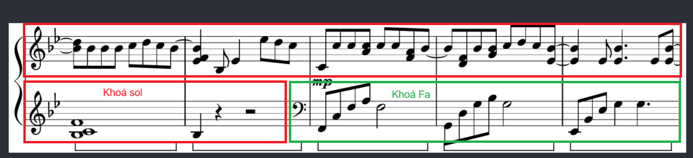
        <p><i>Hai khoá nhạc khác nhau trong cùng một khuông nhạc</i></p>
    </div>

    Trong trường hợp này, ta sẽ phải lưu trữ một **khuông nhạc dự phòng** mà toạ độ dòng kẻ và nốt nhạc được ánh xạ khác với thông thường. Ví dụ, khuông nhạc khoá Fa nhưng lại chứa các nốt nhạc khoá Sol.

    ```python
    # Ví dụ về 5 dòng kẻ chính của 2 khuông nhạc gốc
    treble_staff_lines = { "F5": 0, "D5": 10, "B4": 20, "G4": 30, "E4": 40 }
    bass_staff_lines = { "A3": 80, "F3": 90, "D3": 100, "B2": 110, "G2": 120 }

    # Sau khi ánh xạ lại
    treble_staff_lines_modified = { "F5": 80, "D5": 90, "B4": 100, "G4": 110, "E4": 120 }
    bass_staff_lines_modified = { "A3": 0, "F3": 10, "D3": 20, "B2": 30, "G2": 40 }
    ```

    Không chỉ vậy, trong một số bản nhạc cũng tồn tại những nốt **"ngoại giọng"** (non-scale note) không nằm trong âm giai của bản nhạc. Những nốt này thường được sử dụng để tạo ra những âm thanh đặc biệt để làm phong phú thêm cho bản nhạc. Chúng luôn có dấu hoá đi kèm như **dấu thăng, dấu giáng hoặc dấu bình**. Do đó, ta sẽ không xét đến những nốt này trong quá trình xác định cao độ.

    - Nếu dấu hoá là dấu thăng, ta sẽ thăng nốt nhạc lên nửa tông (semitone).
    - Nếu dấu hoá là dấu giáng, ta sẽ giáng nốt nhạc xuống nửa tông (semitone).
    - Nếu dấu hoá là dấu bình, ta chuyển đổi nốt nhạc về trạng thái không có thăng hoặc giáng.

    Trong một hợp âm, nơi mà các nốt nhạc xếp chồng lên nhau, các dấu hoá cũng xếp chồng lên nhau. Do đó, ta phải xác định đúng dấu hoá tương ứng với nốt nhạc mà nó đi kèm. Thông thường, ta sẽ so sánh xem toạ độ bounding box của nốt nhạc có nằm trong khoảng giữa của dấu hoá hay không, thông qua điều kiện:

    ```python
    if (note.y1 - curr_sharp.y1 >= line_space / 2 and curr_sharp.y2 - note.y2 >= line_space / 2):
        # Xử lý cao độ nốt nhạc
    ```

    <div align="center">
        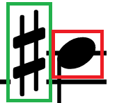
        <p><i>Dấu thăng nằm trước nốt nhạc</i></p>
    </div>

### 3.1.2.5. Xác định trường độ của các nốt nhạc

Đây là một bước khó khăn vì có rất nhiều trường hợp khác nhau mà chương trình cần phải xử lý. Trước tiên, ta sẽ duyệt qua danh sách `flag` và `beam` để xác định vị trí của chúng so với các nốt nhạc. Lúc này, ta sẽ có 2 trường hợp:

1. **Xử lí đuôi nốt**

    Nếu nốt nhạc đi liền với đuôi nốt (`flag`) thì trường độ của nó sẽ được xác định dựa trên kiểu đuôi nốt đó. Các kiểu đuôi nốt đi liền với đầu nốt đen được hỗ trợ bao gồm:

    - **Đuôi nốt đơn**: Có trường độ là `1/8` (eighth note).

    - **Đuôi nốt đôi**: Có trường độ là `1/16` (sixteenth note).

    - **Đuôi nốt ba**: Có trường độ là `1/32` (thirty-second note).

2. **Xử lí dấu nối**

    Nếu nốt nhạc đi liền với dấu nối (`beam`) thì trường độ của nó sẽ được xác định dựa trên kiểu dấu nối đó. Vì dấu nối gồm phần đầu và phần cuối, nên ta phải xử lí chính xác cả hai phần này nếu không muốn có sự sai lệch trong tổng trường độ của ô nhịp. Các bước đễ xử lý như sau:

    Đối với mỗi dấu nối, ta sẽ dùng 2 biến là `start_available` và `end_available` để xác định xem vị trí đầu và cuối của nó còn trống hay không (tức là chưa có nốt nhạc nào được xử lí tại vị trí đó). Tiếp theo, ta sẽ dùng 1 biến `turned_side` để xác định xem dấu nối này có bị lật ngược hay không (hoặc có thể coi là đầu nốt quay về bên trái hay bên phải). Nếu `turned_side` là `True`, thì đầu nốt sẽ quay về bên trái, ngược lại nếu là `False` thì đầu nốt sẽ quay về bên phải.

    <div align="center">
        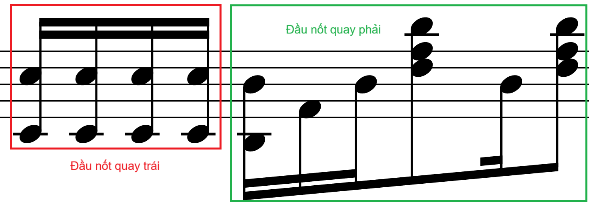
        <p><i>Đầu nốt quay về bên trái và phải</i></p>
    </div>
    
    Trong trường hợp có các dấu nối liền nhau, chúng sẽ có những ảnh hưởng với nhau. Ví dụ, `end_available` của dấu nối này sẽ là `start_available` của dấu nối tiếp theo; hay `turned_side` trong một cụm dấu nối sẽ là giống nhau như hình trên.

    Tiếp theo, ta cần xác định **3 trạng thái của dấu nối** trong bản nhạc thông qua các bước sau:

    1. **Trạng thái 1**: Dấu nối có nốt nhạc ở vị trí đầu (thường là dấu hiệu bắt đầu một cụm dấu nối mới)

         Khi này, ta cần xem xét `turned_side` của dấu nối dựa trên bounding box của nốt nhạc và dấu nối. Cụ thể:

        ```python
        beam_start_box_start = abs(curr_beam.x1 - curr_note.x1)
        beam_start_box_end = abs(curr_beam.x1 - curr_note.x2)

        if (beam_start_box_start <= max_space):
            curr_flag["turned_side"] = "right"

        elif (beam_start_box_end <= max_space):
            curr_flag["turned_side"] = "left"
        ```

        | | Nốt nhạc bên trái | Nốt nhạc bên phải |
        | --- | --- | --- |
        | Hình ảnh | 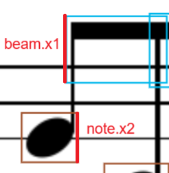 | 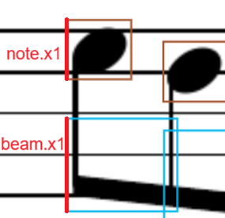 |

        Cuối cùng, trường độ của nốt nhạc sẽ được xác định dựa trên kiểu dấu nối đó, như `eighth note`, `sixteenth note`, `thirty-second note`.
    
    2. **Trạng thái 2**: Dấu nối có nốt nhạc ở vị trí đầu và có nốt nhạc ở vị trí cuối
    
         Trước hết, ta phải kiểm tra `turned_side` xem các nốt này có đang cùng nằm trong cụm dấu nối hay không.
        
        ```python
        beam_end_box_start_next = abs(curr_beam.x2 - next_note.x1) if next_note is not None else 1000
        beam_end_box_end_next = abs(curr_beam.x2 - next_note.x2) if next_note is not None else 1000

        if (
            (curr_flag.turned_side == "right" and beam_end_box_start_next <= max_space) 
            or (curr_flag.turned_side == "left" and beam_end_box_end_next <= max_space)
            ):

            # Xử lý trường hợp nốt nhạc ở vị trí cuối
        ```
        
        Nếu có cùng `turned_side`, ta sẽ xác định xem trường độ của nốt nhạc ở cuối bằng cách so sánh dấu nối hiện tại `curr_beam` và dấu nối kế tiếp `next_beam`. Nếu không có `next_beam` thì trường độ của nốt sẽ là giá trị của dấu nối hiện tại. Nếu có tồn tại, người ta sẽ ưu tiên tính trường độ của nốt nhạc dựa trên **dấu nối có giá trị nhỏ hơn** (ví dụ `sixteenth_beam` sẽ được ưu tiên hơn `eighth_beam`).

        ```python
        BEAM_WEIGHT = {
            "eight": 1/8,
            "sixteenth": 1/16,
            "thirty_second": 1/32,
        }

        def compare_flag_weight(curr_beam, next_beam):
            return BEAM_WEIGHT[next_beam] < BEAM_WEIGHT[curr_beam]
        ```

        <div align="center">
            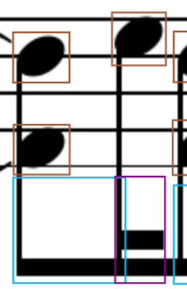
            <p><i>Nốt ở vị trị cuối được ưu tiên trường độ 1/16 thay vì 1/8</i></p>
        </div>
    
    3. **Trạng thái 3**: Dấu nối không có nốt nhạc ở vị trí đầu (hoặc `start_available = False` tức là vị trí đầu đã có nốt nhạc được xử lí trước đó) nhưng lại có nốt nhạc ở vị trí cuối

        Trường hợp này được xử lí tương tự như **Trạng thái 2**. Dưới đây là ví dụ về 2 trường hợp này:

        | | Dấu nối đôi không có nốt nhạc ở vị trí đầu | Dấu nối có nốt nhạc ở vị trí đầu nhưng đã được xử lí |
        | --- | --- | --- |
        | Hình ảnh | 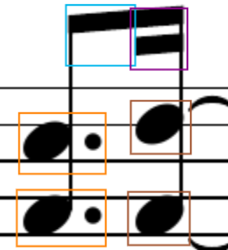 | 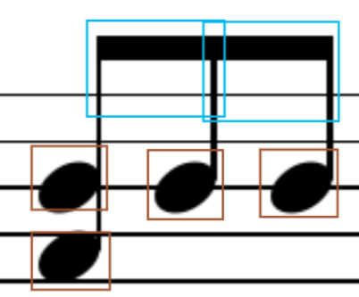 |

    Các nốt nhạc sau khi được xử lí (tức là đã xác định được trường độ) thì sẽ được ghi nhận thông qua biến `start_available` và `end_available` của chúng. Hơn nữa, biến này còn có tác dụng như mốt **"checkpoint"**, kết hợp với `last_valid_note_idx` để đánh dấu vị trí nốt nhạc cuối cùng đã được xử lí. Điều này giúp cho việc quay lại xử lí nốt nhạc tiếp theo của `last_valid_note_idx` được tiếp tục trong trường hợp chương trình bị "mất dấu" nốt nhạc khi xử lí dấu nối.

    <div align="center">
        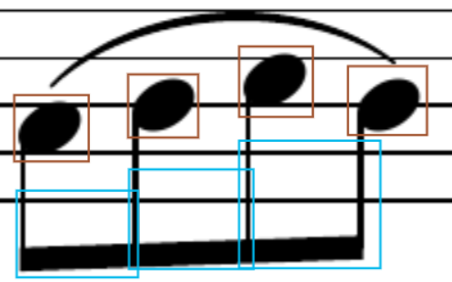
        <p><i>Nốt nhạc cuối cùng bị "mất dấu"</i></p>
    </div>

    Hình ảnh trên là một ví dụ tiêu biểu cho trường hợp này, khi mà có sự sai lệch đủ lớn trong công đoạn gán nhãn dẫn đến `abs(curr_beam.x2 - next_note.x1) > max_space`. Khi này, chương trình sẽ quay lại xử lí nốt nhạc cuối cùng đã được xử lí - nốt thứ 3 - và tiếp tục xử lí nốt nhạc thứ 4.

### 3.1.2.6. Thêm các dấu lặng và vạch nhịp

Các dấu lặng được thêm vào vị trí thích hợp trong `sheet` dựa trên toạ độ của chúng. Do các dấu lặng đã có giá trị trường độ riêng, nên ta không cần phải xử lí thêm gì nữa. Quá trình này sẽ được thực hiện tương tự cho các vạch nhịp.

### 3.1.2.7. Kiểm tra trường độ ô nhịp

Dựa trên toạ độ các vạch nhịp, các kí hiệu trong một ô nhịp sẽ được gom nhóm lại với nhau để kiểm tra trường độ của ô nhịp. Để kiểm tra, ta cần 2 biến là `measure_duration` là **tổng trường độ thực tế** của các nốt nhạc và dấu lặng trong ô nhịp, và `measure_playtime` là **tổng trường độ lý thuyết** của ô nhịp. Thông thường, ta sẽ cho `measure_playtime = 1 * TIME_COEFF`, với `TIME_COEFF` là hệ số thời gian của ô nhịp, được xác định dựa trên kí hiệu nhịp ở đầu khuông nhạc. 

Các kí hiệu nhịp được hỗ trợ bao gồm:
```python
TIME_SIGNATURE_WEIGHT = {
    "two_four": 2/4,
    "three_four": 3/4,
    "four_four": 4/4,
    "five_four": 5/4,
    "six_eight": 6/8,
}
```

Trường độ các nốt nhạc được hỗ trợ bao gồm:
```python
note_playtime = {
    "whole": 1 * measure_playtime,
    "half": 0.5 * measure_playtime,
    "quarter": 0.25 * measure_playtime,
    "eighth": 0.125 * measure_playtime,
    "sixteenth": 0.0625 * measure_playtime,
    "thirty_second": 0.03125 * measure_playtime,
}
```

> Lưu ý: Các nốt nhạc có dấu chấm dôi (dotted note) có trường độ bằng trường độ của nốt nhạc đó cộng với một nửa trường độ của nó. Ví dụ, nốt nhạc `quarter` có trường độ là `0.25 * measure_playtime`, thì nốt nhạc `dotted quarter` sẽ có trường độ là `0.25 * measure_playtime + 0.125 * measure_playtime = 0.375 * measure_playtime`.

Trong một số bản nhạc, đôi khi có sự xuất hiện của nhiều hơn 1 kí hiệu nhịp (tương tự như trường hợp có nhiều hơn 1 khoá nhạc). Khi này, ta sẽ phải xử lí tương tự như trường hợp có nhiều hơn 1 khoá nhạc bằng các cập nhật `TIME_COEFF` dựa trên `TIME_SIGNATURE_WEIGHT`để tính `measure_playtime`. Hình ảnh dưới đây là một ví dụ cho trường hợp này:

<div align="center">
    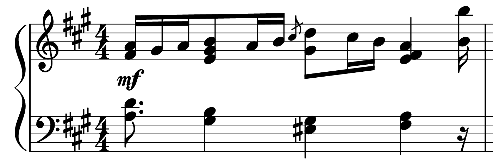
    <p><i>Bản nhạc ban đầu có nhịp 4/4</i></p>
</div>

<div align="center">
    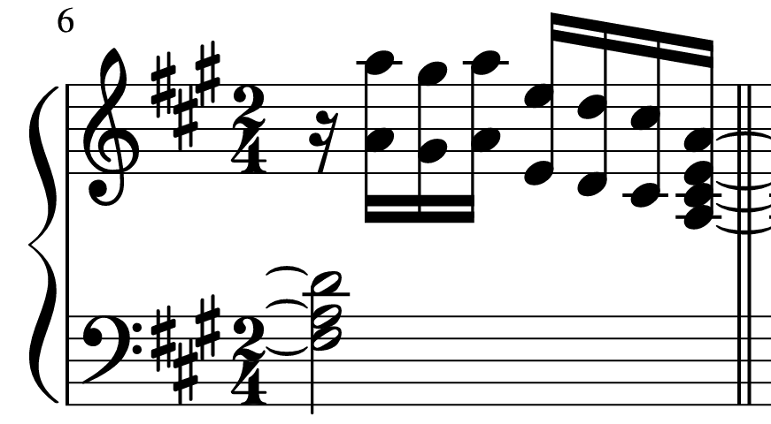
    <p><i>Bản nhạc sau đó có nhịp 2/4</i></p>
</div>


Cuối cùng, ta sẽ thêm ô nhịp này vào `sheet` với định dạng như sau:

```python
symbols = [
    {
        "barline": "barline", # Vạch nhịp
    },
    {
        "notes": [ # Danh sách các nốt nhạc của hợp âm
            "As4",
            "F4",
            "Ds5",
        ],
        "head_type": "black", # Kiểu đầu nốt nhạc (tròn, trắng, đen, v.v.)
        "flag_type": "eighth", # Trường độ nốt nhạc (1/8, 1/16, 1/32, v.v.)
    },
    {
        "rest": "quarter", # Dấu lặng
    },
    # ... Các ký hiệu khác trong ô nhịp
]

measure = {
    "measure": measure_idx, # Số thứ tự ô nhịp
    "symbols": symbols, # Danh sách các ký hiệu trong ô nhịp
    "measure_duration": measure_duration, # Tổng trường độ thực tế của ô nhịp
    "measure_playtime": measure_playtime * TIME_COEFF[0], # Tổng trường độ lý thuyết của ô nhịp
}

sheet.append(measure)
```

### 3.1.2.8. Xuất kết quả

Cuối cùng, sau khi đã xử lí xong tất cả các ô nhịp trong bản nhạc, ta sẽ xuất kết quả ra file JSON với định dạng như sau:

```json
{
    "sheet": [
        {
            "measure": 1,
            "symbols": [
                {
                    "barline": "barline",
                },
                {
                    "notes": [
                        "As4",
                        "F4",
                        "Ds5",
                    ],
                    "head_type": "black",
                    "flag_type": "eighth",
                },
                {
                    "rest": "quarter",
                },
            ],
            "measure_duration": 0.5,
            "measure_playtime": 1.0,
        },
        # ... Các ô nhịp khác
    ]
}
```

Hệ thống chuyển đổi dữ liệu JSON này sang định dạng âm thanh sẽ dùng các audio của nốt nhạc được lưu trữ sẵn và kết hợp chúng lại với các khoảng thời gian tương ứng để tạo thành bản nhạc hoàn chỉnh.

## 3.2. Xây dựng đầu ra âm thanh của bản nhạc
### 3.2.1. Tổng quan

Việc xây dựng đầu ra âm thanh của bản nhạc là bước cuối cùng trong quy trình chuyển đổi từ ảnh sang âm thanh. Sau khi đã chuyển đổi dữ liệu từ dạng thông số kỹ thuật sang dạng nhạc lý, ta sẽ tiến hành tạo ra âm thanh tương ứng với các ký hiệu âm nhạc. Quá trình này được thực hiện thông qua các bước sau:

1. **Lựa chọn âm thanh của nhạc cụ**: Chọn âm thanh của nhạc cụ mà ta muốn sử dụng để phát bản nhạc theo lựa chọn của người dùng. Các nhạc cụ được hỗ trợ bao gồm piano, guitar, violin, v.v. Nhưng mặc định sẽ là `classical_piano`.

2. **Kết hợp nốt nhạc và quãng nghỉ**: Dựa trên các ký hiệu âm nhạc trong bản nhạc, ta sẽ kết hợp các nốt nhạc và quãng nghỉ lại với nhau để tạo thành âm thanh hoàn chỉnh. Các nốt nhạc sẽ được phát theo thứ tự đúng với dữ liệu đầu vào. Quá trình này bao gồm các thao tác xử lí một số hiệu ứng làm hư âm thanh như rè (buzzing), có tiếng nổ lách tách (crackling), chói tai (distortion), v.v.

3. **Kết hợp khuông nhạc Treble và Bass**: Chồng 2 khuông nhạc Treble và Bass lại với nhau để tạo thành một bản nhạc hoàn chỉnh. Quá trình này cũng có các thao tác giới hạn mức âm lượng của khuông nhạc và tổng thể bản nhạc để tránh việc âm thanh bị chói.

4. **Xuất âm thanh**: Cuối cùng, ta sẽ xuất âm thanh đã tạo ra thành một file âm thanh với định dạng MP3 và trả về cho người dùng.

### 3.2.2. Chi tiết
### 3.2.2.1. Lựa chọn âm thanh của nhạc cụ

Mỗi nhạc cụ có một âm thanh riêng biệt và chúng mang lại những cảm xúc khác nhau cho người nghe. Do đó, việc lựa chọn âm thanh của nhạc cụ là rất quan trọng trong quá trình tạo ra âm thanh của bản nhạc. Hệ thống sẽ cung cấp cho người dùng một danh sách các nhạc cụ có sẵn và cho phép họ chọn nhạc cụ mà họ muốn sử dụng. Các nhạc cụ được hỗ trợ bao gồm:

- **Classical Piano**: Âm thanh của đàn piano cổ điển, rất phổ biến trong âm nhạc cổ điển và hiện đại.

- **Auditorium Piano**: Âm thanh của đàn piano trong một không gian lớn, tạo ra âm thanh vang vọng và mạnh mẽ.

- **Upright Piano**: Âm thanh của đàn piano đứng, thường được sử dụng trong các bản nhạc nhẹ nhàng và tình cảm.

- **Jazz Piano**: Âm thanh của đàn piano jazz, mang lại cảm giác ấm áp với những âm thanh ngọt ngào và du dương.

- **Organ**: Âm thanh của đàn organ, thường được sử dụng trong các bản nhạc rock và pop.

- **Classical Guitar**: Âm thanh của đàn guitar cổ điển, rất phổ biến trong âm nhạc dân gian và cổ điển.

- **Harp**: Âm thanh của đàn hạc, mang lại cảm giác nhẹ nhàng và thanh thoát.

- **Violin**: Âm thanh của đàn violin, thường được sử dụng trong các bản nhạc cổ điển và hiện đại.

Với mỗi nhạc cụ, hệ thống sẽ lưu trữ 88 âm thanh trải dài từ `A0` đến `C8` (tương ứng với 88 phím đàn piano) trong một thư mục riêng biệt. Mỗi âm thanh đều có trường độ phù hợp để đáp ứng đầy đủ các nốt trong bản nhạc. Tuy nhiên, đối với một số nhạc cụ như violin, guitar, v.v. thì ta cần giảm mức âm thanh của dải tần số thấp (bass) xuống để làm nổi bật hơn dải tần số cao (treble), vốn là đặc trưng của các nhạc cụ này.

Trong hệ thống này, ta sẽ sử dụng thư viện `pydub` để xử lý âm thanh. Thư viện này cho phép ta dễ dàng kết hợp các âm thanh lại với nhau và xuất chúng thành file âm thanh với định dạng MP3. Để giảm thời gian xử lý, ta sẽ sử dụng `ThreadPoolExecutor` để xử lí song song đầu ra của các khuông nhạc và một dictionary `USED_NOTES` được sử dụng chung giữa các `thread` để lưu trữ những âm thanh đã được tải từ file mp3, tránh việc tải lại nhiều lần cùng một âm thanh. 

```python
from concurrent.futures import ThreadPoolExecutor

# Xử lí song song các khuông nhạc
with ThreadPoolExecutor() as executor:
    results = list(executor.map(process_zone, music_sheet, [measure_playtime] * len(music_sheet), [note_playtime] * len(music_sheet)))
```

```python
import threading
from pydub import AudioSegment

# Shared dictionary
USED_NOTES = {}
USED_NOTES_LOCK = threading.Lock()

with USED_NOTES_LOCK:
    if note not in USED_NOTES:
        USED_NOTES[note] = AudioSegment.from_mp3(f"{instrument_path}/{note}.mp3")
```

### 3.2.2.2. Kết hợp nốt nhạc và quãng nghỉ

Thời gian thể hiện của mỗi ô nhịp được xác định bằng `measure_playtime`, tương ứng với tổng thời gian lý thuyết của ô nhịp. Tuy nhiên, nếu thời gian chỉ đúng bằng `measure_playtime`, thì âm thanh ở cuối ô nhịp sẽ bị ngắt quãng và chuyển qua ô nhịp tiếp theo ngay lập tức. Điều này sẽ làm cho âm thanh nghe không được tự nhiên và không có độ ngân vang (sustain). Do đó, ta sẽ thêm một khoảng duy trì âm, bằng `0.25` lần thời gian ô nhịp, vào cuối ô nhịp hiện tại và chồng ô nhịp tiếp theo lên ngay sau `measure_playtime` của ô nhịp hiện tại.

<div align="center">
    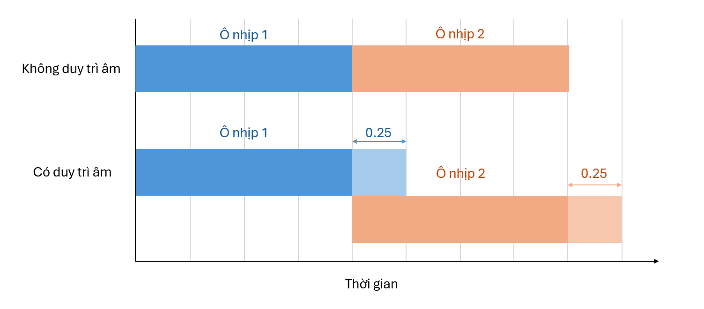
    <p><i>Ô nhịp không được duy trì âm thanh và ô nhịp được duy trì âm thanh</i></p>
</div>

Trước khi thêm âm thanh của các nốt vào ô nhịp, ta sẽ tạo ra một ô nhịp trống với thời gian bằng `measure_playtime * 1.25`. Sau đó, ta duyệt qua các ký hiệu trong ô nhịp và thêm vào ô nhịp trống theo các bước sau:

1. **Xử lí độ lớn của âm thanh gốc**:

    Nếu ký hiệu là một hoặc nhiều nốt nhạc, ta sẽ tải âm thanh của nốt nhạc từ file có định dạng `{instrument}/{note}.mp3` và thêm nó vào `USED_NOTES` để tránh việc tải lại nhiều lần cùng một âm thanh. Sau này khí phát âm thanh, ta sẽ sử dụng âm thanh đã được tải từ `USED_NOTES`.

    Tiếp theo, ta sẽ chồng âm thanh của các nốt nhạc này lên nhau để tạo ra một hợp âm (chord). Trước khi làm điều này, ta phải đảm bảo rằng âm lượng của các âm thanh này không được phép vượt quá ngưỡng cho phép, để tránh việc âm thanh quá lớn gây méo (distortion). Do đó ứng với mỗi nốt trong hợp âm, ta sẽ sử dụng `apply_gain` để điều chỉnh âm lượng của nó về mức tối ưu nhất dựa trên số lượng nốt nhạc trong hợp âm.

    ```python
    note_audio = USED_NOTES[note].apply_gain(-4 * (num_notes - 1))
    ```

    Để làm rõ hơn về việc độ lớn của hợp âm sẽ giảm đi bao nhiêu, ta sẽ dùng công thức **Mức cường độ âm**:

    ```math
    L = 10 \cdot log_{10} \left( \frac{I}{I_0} \right) \text{ (dB)}
    ```

    Trong đó:
    - `L`: Mức cường độ âm (đơn vị là dB).
    - `I`: Cường độ âm (đơn vị là W/m²).
    - `I0`: Cường độ âm chuẩn (đơn vị là W/m²), thường được lấy là `10^-12 W/m²`.

    Từ đó, ta có thể tính được

    ```math
    I_{i} = 10^{\frac{L_{i}}{10}} \cdot I_0 \text{ (W/m²)}
    ```

    Do đó, ta dễ dàng tính ra được tổng cường độ âm của các âm thanh có cùng mức cường độ âm là:

    ```math
    I_{total} = \sum_{i=1}^{n} I_{i} = n \cdot 10^{\frac{L_{i}}{10}} \cdot I_0 \text{ (W/m²)}
    ```

    Như vậy, ta có thể tính được mức cường độ âm của hợp âm là:

    ```math
    L_{total} = 10 \cdot log_{10} \left( \frac{I_{total}}{I_0} \right) = 10 \cdot log_{10} \left( n \cdot 10^{\frac{L_{i}}{10}} \right) = L_{i} + 10 \cdot log_{10}(n)
    ```

    Ví dụ, một hợp âm có 4 nốt nhạc và mỗi nốt được giảm đi `-4 * (4 - 1) = -12 dB`, thì mức cường độ âm của hợp âm sẽ giảm gần `6 db`:

    ```math
    L_{total} = L_{i} + 10 \cdot log_{10}(4) = (L_{i} - 12) + 10 \cdot log_{10}(4) = L_{i} - 12 + 6.0205 = L_{i} - 5.9795 \approx L_{i} - 6 (dB)
    ```

2. **Phân bố âm thanh stereo**:

    Âm thanh stereo là âm thanh được phát ra từ hai kênh âm thanh khác nhau, tạo ra hiệu ứng không gian cho người nghe. Để tạo ra âm thanh stereo, ta sẽ phân bố các nốt nhạc trong hợp âm vào hai kênh trái và phải của âm thanh.

    ```python
    pan_value = random.uniform(-0.15, 0.15)
    note_audio = note_audio.pan(pan_value)
    ```

    Trong đó, `pan_value` là giá trị phân bố âm thanh, có thể nằm trong khoảng từ `-1` đến `1`, với `-1` là âm thanh chỉ phát ra từ kênh trái và `1` là âm thanh chỉ phát ra từ kênh phải. Ta sẽ sử dụng hàm `random.uniform(-0.15, 0.15)` để tạo ra một giá trị ngẫu nhiên trong khoảng này, giúp ngăn chặn việc âm thanh bị lệch quá nhiều về một bên gây chói tai cho người nghe.

3. **Xây dựng hợp âm**:

    Sau khi đã xử lí độ lớn của âm thanh gốc và phân bố âm thanh stereo, ta sẽ tạo ra một hợp âm bằng cách chồng các nốt nhạc lại với nhau. Để làm điều này, ta sẽ sử dụng hàm `overlay` với các offset khác nhau trong khoảng từ `5ms` đến `25ms`. Điều này giúp tạo ra hiệu ứng âm thanh tự nhiên hơn, giống như khi người chơi ấn các nốt nhạc cùng một lúc nhưng không hoàn toàn đồng bộ với nhau.

    ```python
    chord = notes[0]
    for i, note in enumerate(notes[1:], 1):
        chord = chord.overlay(note, position=random.uniform(5, 25))
    ```

4. **Thiết lập trường độ cho hợp âm**:

    Trước hết, ta sẽ tính toán trường độ lý thuyết của hợp âm bằng cách lấy trường độ của nốt nhạc đầu tiên trong hợp âm và xử lí các nốt có dấu chấm dôi (dotted note) bằng cách cộng thêm một nửa trường độ của nó.

    ```python
    note_type = symbol.flag_type if symbol.flag_type else symbol.head_type # Kiểu nốt nhạc (có đuôi nốt hay không có đuôi nốt)

    chord_duration = note_playtime[note_type]

    # Tăng trường độ cho nốt nhạc có dấu chấm dôi
    if "dotted" in symbol.head_type:
        chord_duration += note_playtime[note_type] / 2
    ```

    Tương tự như xây dựng ô nhịp, ta sẽ điều chỉnh trường độ cho hợp âm bằng cách thêm một khoảng duy trì âm vào cuối hợp âm. Khoảng duy trì âm này sẽ được tính bằng `chord_duration * 1.5` nếu có thể. Hơn nữa, ta áp dụng `fade_in` và `fade_out` bằng `50ms` để tạo ra hiệu ứng mờ dần cho âm thanh, giúp âm thanh nghe tự nhiên hơn. Cuối cùng, ta sẽ thêm hợp âm này vào ô nhịp trống đã tạo ở bước 1.

    ```python
    # Thêm khoảng duy trì âm vào cuối hợp âm
    chord = chord[:int(chord_duration * 1.5)]

    # Fade in và fade out
    chord = chord.fade_in(50).fade_out(50)
    ```

    <div align="center">
        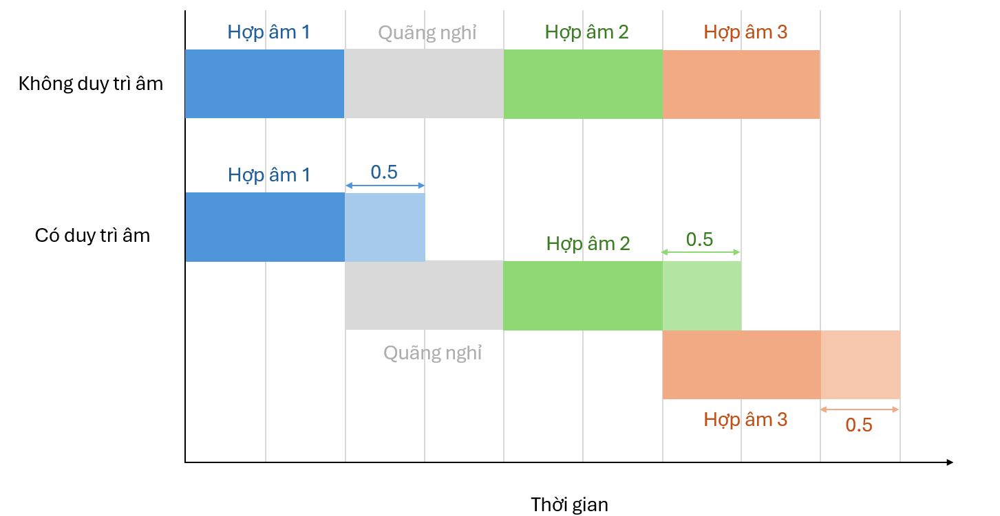
        <p><i>Hợp âm không được duy trì âm thanh và hợp âm được duy trì âm thanh</i></p>
    </div>

5. **Thêm quãng nghỉ (nếu có)**:

    Nếu ký hiệu là một quãng nghỉ, ta sẽ tạo ra một âm thanh trống với thời gian bằng trường độ của quãng nghỉ.
    
### 3.2.2.3. Kết hợp khuông nhạc Treble và Bass

Sau khi đã xử lí xong tất cả ô nhịp của mỗi khuông nhạc, ta sẽ kết hợp 2 khuông nhạc Treble và Bass lại với nhau. Tuy nhiên, trước khi chồng 2 âm thanh này lên nhau, ta cần đảm bảo rằng mức âm lượng không vượt quá ngưỡng cho phép. Do đó, ta sẽ điều chỉnh mức âm lượng của `treble_audio` và `bass_audio` về mức âm tối ưu.

```python
treble_audio = treble_audio.apply_gain(TARGET_DBFS.treble - treble_audio.dBFS)
bass_audio = bass_audio.apply_gain(TARGET_DBFS.bass - bass_audio.dBFS)
```

Để đảm bảo hơn nữa, ta sẽ kiểm soát mức âm lượng tối đa của âm thanh sau khi chồng 2 khuông nhạc lại với nhau bằng cách điều chỉnh `max_dBFS` của âm thanh tổng hợp. Nếu mức âm lượng vượt quá ngưỡng cho phép, ta sẽ giảm âm lượng của âm thanh tổng hợp về mức tối ưu.

```python
if mix_audio.max_dBFS > -0.1:
    mix_audio = mix_audio.apply_gain(-mix_audio.max_dBFS - 0.5)
```

### 3.2.2.4. Xuất âm thanh

Cuối cùng, ta sẽ xuất âm thanh đã tạo ra thành một file âm thanh với định dạng `mp3`, bitrate là `320kbps` và trả về cho người dùng. Tên của file sẽ được đặt dựa trên `uuid` của hệ thống nên sẽ không bị trùng lặp với các file âm thanh khác.

```python
final_audio.export(f"output/{str(uuid4())}.mp3", format="mp3", bitrate="320k")
```